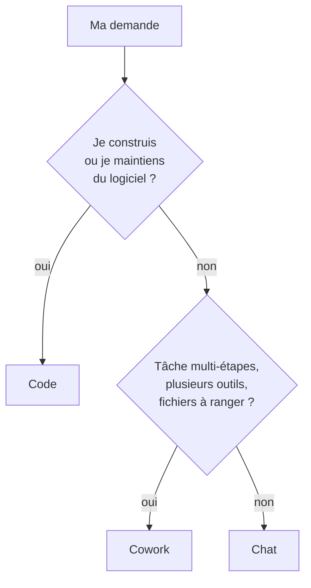

---
tags:
  - projet/claude-skilljar
  - type/concept
  - techno/claude
  - sujet/ia
  - statut/a-jour
aliases:
  - Les trois modes de l'app desktop
  - Chat Cowork Code
cree: 2026-10-07
maj: 2026-10-09
---

# Claude sur le desktop — les trois façons de travailler

> [!abstract] En une phrase
> L'app desktop propose **trois onglets** : **Chat** (tour par tour), **Cowork** (on délègue une tâche entière) et **Code** (on construit du logiciel). **Le seul vrai skill de la leçon : savoir dans lequel tu es avant de commencer.**

> [!warning] Cowork s'appelle désormais « Claude »
> Depuis octobre 2026, **Cowork est fusionné dans Claude**, en déploiement sur Pro et Max d'abord. La distinction « tour par tour » ou « tâche entière » reste la bonne façon de penser, même si l'onglet change de nom. Voir [[00 Cowork]].

---

## 🧭 Les trois onglets

| Onglet | Comment on travaille | Ce qu'on récupère |
|---|---|---|
| **Chat** | Tu poses une question, tu lis, tu relances : **tour par tour** | Une réponse, des fichiers **à télécharger** |
| **Cowork** | Tu décris le résultat voulu, l'assistant **enchaîne les étapes seul** | Des fichiers **enregistrés directement dans ton dossier** |
| **Code** | Tu travailles dans un **repo** : diffs, terminal, git | Du code modifié, prêt à commiter |

> [!example] Métaphore
> **Chat**, c'est un collègue à qui tu poses des questions au fil de l'eau. **Cowork**, c'est un stagiaire à qui tu confies un dossier complet et qui revient avec le livrable rangé. **Code**, c'est un développeur assis dans ton repo.

---

## 🔀 Choisir le bon onglet

> [!tip] La règle simple
> Si une tâche est **multi-étapes**, touche **plusieurs outils** ou doit **produire des fichiers rangés**, c'est du **Cowork**.

> [!warning] Piège du quiz
> Un **deck ou un document seul** ne demande **pas** Cowork. Sur un plan payant, un **artifact** dans n'importe quelle conversation suffit.

---

## 🤔 La question de fin de leçon

> [!question] À se poser vraiment
> Parmi mes demandes de la semaine, lesquelles étaient en fait **des tâches entières** que j'ai découpées en plusieurs questions **par habitude** ?

---

## 🔗 Liens

- [[01 Chat sur le desktop]] — le détail de l'onglet Chat
- [[00 Cowork]] — le détail de l'onglet Cowork
- [[00 Claude Code dans l'app]] — le détail de l'onglet Code
- [[01 Claude Code et Cowork ensemble]] — faire bosser les deux sur le même dossier
