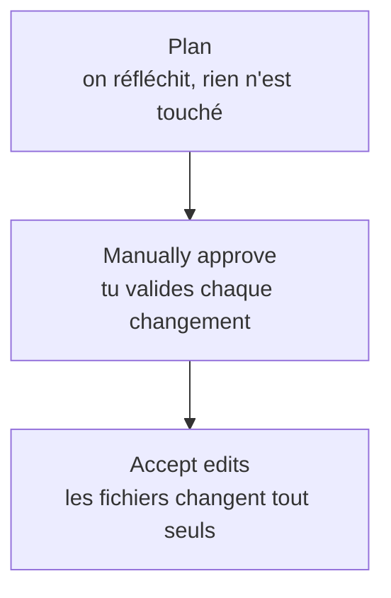

---
tags:
  - projet/claude-skilljar
  - type/concept
  - techno/claude
  - techno/claude-code
  - techno/git
  - sujet/ia
  - statut/a-jour
aliases:
  - Onglet Code
  - Claude Code desktop
cree: 2026-10-07
maj: 2026-10-07
---

# Claude Code dans l'app

> [!abstract] En une phrase
> L'onglet **Code** sert à **construire et maintenir du logiciel** dans un repo, en local ou dans le cloud, avec le niveau d'autonomie que tu choisis. À lire avant : [[00 Claude sur le desktop]].

---

## ☁️ Local ou cloud

| | Local | Cloud |
|---|---|---|
| Où tourne la session | Sur ton PC | À distance |
| Source du code | Ton dossier | Un **repo GitHub** connecté |
| Si tu fermes l'app | La session s'arrête | **La session continue** |

> [!tip]
> Le cloud est pratique pour lancer un **gros refacto** et fermer l'app.

---

## 🎚️ Les trois modes d'autonomie

| Mode | Ce qui se passe |
|---|---|
| **Manually approve** | Chaque changement **attend ta validation** |
| **Accept edits** | Les modifications de fichiers sont **appliquées automatiquement** |
| **Plan** | L'assistant fait **d'abord un plan**, avant de toucher quoi que ce soit |

> [!note]
> De haut en bas : de moins en moins de contrôle, de plus en plus de vitesse.

---

## 🗂️ La sidebar

On peut **filtrer les sessions** par **environnement** (Local / Cloud) et par **statut**.

---

## 🔗 Liens

- [[00 Claude sur le desktop]] — les trois onglets
- [[01 Claude Code et Cowork ensemble]] — partager le travail avec Cowork
