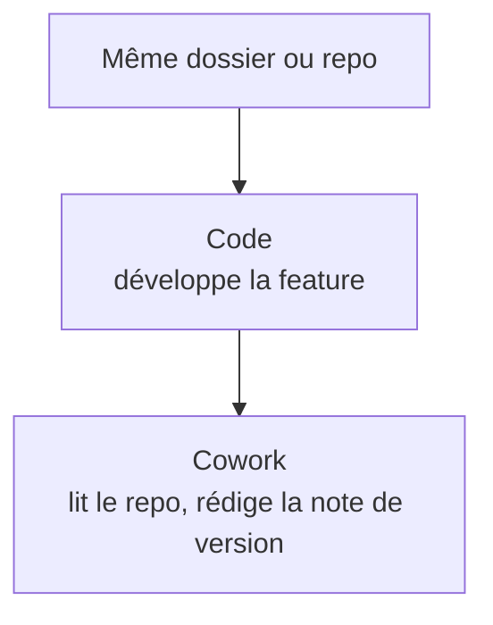

---
tags:
  - projet/claude-skilljar
  - type/astuce
  - techno/claude
  - techno/claude-code
  - techno/cowork
  - sujet/automatisation
  - statut/a-jour
aliases:
  - Cowork et Code
cree: 2026-10-07
maj: 2026-10-07
---

# Claude Code et Cowork ensemble

> [!abstract] En une phrase
> Cowork **ne peut pas appeler** Claude Code comme un outil : ce sont deux onglets séparés. Mais on peut les faire **travailler sur le même dossier**, chacun sur son rôle. À lire avant : [[00 Cowork]] et [[00 Claude Code dans l'app]].

---

## 🧩 Même moteur, autre interface

Cowork repose en gros **sur le même moteur d'exécution** que Claude Code, habillé d'une interface graphique. **La capacité de fond est la même, c'est l'interface qui change.**

> [!question] À confirmer
> Cette info vient d'articles de blog ([lowcode.agency](https://www.lowcode.agency/blog/claude-cowork-vs-claude-code), [go9x.com](https://go9x.com/blog/claude-cowork-vs-claude-code)), pas de la doc officielle. À vérifier sur [support.claude.com](https://support.claude.com/) : une vraie intégration a pu être ajoutée depuis.

---

## ⚖️ Ce que chacun sait faire

| | Cowork | Code |
|---|---|---|
| Écrire et lancer du **petit code « outil »** (script Python sur un CSV, conversion…) | ✅ | ✅ |
| Travailler proprement dans un **repo** | ❌ | ✅ |
| **Diffs** visuels, **terminal**, **git** | ❌ | ✅ |
| Modes d'approbation (manual, accept edits, plan) | ❌ | ✅ |
| Sessions **cloud branchées sur GitHub** | ❌ | ✅ |
| Documents, recherche, reporting | ✅ | — |

---

## 🔁 La combinaison qui marche

**Code construit le logiciel, Cowork s'occupe de tout ce qu'il y a autour.**

> [!example] Deux enchaînements
> - Code développe une feature, puis Cowork lit le repo et rédige la **note de version** ou la **doc utilisateur**.
> - Une tâche Cowork planifiée prépare **chaque lundi** un récap à partir des tickets et de Slack, puis tu enchaînes dans Code.

> [!tip] Le pont le plus proche
> Les **plugins et skills** sont pensés pour être réutilisables, et certains sont **communs aux deux** environnements.

---

## 🔗 Liens

- [[00 Cowork]] — la base de Cowork
- [[00 Claude Code dans l'app]] — la base de Code
- [[01 Cowork — tâches planifiées]] — le récap du lundi
- [[03 Cowork — computer use et plugins]] — les plugins
