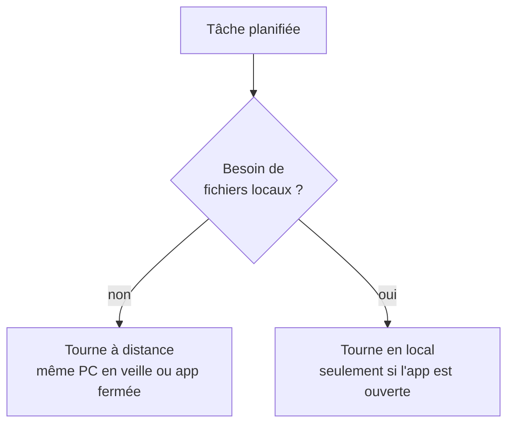

---
tags:
  - projet/claude-skilljar
  - type/concept
  - techno/claude
  - techno/cowork
  - sujet/automatisation
  - statut/a-jour
aliases:
  - Tâches planifiées Cowork
cree: 2026-10-07
maj: 2026-10-07
---

# Cowork — tâches planifiées

> [!abstract] En une phrase
> Une **tâche planifiée** tourne toute seule à l'heure prévue (tous les lundis, tous les matins…), **même si ton PC est en veille ou l'app fermée**. À lire avant : [[00 Cowork]].

---

## ⏰ Où la tâche tourne

Par défaut, la tâche tourne **à distance** : elle n'a pas besoin de ton ordi. **Sauf si elle a besoin de fichiers locaux** : là, elle tourne **en local**, donc seulement **quand l'app est ouverte**.

> [!warning] Piège du quiz
> « La tâche tourne même PC en veille » est vrai, **sauf** quand elle a besoin de fichiers locaux.

---

## 💡 Exemple

> [!example]
> Chaque lundi, une tâche prépare un **récap de la semaine** à partir des tickets et de Slack, et le range dans ton dossier.

---

## 🔗 Liens

- [[00 Cowork]] — la base de Cowork
- [[01 Claude Code et Cowork ensemble]] — enchaîner un récap Cowork avec du travail dans Code
