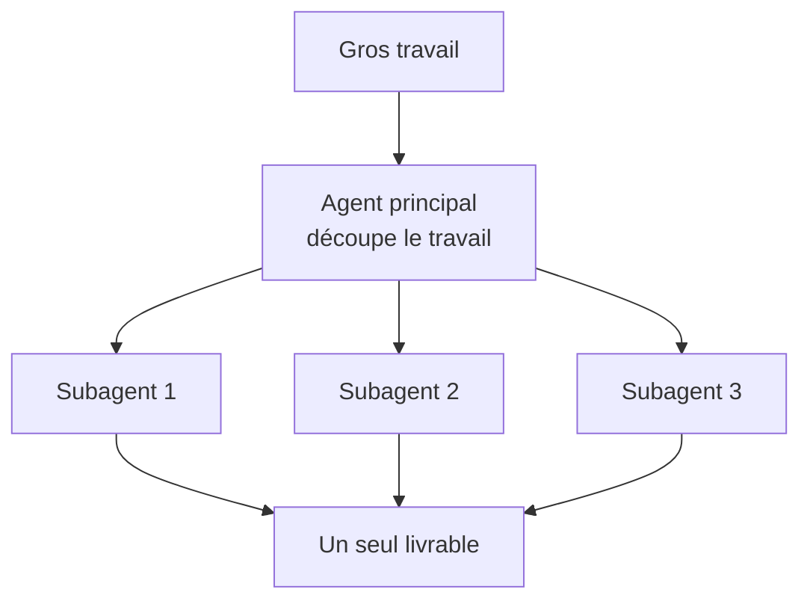

---
tags:
  - projet/claude-skilljar
  - type/concept
  - techno/claude
  - techno/cowork
  - sujet/ia
  - statut/a-jour
aliases:
  - Subagents Cowork
cree: 2026-10-07
maj: 2026-10-07
---

# Cowork — subagents

> [!abstract] En une phrase
> Pour un **gros travail**, l'assistant le découpe entre **plusieurs workers en parallèle**, puis te rend **un seul livrable**. Ces workers s'appellent des **subagents**. À lire avant : [[00 Cowork]].

---

## 🧩 Comment ça marche

Chaque subagent a **son propre contexte** : il ne voit que sa part du travail. Ça évite qu'un seul agent se noie dans tout le dossier.

> [!example] Métaphore
> Un **chef de chantier** répartit les pièces entre plusieurs équipes, puis te remet la maison finie. Tu ne parles qu'au chef.

---

## 🔗 Liens

- [[00 Cowork]] — la base de Cowork
- [[01 Research — la recherche approfondie]] — Research mène aussi plusieurs recherches en parallèle
