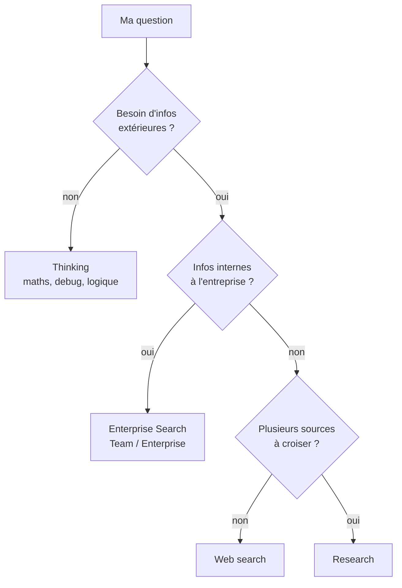

---
tags:
  - projet/claude-skilljar
  - type/index
  - techno/claude
  - sujet/ia
  - sujet/recherche
  - statut/a-jour
aliases:
  - Thinking ou Research
  - Quel outil de recherche
cree: 2026-10-07
maj: 2026-10-09
---

# Chercher de l'info — quel outil choisir

> [!abstract] En une phrase
> Le plus utile à retenir : **quel outil choisir selon ta question**. Raisonner (**Thinking**), chercher vite sur le web (**Web search**), mener une vraie enquête (**Research**) ou fouiller les outils de ton entreprise (**Enterprise Search**).

---

## 🔀 Choisir l'outil

| Outil | Va chercher dehors ? | Pour quoi |
|---|---|---|
| **Thinking** | ❌ | **Raisonner** sur un problème complexe : maths, debug, logique. La réponse vient du **raisonnement**, pas de la collecte |
| **Web search** | ✅ (1 ou 2 sources) | **Un fait précis et rapide** (le cours de bourse du jour, une adresse), quand la **vitesse compte plus que l'exhaustivité** |
| **Research** | ✅ (des dizaines, voire des centaines de sources) | **Collecter et croiser** des infos : comparatifs, rapport avec **citations vérifiables** |
| **Enterprise Search** | ✅ (outils de l'entreprise) | Une question **propre à ton entreprise** : docs, fils Slack, mails, notes de réunion, politiques, processus, décisions passées |

> [!tip] Enterprise Search et l'onboarding
> En phase d'**intégration** dans une boîte, c'est le bon outil pour découvrir vite **comment l'entreprise gère quelque chose**.

> [!warning] Piège du quiz
> **Un bug dans ton code, c'est Thinking, pas Research.** Thinking raisonne sans aller chercher d'info externe ; Research collecte et croise.

> [!warning] Piège de l'exercice
> « Comparez les trois fournisseurs de paie qu'on envisage (tarifs, délai de mise en place, qualité du support), avec des sources vérifiables » → **Research**. Les trois indices y sont : **comparatif**, **plusieurs sources**, **citations**.

---

## 📚 Les notes de la section

- [[01 Research — la recherche approfondie]] — les 4 étapes, la durée, les intégrations
- [[02 Research — bien rédiger son prompt]] — soigner la demande avant de lancer
- [[03 Enterprise Search]] — la recherche dans les outils de l'organisation

---

## 🔗 Liens

- [[claude-skilljar]] — le sommaire
- [[02 Cowork — subagents]] — même idée de travail en parallèle
