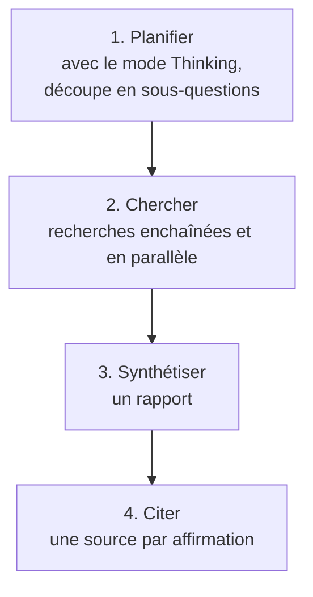

---
tags:
  - projet/claude-skilljar
  - type/concept
  - techno/claude
  - sujet/recherche
  - statut/a-jour
aliases:
  - Research
  - Recherche approfondie
cree: 2026-10-07
maj: 2026-10-09
---

# Research — la recherche approfondie

> [!abstract] En une phrase
> **Research** mène une vraie enquête tout seul : il découpe ta question, lance plein de recherches, puis te rend un **rapport où chaque affirmation est sourcée**. À lire avant : [[00 Chercher de l'info]].

---

## 🕵️ Un investigateur, pas un moteur de recherche

Une recherche web classique, c'est **une requête, une réponse**. Research, lui, **décide tout seul quoi chercher ensuite** à partir de ce qu'il vient de trouver : il suit les pistes prometteuses, comble les trous et **explore plusieurs angles** de ta question sans que tu guides chaque étape. Travailler comme ça, de façon autonome et en plusieurs étapes, c'est être **agentique**.

> [!example] Métaphore
> Un **assistant de recherche** à qui tu confies une question : il rassemble les infos, **recoupe les sources** et compile un rapport pendant que tu continues ton propre travail.

> [!warning] Piège du quiz
> Le mot à retenir, c'est **agentique** : plusieurs recherches qui **s'appuient les unes sur les autres**, et pas une seule recherche.

---

## 🎯 Quand l'utiliser

**Research sert quand une réponse rapide ne suffit pas** : il faut rassembler plusieurs sources, comparer des points de vue et en tirer des conclusions utiles.

| Besoin | Exemples de tâches |
|---|---|
| **Rapport complet** multi-sources | Préparer un **briefing** avec des infos actuelles et vérifiées |
| **Analyse comparative** | Évaluer des **concurrents** ou des **fournisseurs** |
| Un travail qui prendrait **des heures à la main** | **Analyse de marché**, veille concurrentielle |
| Croiser le web **et tes intégrations** | Synthétiser tes **mails, ton agenda et tes docs** |
| Organiser un projet complexe | Un **séminaire d'équipe**, un **lancement produit** |
| Des **citations vérifiables** | Une **doc technique** qui s'appuie sur plusieurs sources |

> [!tip] Le réflexe
> Comparatif + plusieurs sources + citations demandées : **c'est Research**. Pour un fait unique et rapide, voir [[00 Chercher de l'info]].

---

## ⚙️ L'activer

1. Clique sur le bouton **+** en bas à gauche du chat.
2. Choisis **Research** dans le menu : il reste **en surbrillance** une fois actif.
3. Tape ton prompt et valide.
4. Il travaille **en arrière-plan**, avec des **indicateurs de progression**.

> [!warning] Piège du quiz
> **Research ne marche que si Web search est activé.** S'il ne l'est pas, tu l'actives **depuis le même menu +**.

---

## 🔁 Les 4 étapes

Il les enchaîne seul :

| Étape | Le détail |
|---|---|
| **Planifier** | Il s'appuie sur le mode **Thinking** pour découper la question en sous-parties |
| **Chercher** | **Chaque résultat oriente la recherche suivante**. Il peut en mener **en parallèle**, parfois sur **des centaines de sources** |
| **Synthétiser** | Il regroupe tout dans un **rapport** |
| **Citer** | **Une source par affirmation**, pour que tu puisses vérifier |

---

## ⏳ Durée

Compte **quelques minutes, parfois plus**. Il travaille **en arrière-plan** et tu vois sa **progression**.

> [!info] Pourquoi c'est long
> Ce n'est pas **une** recherche : il en lance **beaucoup à la fois**, parfois sur **des centaines de sources**, puis rassemble tout en une seule réponse.

---

## 🔌 Avec tes outils connectés

Research peut **croiser le web et tes intégrations** (Gmail, Calendar, Drive, Slack…).

> [!example] Ce qu'on peut lui demander
> - « Vérifie mes rendez-vous de la semaine prochaine et renseigne-toi sur chaque entreprise. »
> - « Résume ce qui s'est dit sur le Projet X dans mes mails **et sur Slack**, puis cherche les bonnes pratiques du secteur. »
> - « Trouve nos docs internes sur la stratégie tarifaire et **compare-les aux concurrents**. »

Tu peux aussi le **guider explicitement** :
- « Extrais le contexte utile de mon Google Drive. »
- « Inclus les infos de mes mails récents sur ce sujet. »

---

## 🤔 La réflexion de fin de leçon

> [!question] À se poser
> - Quelles recherches, dans mon travail, demandent de rassembler **plusieurs sources** ?
> - Qu'est-ce que Research + mes intégrations changerait dans ma façon de bosser ?
> - **Quelle question complexe ai-je repoussée** parce qu'elle demandait trop de recherche ? C'est le bon candidat pour un premier run.

---

## 🔗 Liens

- [[00 Chercher de l'info]] — Research face aux autres outils
- [[02 Research — bien rédiger son prompt]] — un run coûte des minutes, la demande compte
- [[02 Cowork — subagents]] — même idée de travail en parallèle
- [Utiliser Research (centre d'aide)](https://support.claude.com/en/articles/11088861-using-research-on-claude-ai) — avec tutoriels vidéo
