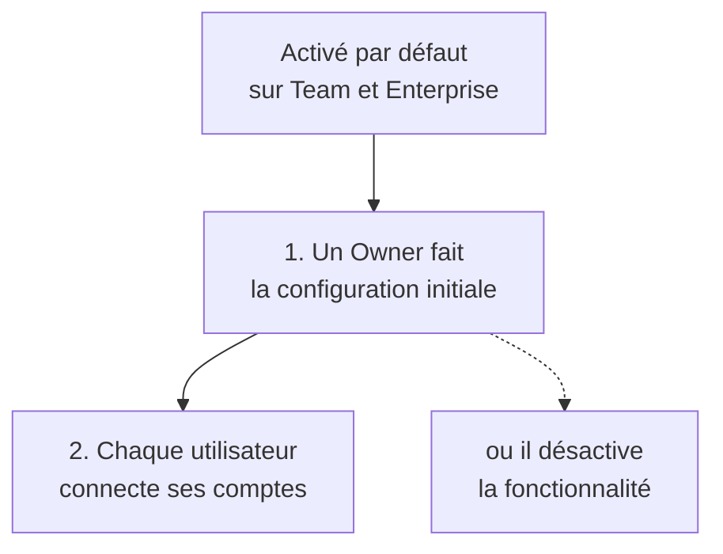

---
tags:
  - projet/claude-skilljar
  - type/concept
  - techno/claude
  - sujet/recherche
  - sujet/securite
  - statut/a-jour
aliases:
  - Enterprise Search
  - Ask Nom de l'org
cree: 2026-10-07
maj: 2026-10-07
---

# Enterprise Search

> [!abstract] En une phrase
> Un **projet préconfiguré pour toute l'organisation**, optimisé pour retrouver une info dans les outils de l'entreprise (docs, messagerie, mails). **Plans Team et Enterprise uniquement.** À lire avant : [[00 Chercher de l'info]].

> [!note] Pour moi
> Sur un plan **Pro ou Max**, la leçon dit qu'on peut la **sauter**.

---

## 🧩 Ce que c'est

Il apparaît dans la barre latérale sous le nom **« Ask [Nom de l'org] »**, **épinglé en favori**.

Par rapport à une conversation normale avec des connecteurs, la différence : il est **optimisé pour la recherche d'info**, avec des **instructions spécifiques écrites par Anthropic**.

---

## ⚙️ La configuration, en deux temps

> [!warning] Piège du quiz
> **Activé par défaut, mais pas utilisable tout de suite** : un **Owner** doit d'abord faire la configuration initiale. Il peut aussi choisir de la **désactiver** à ce moment-là.

### 1. Côté admin

| Connecteur | Statut |
|---|---|
| **Documents** : Google Drive **ou** SharePoint | **Obligatoire** |
| **Messagerie instantanée** : Slack **ou** Teams | **Obligatoire** |
| **Email** | Recommandé, facultatif |
| Autres | Ajoutables avec **+ Ajouter** |

Le **nom** choisi par l'admin s'affiche chez tout le monde sous la forme **« Ask [Nom] »**.

### 2. Côté utilisateur

Chacun **s'authentifie avec ses propres comptes**. **Plus tu branches de services, plus les réponses sont complètes.** Pour en ajouter plus tard : section **Instructions** du projet → bouton **Connecter**.

---

## 🔐 Sécurité

> [!info] Les trois points à retenir
> 1. Tu ne vois **que ce à quoi tu as déjà accès** dans l'outil d'origine.
> 2. Tes conversations restent **privées**.
> 3. Les données ne sont **ni indexées ni stockées à part** : l'outil interroge les services **en direct**.

---

## 🔗 Liens

- [[00 Chercher de l'info]] — Enterprise Search face aux autres outils
- [[01 Research — la recherche approfondie]] — Research aussi peut utiliser tes connecteurs
