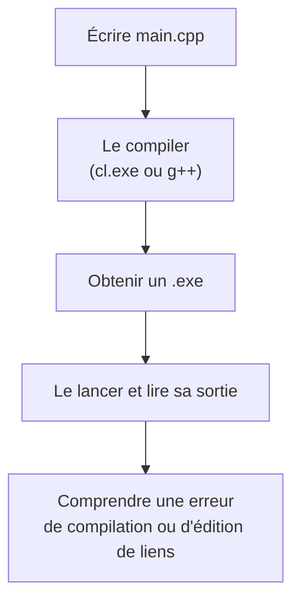

---
tags:
  - projet/cpp
  - type/index
  - techno/cpp
  - statut/a-jour
aliases:
  - C++ — démarrer
cree: 2026-10-04
maj: 2026-10-04
---

# Démarrer en C++

> [!abstract] En une phrase
> Avant d'écrire du « vrai » code, il faut comprendre **ce qu'est un langage compilé**, installer les **outils** (compilateur, CMake, vcpkg, un éditeur) et réussir à transformer un fichier `.cpp` en programme qui se lance.

---

## 🧭 Ce que tu sauras faire à la fin

---

## 📚 Notes de la section

| Note | Contenu |
|---|---|
| [[01 C++ c'est quoi]] | Langage compilé, rapide, proche de la machine : ce que ça implique pour toi |
| [[02 Installer les outils C++]] | Visual Studio Build Tools, CMake, Ninja, vcpkg, Node.js, CLion ou VS Code |
| [[03 Premier programme]] | `main()`, `std::println`, compiler à la main, lancer |
| [[04 De la source à l'exe]] | Les trois étapes : préprocesseur, compilation, édition de liens |

---

## 🔗 Liens

- [[cpp]] — accueil du vault
- [[00 Le langage C++]] — la suite : les bases du langage
