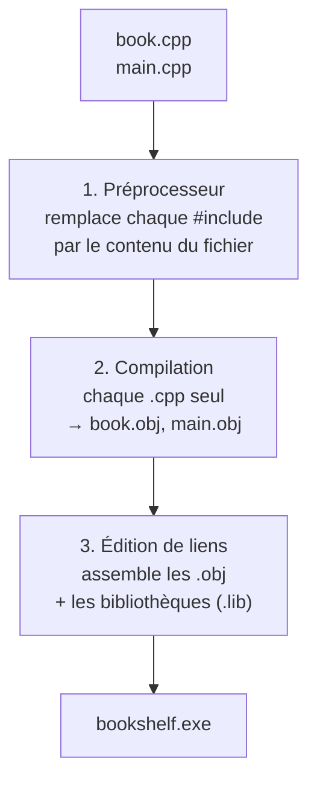

---
tags:
  - projet/cpp
  - type/concept
  - techno/cpp
  - sujet/compilation
  - statut/a-jour
aliases:
  - Compilation et édition de liens
  - Chaîne de compilation C++
cree: 2026-10-04
maj: 2026-10-04
---

# De la source à l'exe

> [!abstract] En une phrase
> Transformer des `.cpp` en `.exe` se fait en **trois étapes** : le **préprocesseur** colle les `#include`, le **compilateur** traduit **chaque `.cpp` séparément** en fichier objet, puis l'**éditeur de liens** assemble tous les objets et les bibliothèques en un seul exécutable. Savoir quelle étape échoue, c'est savoir corriger l'erreur.

---

## 🔁 Les trois étapes

### 1. Le préprocesseur

Il traite les lignes qui commencent par `#` :

| Directive | Effet |
|---|---|
| `#include "book.hpp"` | Copie-colle le fichier à cet endroit |
| `#pragma once` | « Ne m'inclus qu'une fois par `.cpp` », voir [[08 Fichiers hpp et cpp]] |
| `#define NOMINMAX` | Définit une **macro** (un remplacement de texte) |
| `#ifdef NDEBUG … #endif` | Garde ou retire du code selon la configuration (`NDEBUG` = release) |

### 2. La compilation

Chaque `.cpp` (avec tout ce qu'il a inclus) s'appelle une **unité de traduction**. Le compilateur la traduit **seule**, sans regarder les autres `.cpp`. Il vérifie la syntaxe et les **types**.

> [!example] Les chapitres d'un livre
> Chaque traducteur traduit **un** chapitre. Il a juste besoin du **sommaire** (les en-têtes) pour savoir que « le chapitre 4 parle de `validate()` ». Il n'a pas besoin du chapitre 4 lui-même.

### 3. L'édition de liens

L'**éditeur de liens** (*linker*, `link.exe` ou `ld`) rassemble tous les `.obj`, trouve **où est définie** chaque fonction utilisée, et ajoute le code des bibliothèques.

---

## 🧯 Reconnaître l'étape qui échoue

| Message | Étape | Cause habituelle |
|---|---|---|
| `fatal error C1083: Cannot open include file: 'glaze/json.hpp'` | Préprocesseur | Bibliothèque pas installée, ou cible CMake pas liée |
| `error C2065: 'book' : identificateur non déclaré` | Compilation | Faute de frappe, include manquant, mauvais `namespace` |
| `error C2664: impossible de convertir l'argument 1` | Compilation | Mauvais type passé à une fonction |
| `LNK2019: symbole externe non résolu "validate"` | **Édition de liens** | Fonction déclarée dans le `.hpp` mais **pas définie** (ou `.cpp` pas listé dans CMake, ou bibliothèque pas liée) |
| `LNK2005: "x" déjà défini dans a.obj` | Édition de liens | Une variable ou fonction **définie** dans un `.hpp` inclus par deux `.cpp` (il manque `inline`) |

> [!tip] La règle pour `LNK2019`
> 1. La fonction a-t-elle un **corps** quelque part ? 2. Le `.cpp` qui la contient est-il dans `add_library(...)` ? 3. La cible qui l'utilise fait-elle `target_link_libraries(... cette_bibliothèque)` ? Voir [[01 CMake — les bases]].

---

## 📦 Bibliothèques statiques et dynamiques

| | Statique (`.lib` / `.a`) | Dynamique (`.dll` / `.so`) |
|---|---|---|
| Quand le code est ajouté | À l'édition de liens, **dans** l'exe | Au lancement, chargé depuis un fichier à côté |
| Ce qu'on livre | Un seul `.exe` | L'exe **et** les DLL |
| Ce que cette doc choisit | **Statique** : un seul fichier à livrer | — |

Voir [[04 vcpkg — les dépendances]] (triplet `x64-windows-static`).

---

## 🔗 Liens

- [[08 Fichiers hpp et cpp]] — déclaration ou définition
- [[01 CMake — les bases]] — décrire les étapes une fois pour toutes
- [[02 Erreurs fréquentes C++]] — la liste complète
