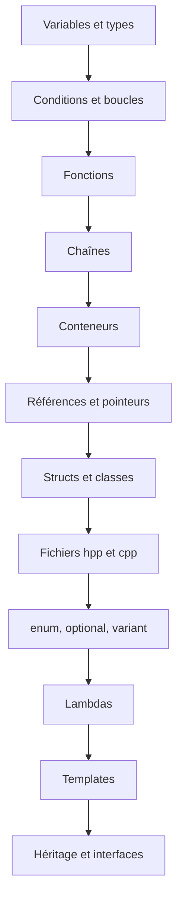

---
tags:
  - projet/cpp
  - type/index
  - techno/cpp
  - statut/a-jour
aliases:
  - C++ — le langage
cree: 2026-10-04
maj: 2026-10-04
---

# Le langage C++

> [!abstract] En une phrase
> Les briques de base du langage : variables, conditions, fonctions, textes, listes, classes, fichiers d'en-tête. Tout ce qu'il faut pour **lire** le code des sections suivantes. À lire avant : [[03 Premier programme]].

---

## 📚 Notes de la section

| Note | Contenu |
|---|---|
| [[01 Variables et types]] | `int`, `double`, `bool`, `auto`, `const`, les entiers de taille fixe |
| [[02 Conditions et boucles]] | `if`, `switch`, `for`, `for` sur une collection, `while` |
| [[03 Fonctions]] | Paramètres par valeur, par référence, par référence constante, surcharge |
| [[04 Chaînes de caractères]] | `std::string`, `std::string_view`, `std::format`, UTF-8 |
| [[05 Conteneurs de la STL]] | `vector`, `array`, `map`, `unordered_map`, `set`, `deque` |
| [[06 Références et pointeurs]] | `&`, `*`, `nullptr`, quand utiliser quoi |
| [[07 Structs et classes]] | Membres, constructeurs, liste d'initialisation, `public` / `private` |
| [[08 Fichiers hpp et cpp]] | Déclarer dans le `.hpp`, définir dans le `.cpp`, `namespace` |
| [[09 enum, optional et variant]] | Un choix parmi plusieurs, une valeur facultative |
| [[10 Lambdas]] | Petites fonctions écrites sur place, captures |
| [[11 Templates]] | Une fonction ou une classe pour plusieurs types |
| [[12 Héritage et interfaces]] | `virtual`, `override`, classes abstraites, `= 0` |

---

## 🧭 Ordre de lecture

---

## 🔗 Liens

- [[cpp]] — accueil du vault
- [[00 La mémoire en C++]] — la suite
