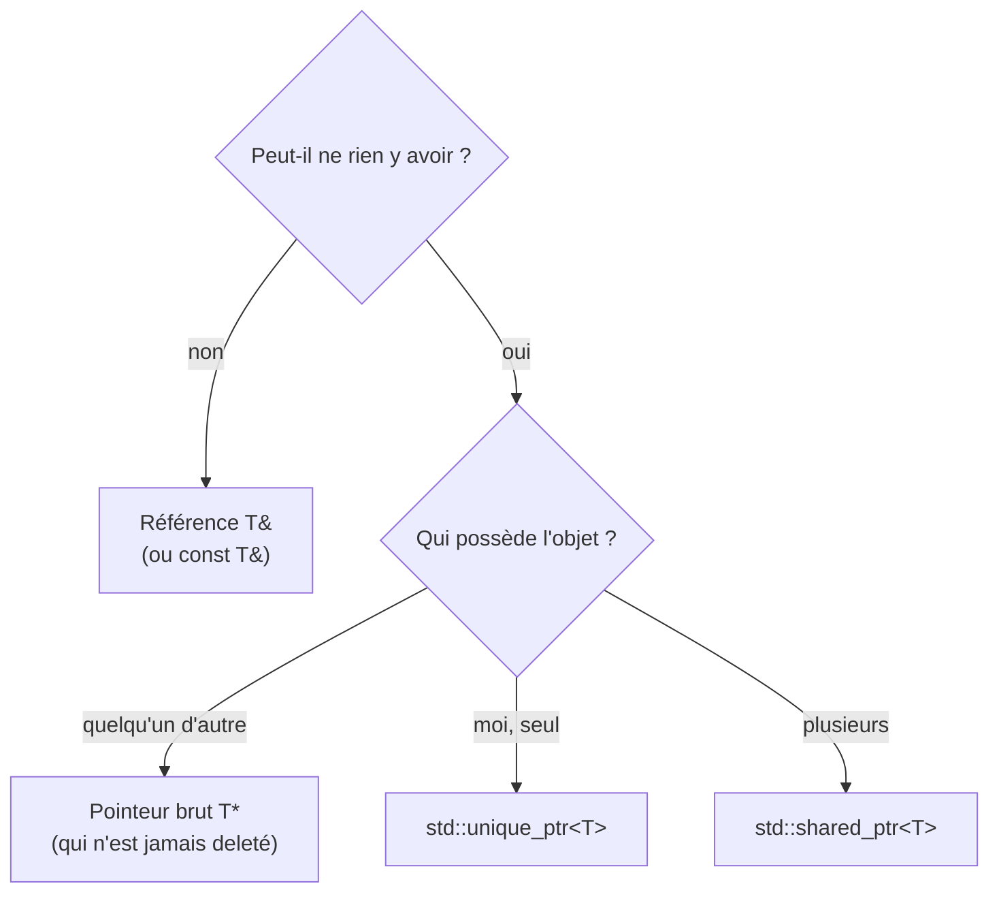

---
tags:
  - projet/cpp
  - type/concept
  - techno/cpp
  - sujet/memoire
  - statut/a-jour
aliases:
  - Pointeurs C++
  - Références C++
cree: 2026-10-04
maj: 2026-10-04
---

# Références et pointeurs

> [!abstract] En une phrase
> Une **référence** (`T&`) est un **autre nom** pour un objet qui existe déjà ; un **pointeur** (`T*`) est une **adresse** qui peut être vide (`nullptr`) et changer de cible. Règle : **une référence par défaut**, un pointeur seulement quand « rien » est une valeur possible, et **jamais de `new` / `delete` à la main** (voir [[03 Pointeurs intelligents]]).

---

## 🏷️ La référence : un surnom

```cpp
std::string title = "Dune";
std::string& alias = title;   // alias EST title
alias += " !";
std::println("{}", title);    // « Dune ! »
```

- Elle doit être **initialisée** tout de suite.
- Elle ne peut **jamais** changer de cible ni être vide.

C'est ce qu'on utilise pour passer un paramètre sans copie ([[03 Fonctions]]) et pour qu'un service **utilise** un dépôt qu'il ne possède pas :

```cpp
class BookService
{
    IBooks& books_;   // 👈 le service utilise le dépôt, il ne le crée pas, il ne le détruit pas
};
```

---

## 📍 Le pointeur : une adresse

```cpp
int value = 42;
int* address = &value;   // & devant une variable = « l'adresse de »
*address = 7;            // * devant un pointeur = « ce qui est à cette adresse »
// value vaut 7

int* nothing = nullptr;  // ne pointe sur rien
if (nothing != nullptr) { /* ... */ }
```

| Symbole | Dans une **déclaration** | Dans une **expression** |
|---|---|---|
| `&` | `T&` : référence | `&x` : adresse de `x` |
| `*` | `T*` : pointeur | `*p` : l'objet pointé |
| `->` | — | `p->title` = `(*p).title` |

---

## 🤔 Lequel choisir



> [!tip] Un pointeur brut ne possède rien
> Dans du C++ moderne, `T*` veut dire « je regarde, je ne libère pas ». Ce qui **possède** est toujours un objet RAII : un conteneur, un `unique_ptr`… Voir [[02 RAII]].

Pour « une valeur peut-être absente » (pas un objet qui existe ailleurs), on préfère `std::optional<T>` à un pointeur : [[09 enum, optional et variant]].

---

## ⚠️ Pièges

| Symptôme | Cause | Solution |
|---|---|---|
| Plantage « access violation » | On utilise un pointeur `nullptr` | Tester avant, ou utiliser une référence |
| Valeurs bizarres, plantage aléatoire | Référence / pointeur vers un objet **déjà détruit** | Voir [[05 Durée de vie et pièges]] |
| Fuite de mémoire | `new` sans `delete` | Jamais de `new` : `std::make_unique` |

---

## 🔗 Liens

- [[07 Structs et classes]] — la suite
- [[01 Pile et tas]] — où vivent les objets pointés
