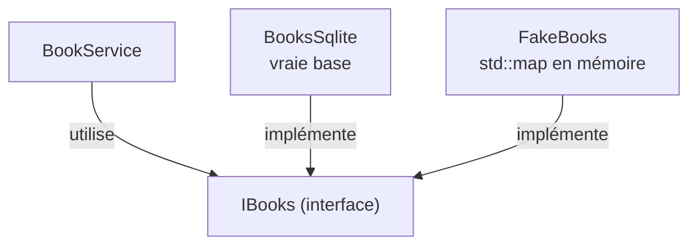

---
tags:
  - projet/cpp
  - type/concept
  - techno/cpp
  - sujet/architecture
  - statut/a-jour
aliases:
  - Interfaces C++
  - virtual override
cree: 2026-10-04
maj: 2026-10-04
---

# Héritage et interfaces

> [!abstract] En une phrase
> Le C++ n'a pas de mot-clé `interface` : on écrit une **classe abstraite**, dont toutes les méthodes sont `virtual ... = 0`. Les vraies classes en **héritent** et écrivent chaque méthode avec `override`. Le code qui n'utilise que l'interface peut alors recevoir **n'importe quelle** implémentation : la vraie base de données ou un faux en mémoire pour les tests.

---

## 🧩 Déclarer une interface

```cpp
class IBooks
{
public:
    IBooks() = default;
    IBooks(const IBooks&) = delete;              // 👈 une interface ne se copie pas
    IBooks& operator=(const IBooks&) = delete;
    virtual ~IBooks() = default;                 // 👈 OBLIGATOIRE : destructeur virtuel

    [[nodiscard]] virtual Id<Book> create(const Book& book) = 0;   // 👈 = 0 : « à écrire par les filles »
    [[nodiscard]] virtual std::optional<Book> get(Id<Book> id) = 0;
    [[nodiscard]] virtual bool update(const Book& book) = 0;
    [[nodiscard]] virtual bool remove(Id<Book> id) = 0;
    [[nodiscard]] virtual std::vector<Book> list(std::string_view search) = 0;
};
```

| Code | Pourquoi |
|---|---|
| `virtual` | La méthode appelée sera celle **de l'objet réel**, pas celle du type de la variable |
| `= 0` | Méthode **pure** : la classe est abstraite, on ne peut pas créer un `IBooks` |
| `virtual ~IBooks()` | Détruire un objet via un `IBooks*` appelle bien le destructeur de la fille |
| `= delete` sur la copie | Copier « un `IBooks` » n'a pas de sens et couperait l'objet en deux |
| Préfixe `I` | Convention : on voit tout de suite que c'est une interface |

---

## 🛠️ Implémenter

```cpp
class BooksSqlite : public IBooks           // 👈 « est un » IBooks
{
public:
    explicit BooksSqlite(Connection& connection);

    Id<Book> create(const Book& book) override;    // 👈 override : le compilateur vérifie
    std::optional<Book> get(Id<Book> id) override;
    bool update(const Book& book) override;
    bool remove(Id<Book> id) override;
    std::vector<Book> list(std::string_view search) override;

private:
    Connection& connection_;
};
```

> [!tip] Toujours `override`
> Si tu te trompes d'une lettre ou d'un `const` dans la signature, sans `override` tu crées une **nouvelle** méthode et la vraie n'est jamais appelée. Avec `override`, c'est une erreur de compilation.

---

## 🔌 Utiliser l'interface

```cpp
class BookService
{
public:
    BookService(IBooks& books, const IClock& clock);   // 👈 ne connaît que les interfaces
private:
    IBooks& books_;
};

// Dans l'application :
BooksSqlite booksSqlite{connection};
BookService service{booksSqlite, clock};

// Dans un test :
FakeBooks fakeBooks;
BookService service{fakeBooks, fixedClock};
```



C'est ce qu'on appelle un **port** en architecture : voir [[03 Les ports (interfaces)]].

---

## 🤔 Quand créer une interface

| Situation | Interface ? |
|---|---|
| Il y aura **deux implémentations** (vraie + fausse pour les tests) : base, horloge, fichiers, boîtes de dialogue | ✅ Oui |
| Une seule implémentation, testable telle quelle (un service, une règle du domaine) | ❌ Non, une classe concrète suffit |

> [!warning] Pas d'héritage « pour réutiliser du code »
> L'héritage sert à **substituer** une implémentation. Pour réutiliser du code, on appelle une fonction ou on met un objet en membre (**composition**).

---

## 🔗 Liens

- [[03 Les ports (interfaces)]] — les interfaces dans l'architecture
- [[02 Tester un service avec des faux]] — la deuxième implémentation
- [[00 La mémoire en C++]] — la suite
