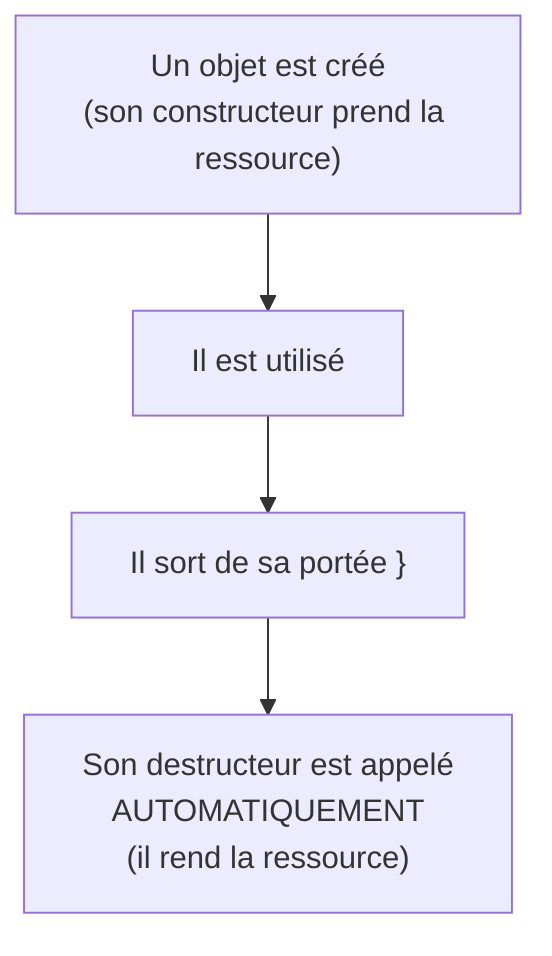

---
tags:
  - projet/cpp
  - type/index
  - techno/cpp
  - sujet/memoire
  - statut/a-jour
aliases:
  - C++ — mémoire
cree: 2026-10-04
maj: 2026-10-04
---

# La mémoire en C++

> [!abstract] En une phrase
> En C++, il n'y a pas de ramasse-miettes : **chaque objet est détruit à un moment précis**, connu à l'avance. Bien utilisé (RAII, pointeurs intelligents, conteneurs), c'est un **avantage** : les fichiers, connexions et verrous se libèrent tout seuls, au bon moment.

---

## 🧠 L'idée en une image

---

## 📚 Notes de la section

| Note | Contenu |
|---|---|
| [[01 Pile et tas]] | Les deux endroits où vivent les objets |
| [[02 RAII]] | Lier une ressource à la vie d'un objet : **l'idée centrale** |
| [[03 Pointeurs intelligents]] | `unique_ptr`, `shared_ptr`, `make_unique`, supprimeur personnalisé |
| [[04 Copie et déplacement]] | `std::move`, règle de zéro, règle de cinq, `= delete` |
| [[05 Durée de vie et pièges]] | Références pendantes, comportement indéfini, et comment les détecter |

---

## 📏 Les 5 règles à retenir

1. **Jamais de `new` / `delete`** dans ton code : `std::make_unique`, ou un conteneur.
2. **Toute ressource** (fichier, connexion, verrou) est gardée par un objet dont le **destructeur** la libère.
3. Un pointeur ou une référence **brut** ne possède jamais rien : il regarde.
4. Ne garde **jamais** une référence, un pointeur ou un `string_view` vers quelque chose qui peut mourir avant toi.
5. En debug, compile avec **AddressSanitizer** ([[07 Déboguer et sanitizers]]) : il attrape les erreurs mémoire.

---

## 🔗 Liens

- [[cpp]] — accueil du vault
- [[00 C++ moderne]] — la suite
