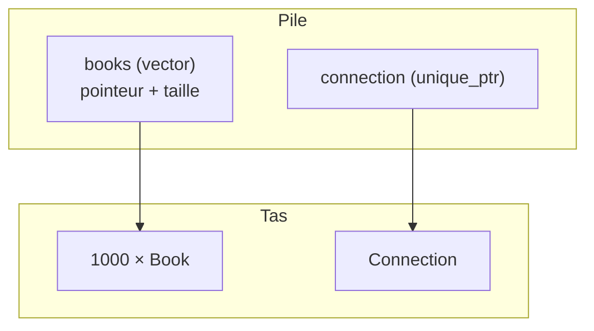

---
tags:
  - projet/cpp
  - type/concept
  - techno/cpp
  - sujet/memoire
  - statut/a-jour
aliases:
  - Stack et heap
cree: 2026-10-04
maj: 2026-10-04
---

# Pile et tas

> [!abstract] En une phrase
> Les variables locales vivent sur la **pile** (*stack*) : rapide, automatique, détruit à la fin du bloc. Ce qui doit vivre plus longtemps ou dont la taille est inconnue va sur le **tas** (*heap*), mais toujours **gardé par un objet de la pile** (un `vector`, un `unique_ptr`) qui le libère pour toi.

---

## 📚 La pile

```cpp
void example()
{
    int count = 3;            // sur la pile
    Book book{.title = "Dune"};  // sur la pile (la struct)
}   // 👈 book puis count sont détruits ici, dans l'ordre inverse
```

> [!example] La pile d'assiettes
> Chaque appel de fonction pose une assiette (ses variables). En sortant, on enlève l'assiette du dessus. C'est automatique et très rapide, mais l'assiette disparaît quand la fonction se termine.

---

## 🏔️ Le tas

```cpp
std::vector<Book> books(1000);   // l'objet vector est sur la pile...
                                 // ...ses 1000 livres sont sur le TAS
auto connection = std::make_unique<Connection>(path);   // la Connection est sur le tas
```



Quand `books` et `connection` sortent de la portée, leurs destructeurs libèrent ce qu'ils ont sur le tas. **Tu n'écris jamais la libération.**

---

## 🤔 Où mettre un objet

| Besoin | Solution |
|---|---|
| Un objet utilisé dans la fonction | Variable locale (pile) |
| Une liste de taille variable | `std::vector` |
| Un objet qui doit survivre à la fonction | Le **renvoyer par valeur** (c'est gratuit) |
| Un objet polymorphe (on ne connaît que son interface) | `std::unique_ptr<IInterface>` |
| Un objet **optionnel**, créé plus tard | `std::optional<T>` (sur la pile !) |
| Un très gros objet | Tas, via `unique_ptr` (la pile fait ~1 Mo) |

---

## 🔗 Liens

- [[02 RAII]] — comment le tas est libéré automatiquement
- [[03 Pointeurs intelligents]] — `unique_ptr` en détail
