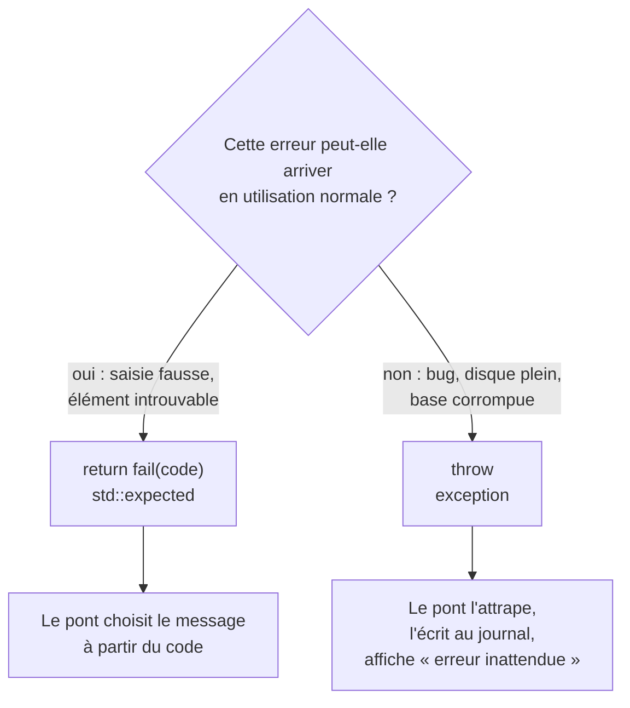

---
tags:
  - projet/cpp
  - type/concept
  - techno/cpp
  - sujet/erreurs
  - statut/a-jour
aliases:
  - std::expected
  - Result C++
  - Exceptions C++
cree: 2026-10-04
maj: 2026-10-04
---

# Gérer les erreurs : `expected` et exceptions

> [!abstract] En une phrase
> Deux sortes d'erreurs, deux outils. Ce qui est **prévu** (titre vide, livre introuvable, mauvais mot de passe) est **renvoyé** dans un **`std::expected<T, Error>`** avec un **code stable**. Ce qui est **imprévu** (disque plein, requête SQL fausse) est une **exception**, attrapée à un seul endroit : le [[06 Le pont côté C++|pont]], qui la journalise et affiche un message générique.

---

## 🧭 La règle



---

## 📦 `std::expected<T, E>` (C++23)

Une boîte qui contient **soit** une valeur `T`, **soit** une erreur `E`.

```cpp
#include <expected>

std::expected<int, std::string> parseAge(std::string_view text);

auto age = parseAge("42");
if (age)                       // succès ?
{
    std::println("{}", *age);  // la valeur
}
else
{
    std::println("{}", age.error());   // l'erreur
}
```

---

## 🧱 Le `Result<T>` du projet

`src/domain/common/result.hpp` :

```cpp
#pragma once

#include <expected>
#include <string>
#include <string_view>
#include <utility>

namespace bookshelf::domain
{

// Échec prévu d'une opération (livre introuvable, titre vide…).
// `code` est stable : l'interface s'en sert pour choisir le message à afficher.
// `detail` est technique : il part au journal, jamais à l'écran.
struct Error
{
    std::string_view code;
    std::string detail;
};

// Soit une valeur T, soit une Error. Remplace « return null » et les exceptions prévues.
template <typename T>
using Result = std::expected<T, Error>;

// Raccourci pour écrire `return fail(errors::BookNotFound);`
[[nodiscard]] inline std::unexpected<Error> fail(std::string_view code, std::string detail = {})
{
    return std::unexpected(Error{.code = code, .detail = std::move(detail)});
}

} // namespace bookshelf::domain
```

| Code | Pourquoi |
|---|---|
| `std::string_view code` | Le code pointe vers une **constante** (elle vit toujours) : pas de copie |
| `std::string detail` | Un texte fabriqué au moment de l'erreur : il doit être **possédé** |
| `using Result = std::expected<T, Error>` | Un nom court, partout pareil |
| `fail(...)` | `return fail(x);` se lit comme une phrase |

### Les codes d'erreur stables

`src/domain/common/errors.hpp` :

```cpp
#pragma once

#include <string_view>

// Codes d'erreur stables : une fois livrés, ils ne changent plus jamais de sens.
namespace bookshelf::domain::errors
{

inline constexpr std::string_view BookNotFound = "book.not_found";
inline constexpr std::string_view BookTitleMissing = "book.title_missing";
inline constexpr std::string_view BookTitleTooLong = "book.title_too_long";
inline constexpr std::string_view BookYearInvalid = "book.year_invalid";

inline constexpr std::string_view BridgeInvalidRequest = "bridge.invalid_request";
inline constexpr std::string_view BridgeUnknownFunction = "bridge.unknown_function";
inline constexpr std::string_view Unexpected = "system.unexpected";

} // namespace bookshelf::domain::errors
```

> [!tip] Pourquoi un code texte plutôt qu'un message ?
> Le domaine ne sait pas **comment** l'erreur sera montrée (quelle langue, quel ton). Il donne un **code** ; c'est la couche d'entrée ([[06 Le pont côté C++|le pont]]) qui le traduit en phrase. Le frontend peut aussi réagir à un code précis (`book.not_found` → revenir à la liste).

---

## ✍️ Écrire et enchaîner

```cpp
// Renvoyer un succès
Result<Book> validate(Book book)
{
    if (book.title.empty())
    {
        return fail(errors::BookTitleMissing);   // 👈 échec
    }
    return book;                                 // 👈 succès : conversion automatique
}

// Pas de valeur à renvoyer : Result<void>
Result<void> BookService::remove(Id<Book> id)
{
    if (!books_.remove(id))
    {
        return fail(errors::BookNotFound);
    }
    return {};                                   // 👈 succès « vide »
}

// Transmettre l'erreur d'un appel
Result<Id<Book>> BookService::add(NewBook request)
{
    auto book = validate({ /* ... */ });
    if (!book)
    {
        return std::unexpected(book.error());    // 👈 on fait remonter la même erreur
    }
    return books_.create(*book);
}
```

| Écriture | Sens |
|---|---|
| `if (r)` / `r.has_value()` | Succès ? |
| `*r` / `r->membre` | La valeur |
| `r.error()` | L'erreur (seulement si échec) |
| `r.value_or(x)` | La valeur ou `x` |
| `r.transform(f)` | Transforme la valeur si succès |
| `r.and_then(f)` | Enchaîne une autre opération qui renvoie un `expected` |

---

## 💥 Les exceptions : pour l'imprévu

```cpp
class SqliteError : public std::runtime_error
{
public:
    SqliteError(int code, const std::string& message);
};

throw SqliteError(code, sqlite3_errmsg(db));
```

Elles sont attrapées **une seule fois**, au plus haut niveau :

```cpp
std::string Bridge::handle(std::string_view message) noexcept
{
    try
    {
        // ... appelle le service ...
    }
    catch (const std::exception& error)
    {
        log_(function, error.what());       // le détail au journal
    }
    catch (...)
    {
        log_(function, "exception inconnue");
    }
    return failure(id, errors::Unexpected);  // un message générique à l'écran
}
```

> [!warning] Ne pas attraper partout
> Un `try / catch` au milieu du code qui « avale » l'erreur cache les bugs. **Un seul** endroit attrape : la frontière avec l'extérieur (le pont, `main`, la boucle d'un fil).

> [!warning] Un destructeur ne lève jamais
> Si une exception sort d'un destructeur pendant qu'une autre remonte, le programme s'arrête net. Voir [[02 RAII]].

---

## 📋 Résumé

| Situation | Outil |
|---|---|
| Saisie invalide, élément introuvable, règle métier refusée | `return fail(errors::Xxx);` |
| « Pas trouvé » sans explication | `std::optional<T>` |
| Bug, base corrompue, disque plein, mémoire épuisée | `throw` (ou laisser la bibliothèque lever) |
| Frontière avec l'extérieur | `try / catch` + journal + message générique |

---

## 🔗 Liens

- [[06 Le pont côté C++]] — où les codes deviennent des phrases
- [[02 Types forts]] — la suite
