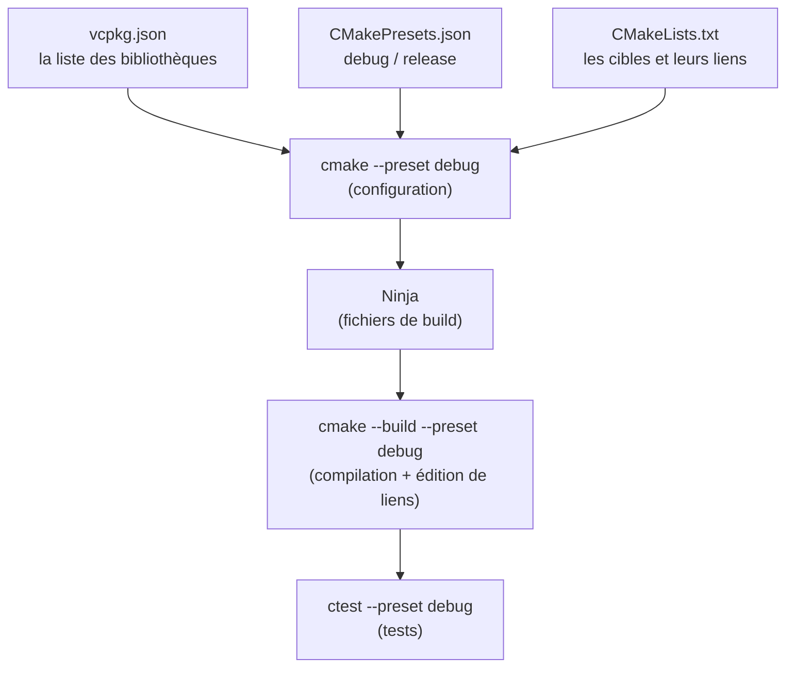

---
tags:
  - projet/cpp
  - type/index
  - techno/cpp
  - techno/cmake
  - sujet/build
  - statut/a-jour
aliases:
  - C++ — build
cree: 2026-10-04
maj: 2026-10-04
---

# Construire un projet C++

> [!abstract] En une phrase
> Dès qu'un projet a plus d'un fichier, on ne compile plus à la main : **CMake** décrit le projet (quels fichiers, quelles bibliothèques), **vcpkg** télécharge et compile les bibliothèques, les **presets** donnent une commande toute prête par configuration, et **clang-format / clang-tidy** gardent le code propre.

---

## 🔁 La chaîne complète



Les trois commandes à connaître par cœur :

```powershell
cmake --preset debug           # configurer (une fois, ou quand un CMakeLists change)
cmake --build --preset debug   # compiler
ctest --preset debug           # lancer les tests
```

---

## 📚 Notes de la section

| Note | Contenu |
|---|---|
| [[01 CMake — les bases]] | `project`, `add_executable`, `add_library`, `target_link_libraries`, `PUBLIC` / `PRIVATE` |
| [[02 CMake — une bibliothèque par couche]] | L'arborescence complète d'un vrai projet, fichier par fichier |
| [[03 CMakePresets]] | Les configurations prêtes à l'emploi, lues par CLion |
| [[04 vcpkg — les dépendances]] | `vcpkg.json`, les versions figées, le triplet statique |
| [[05 Options de compilation et avertissements]] | `/W4 /WX`, une cible d'options partagée |
| [[06 clang-format et clang-tidy]] | Le style automatique et l'analyse statique |
| [[07 Déboguer et sanitizers]] | Points d'arrêt, AddressSanitizer, les DevTools de la webview |
| [[08 Script de vérification avant commit]] | Tout vérifier en une commande |

> [!tip] Le projet modèle
> Tous les fichiers de cette section existent en vrai dans `_projet-exemple/bookshelf/`. Tu peux copier ce dossier pour démarrer une nouvelle application.

---

## 🔗 Liens

- [[cpp]] — accueil du vault
- [[00 Architecture C++]] — la suite
