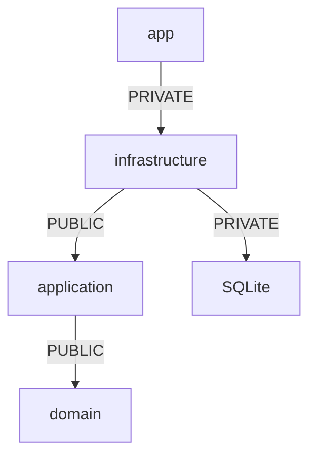

---
tags:
  - projet/cpp
  - type/concept
  - techno/cmake
  - sujet/build
  - statut/a-jour
aliases:
  - CMake
  - CMakeLists.txt
cree: 2026-10-04
maj: 2026-10-04
---

# CMake — les bases

> [!abstract] En une phrase
> **CMake** lit des fichiers `CMakeLists.txt` qui décrivent des **cibles** (un exe, une bibliothèque) avec leurs sources et leurs liens, puis génère les fichiers pour un outil de build (**Ninja**). Tout tourne autour de trois commandes : `add_library`, `add_executable`, `target_link_libraries`.

---

## 🧱 Le plus petit projet

```text
mon-projet/
├─ CMakeLists.txt
└─ main.cpp
```

```cmake
cmake_minimum_required(VERSION 3.28)
project(hello VERSION 0.1.0 LANGUAGES CXX)

set(CMAKE_CXX_STANDARD 23)
set(CMAKE_CXX_STANDARD_REQUIRED ON)

add_executable(hello main.cpp)
```

```powershell
cmake -S . -B build -G Ninja      # configurer : -S sources, -B dossier de build
cmake --build build               # compiler
.\build\hello.exe
```

| Ligne | Pourquoi |
|---|---|
| `cmake_minimum_required` | La version de CMake dont on a besoin |
| `project(...)` | Le nom, la version (récupérable dans `PROJECT_VERSION`), le langage |
| `CMAKE_CXX_STANDARD 23` | Compile en C++23 |
| `add_executable(hello main.cpp)` | Une **cible** : l'exe `hello`, fabriqué à partir de `main.cpp` |

> [!info] Le dossier `build/`
> Tout ce que génère CMake va dans `build/`. On ne le met **jamais** dans git (`.gitignore`). On peut le supprimer à tout moment pour repartir de zéro.

---

## 📚 Une bibliothèque + un exe

```cmake
add_library(books STATIC
    book.cpp
    book_service.cpp
)
target_include_directories(books PUBLIC "${CMAKE_CURRENT_SOURCE_DIR}")

add_executable(app main.cpp)
target_link_libraries(app PRIVATE books)    # 👈 app utilise books
```

> [!info] Définition — cible (*target*)
> Une **cible** est une chose que CMake fabrique : un exe (`add_executable`) ou une bibliothèque (`add_library`). Chaque cible porte ses **propriétés** : ses sources, ses dossiers d'en-têtes, ses options, ses dépendances. Le CMake moderne ne fait **que** ça : déclarer des cibles et les relier.

---

## 🔑 `PUBLIC`, `PRIVATE`, `INTERFACE`

C'est **la** notion à comprendre. Quand une cible B utilise une cible A, est-ce que les cibles qui utilisent B doivent aussi voir A ?

```cmake
target_link_libraries(bookshelf_application
    PUBLIC bookshelf::domain        # 👈 mes en-têtes incluent ceux du domaine
    PRIVATE bookshelf::options      # 👈 seulement pour me compiler moi
)
```

| Mot | Sens | Exemple |
|---|---|---|
| `PRIVATE` | Je m'en sers **dans mes `.cpp`** seulement | SQLite pour l'infrastructure : personne d'autre ne doit inclure `<sqlite3.h>` |
| `PUBLIC` | Je m'en sers **dans mes `.hpp`** : ceux qui m'incluent en ont besoin aussi | `application` expose des types du `domain` dans ses en-têtes |
| `INTERFACE` | Je ne m'en sers pas, mais **ceux qui me lient** en ont besoin | Une cible « options de compilation » qui n'a pas de source |



Ici, `app` voit `application` et `domain` (transmis par `PUBLIC`), mais **pas** SQLite (gardé `PRIVATE` par l'infrastructure). C'est exactement ce qu'on veut : seule l'infrastructure parle à la base.

---

## 📦 Utiliser une bibliothèque externe

```cmake
find_package(SQLite3 REQUIRED)                         # 1. la trouver
target_link_libraries(bookshelf_infrastructure
    PRIVATE SQLite::SQLite3)                           # 2. la lier
```

`find_package` cherche la bibliothèque (installée par vcpkg, voir [[04 vcpkg — les dépendances]]) et crée une **cible importée** (`SQLite::SQLite3`, `glaze::glaze`…). La lier suffit : les dossiers d'en-têtes et les `.lib` suivent.

---

## 🧰 Les commandes utiles

| Commande | Rôle |
|---|---|
| `add_subdirectory(src)` | Lit `src/CMakeLists.txt` |
| `add_library(x ALIAS y)` | Un autre nom (`bookshelf::domain`) : une faute de frappe devient une erreur |
| `target_compile_options(x PRIVATE /W4)` | Options du compilateur |
| `target_compile_definitions(x PRIVATE NOMINMAX)` | Définit une macro |
| `option(NOM "texte" ON)` | Un interrupteur réglable (`-DNOM=OFF`) |
| `set(VAR valeur)` | Une variable |
| `if(WIN32) ... endif()` | Une condition (`WIN32`, `MSVC`, une option…) |
| `message(STATUS "...")` / `message(FATAL_ERROR "...")` | Afficher / arrêter avec une erreur |
| `configure_file(a.in b @ONLY)` | Copie un fichier en remplaçant `@VARIABLE@` |
| `enable_testing()` + `add_test(...)` | Déclarer des tests pour `ctest` |

---

## ⚠️ Erreurs fréquentes

| Symptôme | Cause | Solution |
|---|---|---|
| `Could not find a package configuration file provided by "glaze"` | Bibliothèque absente de `vcpkg.json`, ou toolchain vcpkg pas utilisée | L'ajouter à `vcpkg.json`, utiliser un preset ([[03 CMakePresets]]) |
| `Cannot open include file` alors que la bibliothèque est installée | `target_link_libraries` oublié, ou lien `PRIVATE` là où il faut `PUBLIC` | Lier la cible, vérifier la visibilité |
| `LNK2019` | `.cpp` pas listé dans `add_library` | L'ajouter |
| Un changement de `CMakeLists.txt` ne semble pas pris | Cache de configuration | `cmake --preset debug` de nouveau, ou supprimer `build/` |

---

## 🔗 Liens

- [[02 CMake — une bibliothèque par couche]] — un vrai projet complet
- [[04 De la source à l'exe]] — ce que CMake orchestre
