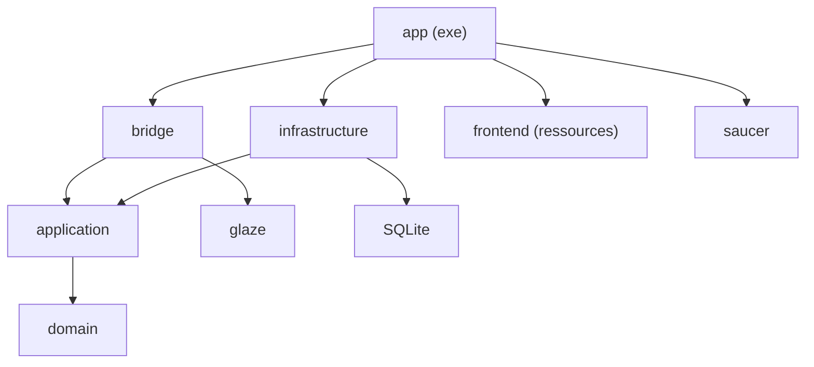

---
tags:
  - projet/cpp
  - type/guide
  - techno/cmake
  - sujet/build
  - sujet/architecture
  - statut/a-jour
aliases:
  - Arborescence CMake
cree: 2026-10-04
maj: 2026-10-04
---

# CMake — une bibliothèque par couche

> [!abstract] En une phrase
> Chaque **couche** de l'architecture ([[01 Les couches et la règle des dépendances]]) devient une **bibliothèque statique** CMake qui ne lie que les couches **en dessous** d'elle. Si quelqu'un essaie d'utiliser la base de données depuis le domaine, **ça ne compile pas**. À lire avant : [[01 CMake — les bases]].

---

## 🌳 L'arborescence

```text
bookshelf/
├─ CMakeLists.txt            le projet, les options, le standard
├─ CMakePresets.json         debug / release / tidy
├─ vcpkg.json                les bibliothèques
├─ .clang-format · .clang-tidy · .editorconfig · .gitignore
├─ cmake/
│  ├─ CompilerOptions.cmake  les options partagées (cible bookshelf::options)
│  ├─ Frontend.cmake         construit et embarque l'interface web
│  ├─ Saucer.cmake           la cible saucer::saucer
│  ├─ CheckLayers.cmake      le test des couches
│  └─ CheckDist.cmake        le test « aucune adresse externe »
├─ src/
│  ├─ CMakeLists.txt
│  ├─ domain/          → bookshelf::domain          (STL seule)
│  ├─ application/     → bookshelf::application     (+ domain)
│  ├─ infrastructure/  → bookshelf::infrastructure  (+ application, SQLite)
│  ├─ bridge/          → bookshelf::bridge          (+ application, glaze)
│  └─ app/             → exe bookshelf              (tout + saucer)
├─ frontend/                 Vite + TypeScript + Preact
├─ tests/                    un exe de tests par couche
└─ scripts/check.ps1
```



---

## 📄 Le `CMakeLists.txt` racine

```cmake
cmake_minimum_required(VERSION 3.28)

project(bookshelf VERSION 0.1.0 LANGUAGES CXX)

# Le nom affiché (titre de fenêtre, dossier des données). Écrit à un seul endroit.
set(BOOKSHELF_APP_NAME "Bookshelf" CACHE STRING "Nom de l'application affiché à l'utilisateur")

option(BOOKSHELF_WARNINGS_AS_ERRORS "Un avertissement du compilateur arrête le build" ON)
option(BOOKSHELF_ASAN "Compile avec AddressSanitizer" OFF)
option(BOOKSHELF_CLANG_TIDY "Passe clang-tidy sur chaque fichier compilé" OFF)
option(BOOKSHELF_TESTS "Compile les tests" ON)
# La fenêtre (saucer + WebView2) n'existe que sous Windows. Ailleurs, on compile et on teste
# quand même tout le reste.
option(BOOKSHELF_APP "Compile l'application graphique" ${WIN32})

# Un seul standard pour tout le projet.
set(CMAKE_CXX_STANDARD 23)
set(CMAKE_CXX_STANDARD_REQUIRED ON)
set(CMAKE_CXX_EXTENSIONS OFF)
# compile_commands.json : utilisé par clang-tidy et les éditeurs.
set(CMAKE_EXPORT_COMPILE_COMMANDS ON)
# Le projet n'utilise pas les modules C++ : inutile de les chercher dans chaque fichier.
set(CMAKE_CXX_SCAN_FOR_MODULES OFF)

if(MSVC)
    # Bibliothèques vcpkg statiques : le runtime C++ l'est aussi. L'exe livré ne dépend
    # alors d'aucune DLL à installer.
    set(CMAKE_MSVC_RUNTIME_LIBRARY "MultiThreaded$<$<CONFIG:Debug>:Debug>")
endif()

list(APPEND CMAKE_MODULE_PATH "${CMAKE_CURRENT_SOURCE_DIR}/cmake")
include(CompilerOptions)
if(BOOKSHELF_APP)
    include(Frontend)
endif()

add_subdirectory(src)

if(BOOKSHELF_TESTS)
    enable_testing()
    add_subdirectory(tests)
endif()
```

| Ligne | Pourquoi |
|---|---|
| `set(BOOKSHELF_APP_NAME ... CACHE STRING)` | Le nom de l'appli à **un seul endroit**, réutilisé dans le code via `configure_file` |
| `option(BOOKSHELF_APP ... ${WIN32})` | La fenêtre n'existe que sous Windows ; ailleurs on compile et teste tout le reste |
| `CMAKE_EXPORT_COMPILE_COMMANDS` | Produit `compile_commands.json`, lu par clang-tidy et les éditeurs |
| `CMAKE_MSVC_RUNTIME_LIBRARY "MultiThreaded..."` | Runtime C++ **statique** : l'exe ne demande aucune DLL Visual C++ |
| `list(APPEND CMAKE_MODULE_PATH cmake)` | `include(CompilerOptions)` trouve `cmake/CompilerOptions.cmake` |

---

## 📄 `src/CMakeLists.txt`

```cmake
# Une cible par couche. L'ordre suit le sens des dépendances : une couche ne lie que
# celles qui sont au-dessus d'elle dans ce fichier, jamais l'inverse.

# Racine d'inclusion commune : #include "domain/book/book.hpp".
set(BOOKSHELF_SRC_DIR "${CMAKE_CURRENT_SOURCE_DIR}")

add_subdirectory(domain)
add_subdirectory(application)
add_subdirectory(infrastructure)
add_subdirectory(bridge)
if(BOOKSHELF_APP)
    add_subdirectory(app)
endif()
```

## 📄 Une couche : `src/domain/CMakeLists.txt`

```cmake
# Domaine : les données et les règles pures. Aucune dépendance, STL seule.
add_library(bookshelf_domain STATIC
    book/book.cpp
    common/dates.cpp
    common/text.cpp
)
add_library(bookshelf::domain ALIAS bookshelf_domain)

target_include_directories(bookshelf_domain PUBLIC "${BOOKSHELF_SRC_DIR}")
target_link_libraries(bookshelf_domain PRIVATE bookshelf::options)
```

## 📄 `src/application/CMakeLists.txt`

```cmake
# Application : les cas d'usage et les interfaces (ports) dont ils ont besoin.
# Ne connaît ni la base, ni le système, ni l'interface : STL seule.
add_library(bookshelf_application STATIC
    books/book_service.cpp
)
add_library(bookshelf::application ALIAS bookshelf_application)

target_include_directories(bookshelf_application PUBLIC "${BOOKSHELF_SRC_DIR}")
target_link_libraries(bookshelf_application
    PUBLIC bookshelf::domain
    PRIVATE bookshelf::options
)
```

## 📄 `src/infrastructure/CMakeLists.txt`

```cmake
# Infrastructure : tout ce qui touche au disque et au système.
find_package(SQLite3 REQUIRED)
# CMake 4.1 a renommé la cible SQLite::SQLite3 en SQLite3::SQLite3 : on prend celle qui existe.
if(TARGET SQLite3::SQLite3)
    set(BOOKSHELF_SQLITE_TARGET SQLite3::SQLite3)
else()
    set(BOOKSHELF_SQLITE_TARGET SQLite::SQLite3)
endif()

add_library(bookshelf_infrastructure STATIC
    sqlite/books_sqlite.cpp
    sqlite/connection.cpp
    sqlite/migrations.cpp
    system/file_log.cpp
    system/system_clock.cpp
)
add_library(bookshelf::infrastructure ALIAS bookshelf_infrastructure)

# Ce qui n'existe que sous Windows.
if(WIN32)
    target_sources(bookshelf_infrastructure PRIVATE
        windows/data_folder.cpp
        windows/text.cpp
    )
    # Shell32 : SHGetKnownFolderPath. Ole32 : CoTaskMemFree.
    target_link_libraries(bookshelf_infrastructure PRIVATE Shell32 Ole32)
endif()

target_include_directories(bookshelf_infrastructure PUBLIC "${BOOKSHELF_SRC_DIR}")
target_link_libraries(bookshelf_infrastructure
    PUBLIC
        bookshelf::domain
        bookshelf::application
    PRIVATE
        bookshelf::options
        ${BOOKSHELF_SQLITE_TARGET}
)
```

## 📄 `src/bridge/CMakeLists.txt`

```cmake
# Pont : traduit les messages JSON de l'interface en appels de services, et leurs
# résultats en JSON. Ne connaît ni la base ni la fenêtre.
find_package(glaze CONFIG REQUIRED)

add_library(bookshelf_bridge STATIC
    bridge.cpp
    messages.cpp
    worker.cpp
)
add_library(bookshelf::bridge ALIAS bookshelf_bridge)

target_include_directories(bookshelf_bridge PUBLIC "${BOOKSHELF_SRC_DIR}")
target_link_libraries(bookshelf_bridge
    PUBLIC
        bookshelf::application
        bookshelf::domain
    PRIVATE
        bookshelf::options
        glaze::glaze
)
```

## 📄 `src/app/CMakeLists.txt`

```cmake
# Racine de composition : main, fenêtre, assemblage des couches. Windows seulement.
include(Saucer)

configure_file(identity.hpp.in "${CMAKE_CURRENT_BINARY_DIR}/generated/app/identity.hpp" @ONLY)

# WIN32 : application graphique, aucune console ne s'ouvre au lancement.
add_executable(bookshelf WIN32
    embedded_frontend.cpp
    main.cpp
    window.cpp
)

target_include_directories(bookshelf PRIVATE
    "${BOOKSHELF_SRC_DIR}"
    "${CMAKE_CURRENT_BINARY_DIR}/generated"
)
target_link_libraries(bookshelf PRIVATE
    bookshelf::options
    bookshelf::infrastructure
    bookshelf::bridge
    bookshelf::frontend
    saucer::saucer
)
set_target_properties(bookshelf PROPERTIES OUTPUT_NAME "${BOOKSHELF_APP_NAME}")
```

| Point | Pourquoi |
|---|---|
| `bookshelf_domain` + alias `bookshelf::domain` | On lie toujours l'alias : `bookshelf::domian` (faute) est une erreur, alors que `bookshelf_domian` serait pris pour une bibliothèque système |
| `target_include_directories(... PUBLIC "${BOOKSHELF_SRC_DIR}")` | Une seule racine d'inclusion : `#include "domain/book/book.hpp"` |
| `PUBLIC bookshelf::domain` dans `application` | Les en-têtes de l'application montrent des types du domaine |
| `PRIVATE ... SQLite` dans `infrastructure` | Personne d'autre ne voit SQLite |
| `PRIVATE bookshelf::options` partout | Les options strictes s'appliquent à **notre** code seulement, voir [[05 Options de compilation et avertissements]] |
| `add_executable(bookshelf WIN32 ...)` | `WIN32` = application graphique, pas de console noire |
| `configure_file(identity.hpp.in ...)` | Génère un en-tête avec le nom et la version de l'appli |

---

## 📄 Le gabarit `identity.hpp.in`

```cpp
#pragma once

#include <string_view>

// Généré par CMake : ne pas modifier. Changer BOOKSHELF_APP_NAME dans CMakeLists.txt.
namespace bookshelf::app
{

inline constexpr std::string_view AppName = "@BOOKSHELF_APP_NAME@";
inline constexpr std::string_view Version = "@PROJECT_VERSION@";

} // namespace bookshelf::app
```

`@BOOKSHELF_APP_NAME@` et `@PROJECT_VERSION@` sont remplacés par CMake. Le code fait `#include "app/identity.hpp"` et utilise `app::AppName`.

---

## ➕ Ajouter un fichier

1. Créer `src/domain/loan/loan.hpp` et `loan.cpp`.
2. Ajouter `loan/loan.cpp` dans `add_library(bookshelf_domain ...)`.
3. Relancer le build : CMake se reconfigure tout seul.

> [!warning] Pas de `file(GLOB)` pour les sources C++
> Lister les fichiers à la main est voulu : un fichier oublié ou en trop se voit dans le diff, et CMake n'a pas besoin de re-scanner les dossiers.

---

## 🔗 Liens

- [[07 Vérifier les couches automatiquement]] — le test qui complète ces liens
- [[03 CMakePresets]] — la suite
