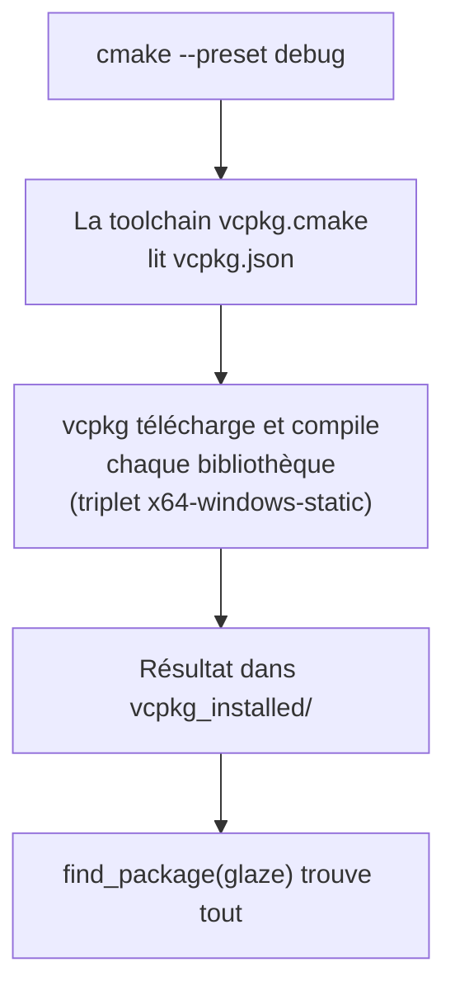

---
tags:
  - projet/cpp
  - type/guide
  - techno/vcpkg
  - techno/cmake
  - sujet/build
  - statut/a-jour
aliases:
  - vcpkg
  - vcpkg.json
cree: 2026-10-04
maj: 2026-10-04
---

# vcpkg — les dépendances

> [!abstract] En une phrase
> **vcpkg** est le gestionnaire de bibliothèques C++ de Microsoft : on liste ce qu'on veut dans **`vcpkg.json`**, et au premier `cmake --preset`, il télécharge et **compile** chaque bibliothèque, aux versions figées par une **baseline**. C'est l'équivalent de `npm` ou NuGet pour le C++.

---

## 📄 Le fichier `vcpkg.json`

```json
{
  "$schema": "https://raw.githubusercontent.com/microsoft/vcpkg-tool/main/docs/vcpkg.schema.json",
  "name": "bookshelf",
  "version-string": "0.1.0",
  "builtin-baseline": "9e593bb18ea69cc5095e012465dcd675a822ed0d",
  "dependencies": [
    "saucer",
    "sqlite3",
    "glaze",
    "cmakerc",
    "doctest"
  ]
}
```

| Champ | Rôle |
|---|---|
| `name` | Nom du projet, en minuscules |
| `builtin-baseline` | Un **commit** du dépôt vcpkg : toutes les versions de bibliothèques sont celles de ce commit. Même résultat chez tout le monde, aujourd'hui et dans 2 ans |
| `dependencies` | Les bibliothèques |

| Bibliothèque | Rôle | Livrée dans l'exe ? |
|---|---|---|
| `saucer` | Fenêtre + webview ([[02 saucer — ouvrir une fenêtre]]) | Oui |
| `sqlite3` | Base de données ([[01 SQLite — enveloppe RAII]]) | Oui |
| `glaze` | JSON ([[05 JSON avec glaze]]) | Oui |
| `cmakerc` | Embarque des fichiers dans l'exe ([[04 Embarquer le frontend dans l'exe]]) | Outil de build seulement |
| `doctest` | Tests ([[01 doctest — premiers tests]]) | Non, tests seulement |

---

## ⚙️ Comment ça marche



- C'est le **mode manifeste** : les bibliothèques sont propres au projet, pas installées globalement.
- La **première** configuration dure longtemps (20 à 30 minutes avec saucer et ses dépendances). Ensuite tout est en cache.

---

## 🧩 Le triplet

Un **triplet** dit pour quelle cible compiler :

| Triplet | Résultat |
|---|---|
| `x64-windows` | Bibliothèques en **DLL** à livrer à côté de l'exe |
| **`x64-windows-static`** | Bibliothèques **dans** l'exe, runtime C++ statique : un seul fichier |
| `x64-linux` | Linux |

Avec un triplet statique, il faut aussi le runtime MSVC statique, sinon l'édition de liens refuse le mélange :

```cmake
set(CMAKE_MSVC_RUNTIME_LIBRARY "MultiThreaded$<$<CONFIG:Debug>:Debug>")
```

---

## ➕ Ajouter une bibliothèque

1. Chercher son nom : `vcpkg search fmt` (ou sur vcpkg.io).
2. L'ajouter dans `dependencies`.
3. Dans le `CMakeLists.txt` de la couche qui l'utilise :
   ```cmake
   find_package(fmt CONFIG REQUIRED)
   target_link_libraries(bookshelf_infrastructure PRIVATE fmt::fmt)
   ```
4. Le nom exact de la cible est affiché à la fin de l'installation (« *The package fmt provides CMake targets* »).

> [!tip] Moins de bibliothèques, mieux c'est
> Chaque bibliothèque est du code à faire confiance, à mettre à jour, à compiler. Règle de ce projet : ce qui est **petit et sans risque** s'écrit à la main (un lecteur CSV, une enveloppe SQLite) ; ce qui touche à la **cryptographie** ou est **gros** (moteur web, base, JSON) vient d'une bibliothèque.

### Obtenir une baseline

```powershell
vcpkg x-update-baseline --add-initial-baseline
```

Ajoute la baseline du vcpkg installé. Pour **monter** les versions plus tard : `vcpkg x-update-baseline`, puis tout recompiler et relancer les tests.

---

## 🧷 Le cas saucer

Le port vcpkg de saucer installe la bibliothèque mais **pas** de fichier de configuration CMake : `find_package(saucer)` ne trouve rien. On reconstruit la cible dans `cmake/Saucer.cmake` :

```cmake
# Cible importée `saucer::saucer`.
#
# Le port vcpkg de saucer installe la bibliothèque et ses en-têtes, mais aucun fichier de
# configuration CMake : find_package(saucer) ne trouve rien. On reconstruit donc ici la cible,
# avec les dépendances que saucer déclare dans son propre CMakeLists.

set(_saucer_prefix "${VCPKG_INSTALLED_DIR}/${VCPKG_TARGET_TRIPLET}")

find_library(SAUCER_LIBRARY_RELEASE saucer PATHS "${_saucer_prefix}/lib" NO_DEFAULT_PATH REQUIRED)
find_library(SAUCER_LIBRARY_DEBUG saucer PATHS "${_saucer_prefix}/debug/lib" NO_DEFAULT_PATH REQUIRED)
find_path(SAUCER_INCLUDE_DIR saucer/webview.hpp PATHS "${_saucer_prefix}/include" NO_DEFAULT_PATH REQUIRED)

find_package(fmt CONFIG REQUIRED)
find_package(glaze CONFIG REQUIRED)
find_package(eraser CONFIG REQUIRED)
find_package(flagpp CONFIG REQUIRED)
find_package(lockpp CONFIG REQUIRED)
find_package(rebind CONFIG REQUIRED)
find_package(Boost REQUIRED COMPONENTS callable_traits)
find_package(unofficial-webview2 CONFIG REQUIRED)

add_library(saucer::saucer STATIC IMPORTED)
set_target_properties(saucer::saucer PROPERTIES
    IMPORTED_CONFIGURATIONS "DEBUG;RELEASE"
    IMPORTED_LOCATION_DEBUG "${SAUCER_LIBRARY_DEBUG}"
    IMPORTED_LOCATION_RELEASE "${SAUCER_LIBRARY_RELEASE}"
    MAP_IMPORTED_CONFIG_RELWITHDEBINFO Release
    MAP_IMPORTED_CONFIG_MINSIZEREL Release
)
target_include_directories(saucer::saucer INTERFACE "${SAUCER_INCLUDE_DIR}")
target_compile_definitions(saucer::saucer INTERFACE SAUCER_WEBVIEW2)
target_link_libraries(saucer::saucer INTERFACE
    Boost::callable_traits
    cr::eraser
    cr::flagpp
    cr::lockpp
    cr::rebind
    fmt::fmt
    glaze::glaze
    unofficial::webview2::webview2
    # Bibliothèques Windows dont dépend l'implémentation WebView2 de saucer.
    Dwmapi
    Shcore
    Shlwapi
    gdiplus
)

unset(_saucer_prefix)
```

| Code | Pourquoi |
|---|---|
| `find_library(... saucer PATHS .../lib)` | Le `.lib` release et celui de debug |
| `add_library(saucer::saucer STATIC IMPORTED)` | Une cible « importée » : déjà compilée, on la décrit seulement |
| `find_package(...)` des dépendances | saucer en a besoin à l'édition de liens |
| `SAUCER_WEBVIEW2` | Dit aux en-têtes de saucer qu'on est sous Windows / WebView2 |

---

## ⚠️ Erreurs fréquentes

| Symptôme | Cause | Solution |
|---|---|---|
| `error: the manifest has no baseline` | `builtin-baseline` manquant | `vcpkg x-update-baseline --add-initial-baseline` |
| `LNK2038: mismatch detected for 'RuntimeLibrary'` | Triplet statique mais runtime dynamique (ou l'inverse) | `CMAKE_MSVC_RUNTIME_LIBRARY` comme ci-dessus |
| Une bibliothèque se recompile à chaque fois | `VCPKG_INSTALLED_DIR` différent par preset | Le fixer dans le preset `base` |
| `Could not find ... glaze` | Configuration lancée sans la toolchain vcpkg | Passer par un preset |

---

## 🔗 Liens

- [[03 CMakePresets]] — où la toolchain est branchée
- [[05 Options de compilation et avertissements]] — la suite
