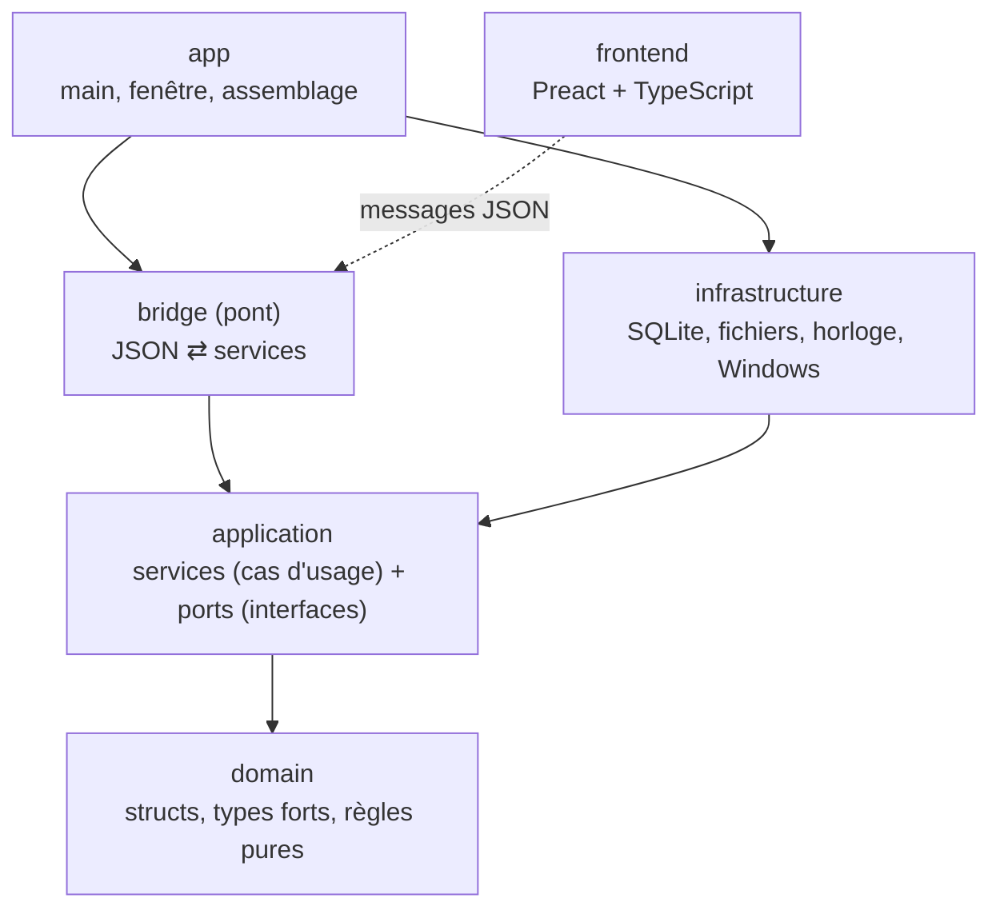

---
tags:
  - projet/cpp
  - type/index
  - techno/cpp
  - sujet/architecture
  - statut/a-jour
aliases:
  - C++ — architecture
cree: 2026-10-04
maj: 2026-10-04
---

# Architecture d'une application C++

> [!abstract] En une phrase
> Une application propre est **découpée en couches**, chacune avec un seul rôle : les **données et règles** (domaine), **ce que l'appli sait faire** (application), **le monde extérieur** (infrastructure), **la traduction pour l'interface** (pont), et **l'assemblage** (app). La règle d'or : **une dépendance ne remonte jamais**.

---

## 🧩 Vue d'ensemble

> [!example] Le restaurant
> - **Domaine** : les recettes. Elles ne savent pas qui les cuisine ni où sont rangés les ingrédients.
> - **Application** : le chef. Il sait **quoi** faire (« préparer une table de 4 ») et demande ce dont il a besoin à des postes (**ports**) : « le garde-manger », « la caisse ».
> - **Infrastructure** : le vrai garde-manger, le vrai four, la vraie caisse.
> - **Pont** : le serveur. Il prend la commande en salle (JSON), la transmet au chef, rapporte l'assiette.
> - **App** : le gérant qui, le matin, ouvre le restaurant et met chacun à son poste.

---

## 📚 Notes de la section

| Note | Contenu |
|---|---|
| [[01 Les couches et la règle des dépendances]] | Qui a le droit de connaître qui, et pourquoi |
| [[02 Le domaine]] | Les structs, les types forts, les règles pures, les codes d'erreur |
| [[03 Les ports (interfaces)]] | Ce dont l'application a besoin, sans dire comment |
| [[04 Les services (cas d'usage)]] | Une classe par domaine fonctionnel, injection par constructeur |
| [[05 L'infrastructure]] | SQLite, fichiers, horloge, API Windows : les implémentations des ports |
| [[06 La racine de composition]] | Le `main()` qui assemble tout, à la main |
| [[07 Vérifier les couches automatiquement]] | Un test qui lit les `#include` et refuse les mauvais sens |

Le **pont** a sa propre série dans la section interface : [[05 Le pont C++ JavaScript — le protocole]].

---

## 🎯 Ce que cette architecture apporte

| Bénéfice | Grâce à |
|---|---|
| Tester les règles **sans base ni fenêtre** | Le domaine et l'application n'utilisent que la STL |
| Changer de base de données (ou de stockage) sans toucher aux règles | Les ports |
| Une interface qui ne peut **rien faire d'autre** que ce qui est prévu | Le pont n'expose qu'une liste fermée de fonctions |
| Savoir où ranger chaque nouveau fichier | Un rôle par couche |
| Des erreurs d'architecture détectées **à la compilation** | Une bibliothèque CMake par couche + le test des couches |

---

## 🔗 Liens

- [[cpp]] — accueil du vault
- [[02 CMake — une bibliothèque par couche]] — les couches dans CMake
- [[00 Interface graphique en C++]] — la suite
