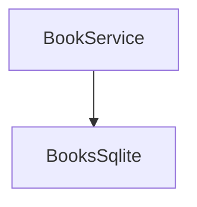
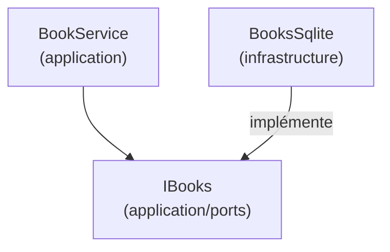
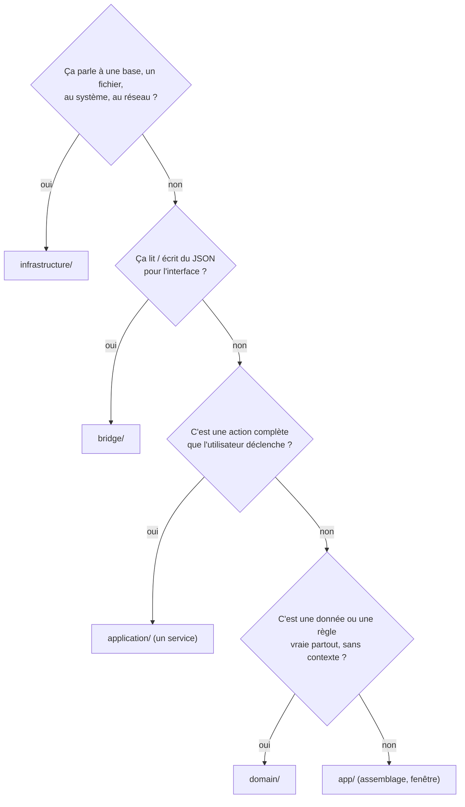

---
tags:
  - projet/cpp
  - type/archi
  - techno/cpp
  - sujet/architecture
  - statut/a-jour
aliases:
  - Couches C++
  - Clean architecture C++
cree: 2026-10-04
maj: 2026-10-04
---

# Les couches et la règle des dépendances

> [!abstract] En une phrase
> Cinq couches, une règle : **une couche basse ne connaît jamais une couche haute**. Le domaine ne sait pas qu'il existe une base de données ; l'application ne sait pas qu'il existe une fenêtre. C'est l'infrastructure qui **s'adapte** aux besoins de l'application, pas l'inverse.

---

## 🧱 Les cinq couches

| Couche | Dossier | Contient | A le droit d'inclure | Bibliothèques externes |
|---|---|---|---|---|
| **Domaine** | `src/domain/` | Structs métier, types forts, règles pures, codes d'erreur | rien d'autre | **aucune** (STL) |
| **Application** | `src/application/` | Services (cas d'usage) + **ports** (interfaces) | domaine | **aucune** (STL) |
| **Infrastructure** | `src/infrastructure/` | Implémentations des ports : SQLite, fichiers, horloge, Windows | domaine, application | SQLite, API Windows… |
| **Pont** (*bridge*) | `src/bridge/` | Fonctions exposées à l'interface, DTO JSON, fil de travail | domaine, application | glaze |
| **App** | `src/app/` | `main`, fenêtre, frontend embarqué, **assemblage** | tout | saucer |

```text
        app      (main, fenêtre, assemblage)
       /   \
   bridge   infrastructure
       \   /
    application   (services + ports)
         |
       domain     (structs, règles pures)
```

> [!warning] `bridge` et `infrastructure` ne se connaissent pas
> Le pont ne sait pas que les livres sont dans SQLite ; l'infrastructure ne sait pas qu'il y a du JSON. Seul `app` les branche ensemble.

---

## 🔄 L'inversion de dépendance

Le service a besoin de ranger des livres. Naïvement :



Le service dépendrait de SQLite : impossible à tester sans base, impossible de changer de stockage. On **inverse** :



L'**interface** est rangée **dans l'application**, à côté de celui qui en a besoin. L'infrastructure **dépend de l'application** pour connaître l'interface à implémenter. La flèche pointe toujours vers le centre.

> [!info] Définition — port
> Un **port** est une interface déclarée par l'application pour dire « j'ai besoin de quelqu'un qui sait faire ça ». L'implémentation qui s'y branche s'appelle parfois un **adaptateur**. Voir [[03 Les ports (interfaces)]].

---

## 📏 Les règles de ce projet

| Règle | Pourquoi |
|---|---|
| **Une dépendance ne remonte jamais** | Les couches basses restent testables et réutilisables |
| Domaine et application : **STL seule** | Ils compilent et se testent sans rien installer |
| Des interfaces **seulement là où il y a deux implémentations** | Base, horloge, fichiers, dialogues : la vraie + la fausse des tests. Un service n'a pas d'interface |
| **Pas de conteneur d'injection** | Les objets sont créés à la main dans `main`, dans l'ordre : c'est lisible et sans magie ([[06 La racine de composition]]) |
| **Lectures d'écran séparées des écritures** quand un écran a besoin d'une requête spéciale | Une liste filtrée/triée a sa propre requête qui renvoie directement ses lignes |
| **Pas d'ORM** | Le passage ligne SQL → struct est écrit à la main, il est court et visible ([[03 Un dépôt SQLite]]) |
| **Le JSON n'existe qu'aux bords** | Pont (interface) et éventuellement stockage. Jamais dans le domaine |
| Nommage : métier en anglais simple, motifs techniques en suffixe | `Book`, `BookService`, `BooksSqlite`, `IBooks` |

---

## 🗺️ Où ranger un nouveau fichier



---

## 🔗 Liens

- [[07 Vérifier les couches automatiquement]] — la règle vérifiée par un test
- [[02 Le domaine]] — la suite
