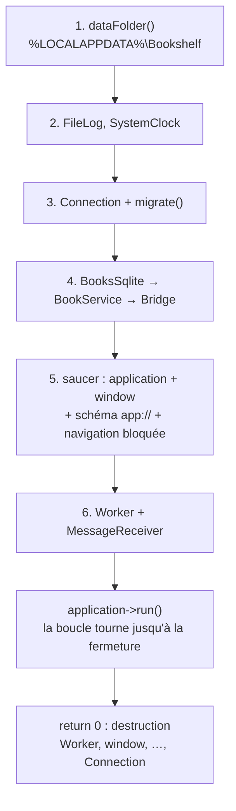

---
tags:
  - projet/cpp
  - type/archi
  - techno/cpp
  - techno/saucer
  - sujet/architecture
  - sujet/injection-de-dependances
  - statut/a-jour
aliases:
  - Composition root
  - main C++
cree: 2026-10-04
maj: 2026-10-04
---

# La racine de composition

> [!abstract] En une phrase
> La **racine de composition** est le **seul** endroit qui connaît toutes les couches : le `main()` de `src/app/`. Il crée chaque objet **dans l'ordre de ses dépendances** (dossier → journal → base → dépôts → services → pont → fenêtre → fil de travail), les relie, lance la boucle de la fenêtre, et à la fin tout est détruit **dans l'ordre inverse**, automatiquement.

---

## 📄 `src/app/main.cpp`

```cpp
#include "app/embedded_frontend.hpp"
#include "app/identity.hpp"
#include "app/window.hpp"
#include "application/books/book_service.hpp"
#include "bridge/bridge.hpp"
#include "bridge/worker.hpp"
#include "infrastructure/sqlite/books_sqlite.hpp"
#include "infrastructure/sqlite/connection.hpp"
#include "infrastructure/sqlite/migrations.hpp"
#include "infrastructure/system/file_log.hpp"
#include "infrastructure/system/system_clock.hpp"
#include "infrastructure/windows/data_folder.hpp"
#include "infrastructure/windows/text.hpp"

#include <saucer/webview.hpp>

#include <windows.h>

#include <exception>
#include <optional>
#include <string>
#include <string_view>
#include <utility>

namespace
{

void showError(std::string_view message)
{
    using bookshelf::infrastructure::toUtf16;
    MessageBoxW(nullptr,
                toUtf16(message).c_str(),
                toUtf16(bookshelf::app::AppName).c_str(),
                MB_OK | MB_ICONERROR);
}

} // namespace

// RACINE DE COMPOSITION : le seul endroit qui connaît toutes les couches et les assemble.
// Pas de conteneur d'injection : les objets sont construits à la main, dans l'ordre de leurs
// dépendances, et détruits dans l'ordre inverse.
int WINAPI wWinMain(HINSTANCE /*instance*/,
                    HINSTANCE /*previous*/,
                    PWSTR /*commandLine*/,
                    int /*show*/)
{
    using namespace bookshelf;

    // 1. Où ranger les données.
    const auto folder = infrastructure::dataFolder(app::AppName);
    if (!folder)
    {
        showError("Impossible d'accéder au dossier des données de l'application.");
        return 1;
    }

    // 2. Les services techniques.
    infrastructure::FileLog log{*folder / "errors.log"};
    const infrastructure::SystemClock clock;

    // 3. La base : ouverte et mise à jour avant tout le reste.
    std::optional<infrastructure::sqlite::Connection> connection;
    try
    {
        connection.emplace(*folder / "bookshelf.db");
        infrastructure::sqlite::migrate(*connection);
    }
    catch (const std::exception& error)
    {
        log.error("démarrage", error.what());
        showError("Impossible d'ouvrir la base de données.");
        return 1;
    }

    // 4. Dépôts, services, pont : chacun reçoit ce dont il a besoin par son constructeur.
    infrastructure::sqlite::BooksSqlite books{*connection};
    application::BookService bookService{books, clock};
    bridge::Bridge bridge{bookService,
                          [&log](std::string_view function, std::string_view detail)
                          {
                              log.error(function, detail);
                          }};

    // 5. La fenêtre. Les schémas personnalisés se déclarent AVANT de créer l'application.
    saucer::webview::register_scheme(std::string{app::FrontendScheme});
    auto application = saucer::application::init({.id = "bookshelf"});

    saucer::webview window{{
        .application = application,
        .persistent_cookies = false,
        // Sans chemin explicite, WebView2 écrit son profil dans le dossier courant :
        // refusé quand l'exe est installé dans Program Files.
        .storage_path = *folder / "webview",
        .browser_flags = app::browserFlags(),
    }};

    window.set_title(std::string{app::AppName});
    window.set_size(1100, 720);
    window.set_min_size(800, 500);
#ifdef NDEBUG
    window.set_dev_tools(false);
    window.set_context_menu(false);
#else
    window.set_dev_tools(true); // F12 en debug
#endif

    app::hardenWebView(window);
    window.handle_scheme(std::string{app::FrontendScheme}, app::serveFrontend);

    // L'application ne quitte jamais son propre frontend : ni lien externe, ni autre site.
    window.on<saucer::web_event::navigate>(
        [](const saucer::navigation& navigation) {
            return app::isFrontendUrl(navigation.url()) ? saucer::policy::allow
                                                        : saucer::policy::block;
        });

    // 6. Le fil de travail. Déclaré en DERNIER, donc détruit en PREMIER : il finit ses tâches
    // avant que le pont, les services et la base ne disparaissent.
    bridge::Worker worker;

    window.add_module<app::MessageReceiver>(
        [&](std::string message)
        {
            // Reçu sur le fil de l'interface, traité sur le fil de travail : la fenêtre ne
            // gèle jamais, même pendant une opération longue.
            worker.post(
                [&, message = std::move(message)]
                {
                    std::string script = app::responseScript(bridge.handle(message));
                    // post() ne bloque pas : la réponse repart vers le fil de l'interface.
                    application->post([&window, script = std::move(script)]
                                      { window.execute(script); });
                });
        });

    window.set_url(std::string{app::HomePage});
    window.show();

    application->run(); // la boucle d'événements : rend la main quand la fenêtre est fermée
    return 0;
}
```

---

## 🔍 Lecture guidée



| Étape | Point important |
|---|---|
| `wWinMain` | Point d'entrée d'une appli **graphique** Windows (pas de console). Avec `add_executable(... WIN32 ...)` |
| `showError` | Avant que la fenêtre existe, on n'a que la boîte de message Windows |
| `std::optional<Connection>` + `try` | L'ouverture de la base peut **lever** (fichier corrompu, disque plein) : on attrape, on journalise, on prévient, on quitte proprement |
| `[&log](...) { log.error(...); }` | Le pont reçoit une fonction de journal, sans savoir que c'est un fichier |
| `register_scheme` **avant** `application::init` | Exigé par WebView2 : les schémas personnalisés se déclarent avant de créer le moteur |
| `.storage_path = *folder / "webview"` | Le profil du navigateur dans **notre** dossier |
| `worker` déclaré **en dernier** | Détruit **en premier** : il termine les tâches en cours pendant que le pont, les services et la base existent encore |
| `application->run()` | La **boucle d'événements** : traite clics, messages, redessins jusqu'à la fermeture |

> [!warning] L'ordre des déclarations EST l'ordre de destruction
> Si `worker` était déclaré avant `bridge`, à la fermeture `bridge` serait détruit pendant qu'une tâche du fil l'utilise encore : **comportement indéfini**. Voir [[02 RAII]] et [[05 Durée de vie et pièges]].

---

## 🧩 Pourquoi pas de conteneur d'injection

| Conteneur (style .NET) | À la main |
|---|---|
| Enregistrer des types, le conteneur résout | Écrire `BookService service{books, clock};` |
| Erreurs de câblage **à l'exécution** | Erreurs de câblage **à la compilation** |
| Durées de vie configurées | Durées de vie = portée des variables, visibles |
| Une bibliothèque de plus | Rien |

Pour une application de bureau, quelques dizaines d'objets : l'assemblage à la main tient sur un écran et ne cache rien.

> [!tip] Quand `main` grossit
> Regrouper les objets d'une même « session » dans une struct :
> ```cpp
> struct Session
> {
>     infrastructure::sqlite::Connection connection;
>     infrastructure::sqlite::BooksSqlite books{connection};
>     application::BookService bookService;
>     Session(const std::filesystem::path& db, const application::IClock& clock)
>         : connection(db), bookService(books, clock) {}
> };
> ```
> Les membres sont construits dans l'ordre de déclaration : même garantie.

---

## 🔗 Liens

- [[02 saucer — ouvrir une fenêtre]] — la partie fenêtre en détail
- [[08 Le fil de travail]] — la partie `worker`
- [[07 Vérifier les couches automatiquement]] — la suite
