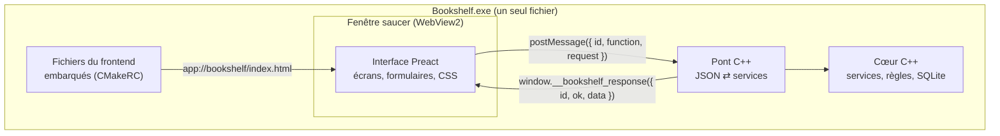
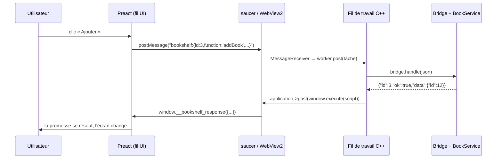

---
tags:
  - projet/cpp
  - type/index
  - techno/cpp
  - techno/saucer
  - techno/webview2
  - techno/preact
  - sujet/ui
  - statut/a-jour
aliases:
  - C++ — interface
  - UI C++
cree: 2026-10-04
maj: 2026-10-04
---

# Interface graphique en C++

> [!abstract] En une phrase
> L'interface est une **page web** (HTML, CSS, TypeScript avec Preact) affichée dans une **fenêtre native** par **saucer** (qui utilise le moteur **WebView2** d'Edge sous Windows). Le **C++ fait tout le travail** ; le JavaScript ne fait qu'**afficher** et envoyer des demandes au C++ par un **pont** de messages JSON. La page est **embarquée dans l'exe** : aucun serveur, aucun fichier à côté, aucun réseau.

---

## 🧩 L'idée : « C++ dedans, web devant »

| Partie | Techno | Rôle |
|---|---|---|
| Fenêtre | **saucer** (C++) | Ouvre une fenêtre Windows avec un navigateur intégré |
| Moteur web | **WebView2** (Edge) | Affiche le HTML/CSS, exécute le JS. Déjà installé sur Windows 11 |
| Interface | **Preact** + **TypeScript** | Les écrans, construits par **Vite** |
| Transport des fichiers | **CMakeRC** + schéma `app://` | Les fichiers de l'interface sont **dans** l'exe |
| Communication | Pont maison, messages **JSON** (**glaze** côté C++) | Une liste fermée de fonctions |
| Travail | **Fil de travail** C++ | La fenêtre ne gèle jamais |

---

## 📚 Notes de la section

| Note | Contenu |
|---|---|
| [[01 Choisir sa techno d'interface]] | Qt, Dear ImGui, wxWidgets, webview : comparaison et choix |
| [[02 saucer — ouvrir une fenêtre]] | `application`, `webview`, la boucle, les événements |
| [[03 Le frontend (Vite, TypeScript, Preact)]] | Le projet `frontend/` : config, scripts, structure |
| [[04 Embarquer le frontend dans l'exe]] | CMakeRC, le schéma `app://`, les types MIME |
| [[05 Le pont C++ JavaScript — le protocole]] | Le format des messages, les codes d'erreur |
| [[06 Le pont côté C++]] | `Bridge::handle`, les DTO, la table des fonctions |
| [[07 Le pont côté TypeScript]] | `call()`, `api.ts`, `types.ts`, les promesses |
| [[08 Le fil de travail]] | Brancher la webview sur le fil de travail, et revenir |
| [[09 Sécuriser la webview]] | CSP, navigation bloquée, réseau coupé, réglages WebView2 |
| [[10 Écrans et composants Preact]] | `useState`, `useEffect`, formulaires, listes, dialogues |
| [[11 CSS et thème]] | Variables CSS, mise en page, une seule source de vérité |
| [[12 Travailler l'interface sans le C++]] | La simulation et `npm run dev` |

---

## 🔁 Le trajet d'un clic

---

## 🔗 Liens

- [[cpp]] — accueil du vault
- [[06 La racine de composition]] — où la fenêtre est créée
- [[00 Données en C++]] — la suite
