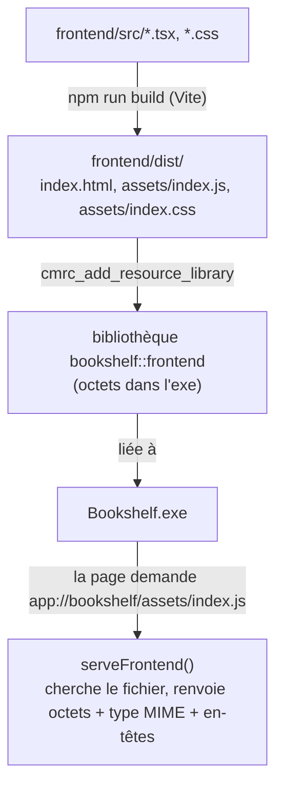

---
tags:
  - projet/cpp
  - type/guide
  - techno/cmake
  - techno/saucer
  - techno/vite
  - sujet/ui
  - sujet/build
  - statut/a-jour
aliases:
  - CMakeRC
  - Schéma app
cree: 2026-10-04
maj: 2026-10-04
---

# Embarquer le frontend dans l'exe

> [!abstract] En une phrase
> CMake lance `npm run build`, puis **CMakeRC** transforme chaque fichier de `frontend/dist/` en tableau d'octets compilé **dans l'exe**. Au lancement, un **schéma personnalisé** `app://bookshelf/...` répond à chaque requête de la page avec le bon fichier embarqué. Résultat : un seul `.exe`, pas de serveur HTTP local, pas de fichier modifiable sur le disque.

---

## 🔁 Le trajet



---

## 📄 `cmake/Frontend.cmake`

```cmake
# Construit le frontend (Vite) et l'embarque dans l'exe avec CMakeRC.
# Résultat : la cible `bookshelf::frontend`, à lier à l'exécutable.
#
# CMakeRC a besoin de la liste des fichiers dès la configuration. Le dist/ est donc construit
# une première fois ici s'il n'existe pas ; ensuite il est reconstruit par le build dès qu'une
# source du frontend change. Vite sort des noms de fichiers FIXES (sans empreinte) pour que
# cette liste ne bouge pas à chaque modification.

find_package(CMakeRC CONFIG REQUIRED)
find_program(BOOKSHELF_NPM NAMES npm.cmd npm REQUIRED)

set(BOOKSHELF_FRONTEND_DIR "${CMAKE_SOURCE_DIR}/frontend")
set(BOOKSHELF_FRONTEND_DIST "${BOOKSHELF_FRONTEND_DIR}/dist")

function(bookshelf_run_npm)
    execute_process(
        COMMAND "${BOOKSHELF_NPM}" ${ARGN}
        WORKING_DIRECTORY "${BOOKSHELF_FRONTEND_DIR}"
        RESULT_VARIABLE code
    )
    if(NOT code EQUAL 0)
        message(FATAL_ERROR "Échec de `npm ${ARGN}` dans ${BOOKSHELF_FRONTEND_DIR}")
    endif()
endfunction()

if(NOT EXISTS "${BOOKSHELF_FRONTEND_DIR}/node_modules")
    message(STATUS "Frontend : installation des dépendances npm")
    bookshelf_run_npm(ci --no-audit --no-fund)
endif()

if(NOT EXISTS "${BOOKSHELF_FRONTEND_DIST}/index.html")
    message(STATUS "Frontend : première construction du dist/")
    bookshelf_run_npm(run build)
endif()

file(GLOB_RECURSE BOOKSHELF_FRONTEND_SOURCES CONFIGURE_DEPENDS
    "${BOOKSHELF_FRONTEND_DIR}/src/*"
    "${BOOKSHELF_FRONTEND_DIR}/public/*"
)
list(APPEND BOOKSHELF_FRONTEND_SOURCES
    "${BOOKSHELF_FRONTEND_DIR}/index.html"
    "${BOOKSHELF_FRONTEND_DIR}/package.json"
    "${BOOKSHELF_FRONTEND_DIR}/package-lock.json"
    "${BOOKSHELF_FRONTEND_DIR}/vite.config.ts"
    "${BOOKSHELF_FRONTEND_DIR}/tsconfig.json"
)

file(GLOB_RECURSE BOOKSHELF_FRONTEND_DIST_FILES CONFIGURE_DEPENDS "${BOOKSHELF_FRONTEND_DIST}/*")

add_custom_command(
    OUTPUT ${BOOKSHELF_FRONTEND_DIST_FILES}
    COMMAND "${BOOKSHELF_NPM}" run build
    WORKING_DIRECTORY "${BOOKSHELF_FRONTEND_DIR}"
    DEPENDS ${BOOKSHELF_FRONTEND_SOURCES}
    COMMENT "Frontend : vite build"
    VERBATIM
)

cmrc_add_resource_library(bookshelf_frontend
    ALIAS bookshelf::frontend
    NAMESPACE frontend
    WHENCE "${BOOKSHELF_FRONTEND_DIST}"
    ${BOOKSHELF_FRONTEND_DIST_FILES}
)
# Code généré par CMakeRC : il n'a pas à suivre nos règles d'analyse.
set_target_properties(bookshelf_frontend PROPERTIES CXX_CLANG_TIDY "")
```

| Partie | Pourquoi |
|---|---|
| `find_program(... npm.cmd npm)` | Sous Windows, `npm` est un `npm.cmd` |
| `npm ci` si pas de `node_modules` | Installe exactement les versions de `package-lock.json` |
| `npm run build` si pas de `dist/` | CMakeRC a besoin des fichiers **dès la configuration** |
| `add_custom_command(OUTPUT ... DEPENDS sources)` | Ensuite, le build relance Vite **seulement** si une source du frontend a changé |
| `cmrc_add_resource_library(... WHENCE dist)` | Les chemins embarqués sont relatifs à `dist/` : `index.html`, `assets/index.js` |
| `CXX_CLANG_TIDY ""` | Le code généré par CMakeRC n'est pas analysé |

---

## 📄 Servir les fichiers : `src/app/embedded_frontend.cpp`

```cpp
#pragma once

#include <saucer/scheme.hpp>

#include <expected>
#include <string_view>

namespace bookshelf::app
{

// Le frontend est servi depuis l'exe par un schéma personnalisé : pas de serveur HTTP
// local, pas de fichier sur le disque.
inline constexpr std::string_view FrontendScheme = "app";
inline constexpr std::string_view FrontendOrigin = "app://bookshelf";
inline constexpr std::string_view HomePage = "app://bookshelf/index.html";

// Répond à une requête app://bookshelf/<chemin> avec le fichier embarqué correspondant.
[[nodiscard]] std::expected<saucer::scheme::response, saucer::scheme::error>
serveFrontend(const saucer::scheme::request& request);

// Vrai si l'adresse appartient au frontend embarqué. Toute autre navigation est refusée.
[[nodiscard]] bool isFrontendUrl(std::string_view url);

} // namespace bookshelf::app
```

```cpp
#include "app/embedded_frontend.hpp"

#include <cmrc/cmrc.hpp>

#include <array>
#include <cstdint>
#include <span>
#include <string>
#include <utility>

CMRC_DECLARE(frontend); // NOLINT : code de la macro CMakeRC

namespace bookshelf::app
{

namespace
{

// La page ne peut charger QUE ses propres fichiers et n'ouvrir aucune connexion : même une
// balise ajoutée par erreur vers un CDN ou une police en ligne serait bloquée.
constexpr std::string_view ContentSecurityPolicy =
    "default-src 'none'; script-src 'self'; style-src 'self'; img-src 'self' data:; "
    "font-src 'self'; connect-src 'none'; base-uri 'none'; form-action 'none'; "
    "frame-ancestors 'none'";

constexpr auto MimeTypes = std::to_array<std::pair<std::string_view, std::string_view>>({
    {".html", "text/html; charset=utf-8"},
    {".js", "text/javascript; charset=utf-8"},
    {".css", "text/css; charset=utf-8"},
    {".json", "application/json; charset=utf-8"},
    {".svg", "image/svg+xml"},
    {".png", "image/png"},
    {".ico", "image/x-icon"},
    {".woff2", "font/woff2"},
});

std::string_view mimeType(std::string_view path)
{
    for (const auto& [extension, mime] : MimeTypes)
    {
        if (path.ends_with(extension))
        {
            return mime;
        }
    }
    return "application/octet-stream";
}

// « app://bookshelf/assets/index.js?x#y » → « assets/index.js ».
// Chaîne vide si l'adresse n'est pas celle du frontend.
std::string_view pathInFrontend(std::string_view url)
{
    if (!isFrontendUrl(url))
    {
        return {};
    }
    url.remove_prefix(FrontendOrigin.size());
    url = url.substr(0, url.find_first_of("?#"));
    if (url.starts_with('/'))
    {
        url.remove_prefix(1);
    }
    return url.empty() ? std::string_view{"index.html"} : url;
}

} // namespace

bool isFrontendUrl(std::string_view url)
{
    if (!url.starts_with(FrontendOrigin))
    {
        return false;
    }
    // « app://bookshelf.evil.com » commence aussi par l'origine : on exige une fin d'hôte.
    const std::string_view rest = url.substr(FrontendOrigin.size());
    return rest.empty() || rest.front() == '/' || rest.front() == '?' || rest.front() == '#';
}

std::expected<saucer::scheme::response, saucer::scheme::error>
serveFrontend(const saucer::scheme::request& request)
{
    const std::string url = request.url();
    const std::string_view path = pathInFrontend(url);
    if (path.empty())
    {
        return std::unexpected(saucer::scheme::error::denied);
    }

    const auto files = cmrc::frontend::get_filesystem();
    const std::string name{path};
    if (!files.is_file(name))
    {
        return std::unexpected(saucer::scheme::error::not_found);
    }

    // Les octets vivent dans l'exe pendant toute la durée du programme : une simple vue
    // suffit, rien n'est copié.
    const cmrc::file file = files.open(name);
    const std::span<const std::uint8_t> bytes{
        reinterpret_cast<const std::uint8_t*>(file.begin()), // NOLINT(*-reinterpret-cast)
        file.size(),
    };

    return saucer::scheme::response{
        .data = saucer::stash<>::view(bytes),
        .mime = std::string{mimeType(path)},
        .headers =
            {
                {"Content-Security-Policy", std::string{ContentSecurityPolicy}},
                {"X-Content-Type-Options", "nosniff"},
                {"Cache-Control", "no-store"},
            },
    };
}

} // namespace bookshelf::app
```

| Code | Pourquoi |
|---|---|
| `CMRC_DECLARE(frontend)` | Donne accès à `cmrc::frontend::get_filesystem()` |
| `isFrontendUrl` exige `/`, `?`, `#` ou la fin après l'origine | `app://bookshelf.evil.com` ne doit **pas** être pris pour notre origine |
| `pathInFrontend` | Retire l'origine, la requête `?...` et l'ancre `#...` ; vide → `index.html` |
| `error::denied` / `error::not_found` | saucer renvoie l'erreur à la page |
| `saucer::stash<>::view(bytes)` | Une **vue** sur les octets : pas de copie, ils vivent dans l'exe pour toujours |
| `Content-Security-Policy` | La page ne peut charger **que** ses propres fichiers, voir [[09 Sécuriser la webview]] |
| `Cache-Control: no-store` | Pas de cache : chaque lancement sert la version de l'exe |

---

## 🔌 Le brancher

```cpp
saucer::webview::register_scheme("app");      // 1. AVANT application::init
// ...
window.handle_scheme("app", app::serveFrontend);   // 2. sur la fenêtre
window.set_url("app://bookshelf/index.html");       // 3. la page d'accueil
```

```cmake
target_link_libraries(bookshelf PRIVATE bookshelf::frontend)   # 4. dans src/app/CMakeLists.txt
```

---

## 🧪 Vérifier qu'aucune adresse externe ne s'est glissée

Une police Google, un CDN, un script de mesure : une seule adresse externe et l'appli devient lente ou cassée hors ligne. Un test CMake lit le `dist/` :

```cmake
# Le frontend embarqué ne doit référencer AUCUNE adresse externe (CDN, police en ligne,
# outil de mesure) : une seule suffirait à rendre l'application lente ou cassée sans réseau.
# Usage : cmake -DDIST=<racine>/frontend/dist -P CheckDist.cmake

cmake_minimum_required(VERSION 3.28)

file(GLOB_RECURSE files "${DIST}/*.html" "${DIST}/*.js" "${DIST}/*.css" "${DIST}/*.svg" "${DIST}/*.json")
if(NOT files)
    message(FATAL_ERROR "Aucun fichier dans ${DIST} : le frontend n'a pas été construit.")
endif()

set(violations "")
foreach(file IN LISTS files)
    file(READ "${file}" content)
    # Les espaces de noms XML (SVG, XHTML) sont des identifiants, jamais téléchargés.
    string(REGEX REPLACE "https?://www\\.w3\\.org/[A-Za-z0-9/.#-]*" "" content "${content}")
    string(REGEX MATCHALL "(https?:)?//[A-Za-z0-9-]+\\.[A-Za-z][A-Za-z0-9./_-]*" urls "${content}")
    if(urls)
        list(REMOVE_DUPLICATES urls)
        file(RELATIVE_PATH relative "${DIST}" "${file}")
        string(APPEND violations "  ${relative} : ${urls}\n")
    endif()
endforeach()

if(violations)
    message(FATAL_ERROR "Adresses externes dans le frontend embarqué :\n${violations}")
endif()
message(STATUS "Frontend embarqué : aucune adresse externe.")
```

> [!info] Autre méthode : `embed` de saucer
> saucer sait aussi embarquer des fichiers (`window.embed(...)` + `window.serve("index.html")`), avec son propre outil de génération. CMakeRC + schéma maison donne en plus le contrôle des **en-têtes** (CSP) et du filtrage des adresses.

---

## ⚠️ Problèmes fréquents

| Symptôme | Cause | Solution |
|---|---|---|
| Page blanche | Chemins absolus dans `index.html` (`/assets/...`) | `base: './'` dans `vite.config.ts` |
| Page blanche, console : *Refused to load the script* | La CSP bloque un script en ligne ou externe | Tout le JS dans des fichiers, aucun `<script>` en ligne |
| Un changement du frontend n'apparaît pas | Fichier ajouté au `dist/` après la configuration | Relancer `cmake --preset debug` (le `GLOB ... CONFIGURE_DEPENDS` le détecte normalement) |
| `Échec de npm ci` | `package-lock.json` absent ou désynchronisé | `npm install` dans `frontend/`, commiter le lock |

---

## 🔗 Liens

- [[03 Le frontend (Vite, TypeScript, Preact)]] — ce qui est construit
- [[05 Le pont C++ JavaScript — le protocole]] — la suite
