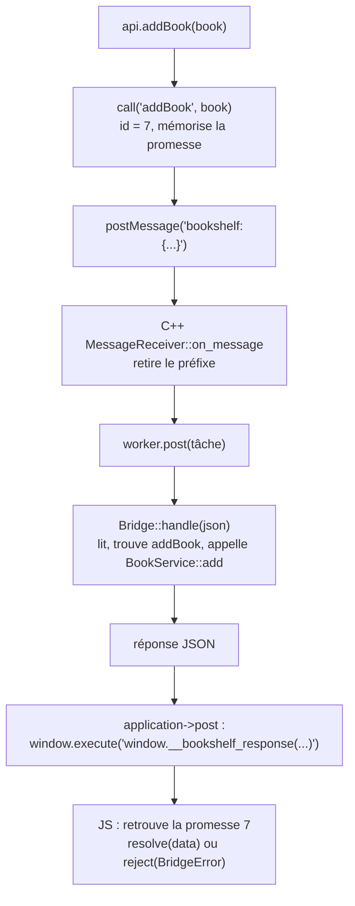

---
tags:
  - projet/cpp
  - type/archi
  - techno/cpp
  - techno/typescript
  - sujet/ui
  - sujet/architecture
  - statut/a-jour
aliases:
  - Protocole du pont
  - Bridge C++ JS
cree: 2026-10-04
maj: 2026-10-04
---

# Le pont C++ ⇄ JavaScript — le protocole

> [!abstract] En une phrase
> Le JavaScript envoie un **message JSON** `{ id, function, request }` ; le C++ répond `{ id, ok: true, data }` ou `{ id, ok: false, code, message }`. L'**id** relie chaque réponse à sa demande, la **function** est cherchée dans une **liste fermée**, et toute erreur devient une réponse lisible. Ce protocole simple est la seule porte entre l'interface et le cœur.

---

## 📨 Les messages

### Demande (JavaScript → C++)

```json
{ "id": 7, "function": "addBook", "request": { "title": "Dune", "author": "Frank Herbert", "year": 1965 } }
```

Envoyée par `window.chrome.webview.postMessage("bookshelf:" + json)`. Le préfixe `bookshelf:` distingue nos messages de ceux que saucer s'envoie à lui-même.

### Réponse réussie (C++ → JavaScript)

```json
{ "id": 7, "ok": true, "data": { "id": 12 } }
```

### Réponse en échec

```json
{ "id": 7, "ok": false, "code": "book.title_missing", "message": "Le titre est obligatoire." }
```

Rendue par le C++ en exécutant `window.__bookshelf_response(<json>);` dans la page.

| Champ | Rôle |
|---|---|
| `id` | Choisi par le JS (1, 2, 3…). Plusieurs demandes peuvent être en cours : la réponse dit à **laquelle** elle répond |
| `function` | Le nom d'un cas d'usage : `listBooks`, `addBook`… |
| `request` | Les paramètres, un objet JSON dont la forme dépend de la fonction |
| `ok` | Succès ou échec |
| `data` | Le résultat (objet, liste, ou `{}`) |
| `code` | Code d'erreur **stable** ([[01 Gérer les erreurs (expected et exceptions)]]) |
| `message` | Phrase **lisible**, prête à afficher. Jamais de détail technique |

---

## 🔁 Le trajet complet



---

## 📏 Les règles du pont

| Règle | Pourquoi |
|---|---|
| **Une fonction par cas d'usage** (`addBook`), jamais d'accès générique (`sql`, `get(table)`) | L'interface ne peut faire **que** ce qui est prévu |
| **Liste fermée** de fonctions dans le C++ | Ce qui n'y est pas n'existe pas pour le JavaScript |
| JSON lu **strictement** : clé inconnue ou manquante = erreur | Le frontend est le nôtre : une différence est un **bug** à voir tout de suite |
| **Aucune règle métier** dans le pont | Il traduit, c'est tout. Les règles sont dans le domaine et les services |
| **Ne lève jamais** | Toute erreur devient `ok: false`, l'interface affiche le `message` |
| Les **détails techniques** vont au journal, jamais à l'écran | Pas de texte SQL ni de chemin de fichier montré à l'utilisateur |
| Les **noms de champs** sont un **contrat** | Renommer un membre d'un DTO C++ casse le TypeScript : changer les deux ensemble |

---

## 🧱 Les trois fichiers qui définissent le contrat

| Côté C++ | Côté TypeScript |
|---|---|
| `src/bridge/dto.hpp` : les structs des demandes et réponses | `frontend/src/bridge/types.ts` : les mêmes formes en TS |
| `Bridge::find` : la liste des fonctions | `frontend/src/bridge/api.ts` : une fonction TS par fonction C++ |
| `src/bridge/messages.cpp` : code → phrase | `BridgeError` porte `code` et `message` |

---

## 🔗 Liens

- [[06 Le pont côté C++]] — l'implémentation C++
- [[07 Le pont côté TypeScript]] — l'implémentation TypeScript
