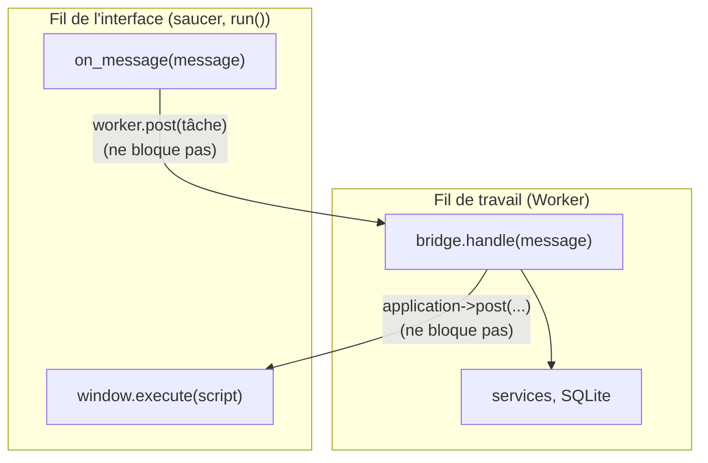

---
tags:
  - projet/cpp
  - type/guide
  - techno/cpp
  - techno/saucer
  - sujet/concurrence
  - sujet/ui
  - statut/a-jour
aliases:
  - Worker thread UI
  - Ne pas figer l'interface
cree: 2026-10-04
maj: 2026-10-04
---

# Le fil de travail

> [!abstract] En une phrase
> Le fil de l'interface ne doit **jamais** attendre la base de données, sinon la fenêtre se fige. Chaque message reçu du JavaScript est donc **déposé** dans la file d'un **fil de travail** unique, qui appelle le pont ; la réponse est ensuite **renvoyée** au fil de l'interface avec `application->post`, qui l'exécute dans la page. À lire avant : [[05 Threads et file de tâches]].

---

## 🧵 Deux fils, deux rôles



| Fil | Fait | Ne fait jamais |
|---|---|---|
| Interface | Recevoir les messages, redessiner, exécuter du JS | Toucher à la base, calculer longtemps |
| Travail | Pont, services, base de données | Toucher à la fenêtre directement |

> [!tip] Un seul fil de travail = aucun verrou
> Comme une seule tâche s'exécute à la fois, la connexion SQLite et les services ne sont **jamais** utilisés par deux fils en même temps. Pas de `mutex` dans les services, pas de *data race* possible. Pour une appli de bureau, c'est largement assez rapide.

---

## 📄 Recevoir les messages : le module

```cpp
#pragma once

#include <saucer/webview.hpp>

#include <functional>
#include <set>
#include <string>
#include <string_view>

namespace bookshelf::app
{

// Les messages du JavaScript destinés au pont commencent par ce préfixe ; tout autre message
// appartient à saucer lui-même.
inline constexpr std::string_view BridgePrefix = "bookshelf:";

// Module saucer : reçoit les messages postés par le JavaScript (window.chrome.webview
// .postMessage) et passe au pont ceux qui lui sont destinés. Appelé sur le fil de l'interface.
class MessageReceiver
{
public:
    using OnMessage = std::function<void(std::string)>;

    MessageReceiver(saucer::webview* window, OnMessage onMessage);

    // Nom imposé par saucer. Vrai si le message a été pris en charge.
    bool on_message(const std::string& message); // NOLINT(readability-identifier-naming)

private:
    OnMessage onMessage_;
};

// Réglages WebView2 : pas d'autoremplissage des formulaires, pas de SmartScreen, pas de
// navigation par glissement.
void hardenWebView(saucer::webview& window);

// Options de démarrage du moteur : aucune activité réseau de fond.
[[nodiscard]] std::set<std::string> browserFlags();

// Le code JavaScript qui rend une réponse du pont à l'interface.
[[nodiscard]] std::string responseScript(std::string_view responseJson);

} // namespace bookshelf::app
```

```cpp
// src/app/window.cpp (extrait)
MessageReceiver::MessageReceiver(saucer::webview* /*window*/, OnMessage onMessage)
    : onMessage_(std::move(onMessage))
{
}

bool MessageReceiver::on_message(const std::string& message)
{
    if (!message.starts_with(BridgePrefix))
    {
        return false; // pas pour nous : saucer s'en occupe
    }
    onMessage_(message.substr(BridgePrefix.size()));
    return true;
}
```

| Code | Pourquoi |
|---|---|
| Constructeur `(saucer::webview*, ...)` | saucer exige que le premier paramètre d'un module soit la fenêtre |
| `on_message` (nom imposé par saucer) | Appelé pour **chaque** message du JavaScript, sur le fil de l'interface |
| `return false` si pas notre préfixe | saucer utilise aussi des messages internes : on les laisse passer |

---

## 🔌 Le branchement dans `main`

```cpp
bridge::Worker worker;   // déclaré APRÈS bridge, window, application

window.add_module<app::MessageReceiver>(
    [&](std::string message)
    {
        worker.post(
            [&, message = std::move(message)]
            {
                std::string script = app::responseScript(bridge.handle(message));
                application->post([&window, script = std::move(script)]
                                  { window.execute(script); });
            });
    });
```

| Ligne | Fil | Rôle |
|---|---|---|
| `[&](std::string message)` | Interface | Reçoit le message |
| `worker.post(...)` | Interface | Dépose la tâche et **rend la main tout de suite** |
| `message = std::move(message)` | — | Le message est **déplacé dans** la tâche : elle s'exécutera plus tard, quand la variable d'origine n'existera plus |
| `bridge.handle(message)` | Travail | Tout le travail |
| `application->post(...)` | Travail | Dépose l'exécution du script **sur le fil de l'interface** |
| `window.execute(script)` | Interface | Appelle `window.__bookshelf_response(...)` dans la page |

### Fabriquer le script de réponse

```cpp
std::string responseScript(std::string_view responseJson)
{
    // La réponse est du JSON, donc une expression JavaScript valide : elle est passée telle
    // quelle, sans chaîne à échapper.
    std::string script = "window.__bookshelf_response(";
    script += responseJson;
    script += ");";
    return script;
}
```

> [!warning] Pourquoi pas `'...' + json + '...'` dans une chaîne JS ?
> Mettre le JSON **entre guillemets** obligerait à échapper les `'`, `\`, retours à la ligne… et une erreur d'échappement permettrait d'injecter du code. Un JSON valide **est** une expression JavaScript valide : on le passe tel quel en argument.

---

## 🧯 Ce qui se passe à la fermeture

1. L'utilisateur ferme la fenêtre → `application->run()` rend la main.
2. `main` se termine : les objets sont détruits **en ordre inverse**. `worker` en premier.
3. Le destructeur de `Worker` laisse le fil **finir les tâches déjà déposées**, puis l'arrête.
4. Ensuite seulement `window`, `bridge`, `bookService`, `books`, `connection` disparaissent.

---

## 🧪 Le tester

```cpp
#include "bridge/worker.hpp"

#include <doctest/doctest.h>

#include <atomic>
#include <vector>

TEST_CASE("le fil de travail exécute tout, dans l'ordre, avant de s'arrêter")
{
    std::vector<int> done;
    {
        bookshelf::bridge::Worker worker;
        for (int i = 0; i < 100; ++i)
        {
            worker.post([&done, i] { done.push_back(i); });
        }
    } // le destructeur attend la fin des tâches

    REQUIRE(done.size() == 100);
    for (int i = 0; i < 100; ++i)
    {
        CHECK(done[static_cast<std::size_t>(i)] == i);
    }
}
```

---

## 🔗 Liens

- [[05 Threads et file de tâches]] — la classe `Worker`
- [[06 La racine de composition]] — l'ordre des déclarations
- [[09 Sécuriser la webview]] — la suite
