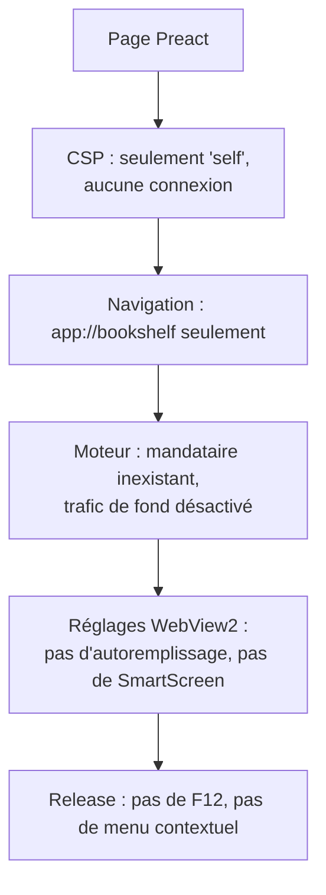

---
tags:
  - projet/cpp
  - type/guide
  - techno/saucer
  - techno/webview2
  - sujet/securite
  - sujet/ui
  - statut/a-jour
aliases:
  - Sécurité WebView2
  - CSP
cree: 2026-10-04
maj: 2026-10-04
---

# Sécuriser la webview

> [!abstract] En une phrase
> Une webview est un **vrai navigateur** : sans précaution, une page pourrait charger un script externe, naviguer vers un site, retenir les saisies des formulaires ou envoyer des données sur le réseau. On ferme chaque porte : **CSP** stricte, **navigation bloquée** hors de `app://`, **réseau coupé** au démarrage du moteur, **autoremplissage désactivé**, **outils de développement** retirés en release, et **pas de HTML injecté** dans l'interface.

---

## 🛡️ Les protections, couche par couche



---

## 1️⃣ La CSP (*Content Security Policy*)

Envoyée en en-tête par `serveFrontend` ([[04 Embarquer le frontend dans l'exe]]) :

```text
default-src 'none'; script-src 'self'; style-src 'self'; img-src 'self' data:;
font-src 'self'; connect-src 'none'; base-uri 'none'; form-action 'none'; frame-ancestors 'none'
```

| Directive | Effet |
|---|---|
| `default-src 'none'` | Tout est interdit par défaut |
| `script-src 'self'` | Seulement les scripts de `app://bookshelf` — **pas** de `<script>` en ligne, pas de CDN |
| `style-src 'self'` | Seulement nos CSS |
| `connect-src 'none'` | Aucun `fetch`, aucune WebSocket |
| `form-action 'none'` | Un `<form>` ne peut rien envoyer nulle part (on gère `onSubmit` en JS) |

## 2️⃣ La navigation bloquée

```cpp
window.on<saucer::web_event::navigate>(
    [](const saucer::navigation& navigation)
    {
        return app::isFrontendUrl(navigation.url()) ? saucer::policy::allow
                                                    : saucer::policy::block;
    });
```

Un lien `<a href="https://...">` ne mène nulle part. Pour ouvrir un vrai site dans le navigateur de l'utilisateur, on passerait par une fonction du pont qui appelle `ShellExecuteW` sur une adresse **vérifiée**.

## 3️⃣ Le réseau coupé au niveau du moteur

```cpp
std::set<std::string> browserFlags()
{
    return {
        "--proxy-server=http://127.0.0.1:9",      // tout HTTP(S) part vers un mandataire qui n'existe pas
        "--disable-background-networking",
        "--disable-component-update",
        "--disable-domain-reliability",
        "--disable-sync",
        "--no-pings",
        "--no-first-run",
    };
}
```

Le moteur Edge fait de lui-même des requêtes (mises à jour de composants, mesures). Le **mandataire inexistant** est le garde-fou : même si une requête part, elle échoue. Le frontend, servi par `app://`, n'est pas concerné.

## 4️⃣ Les réglages WebView2

```cpp
// src/app/window.cpp (extrait)
void hardenWebView(saucer::webview& window)
{
    const auto native = window.native();
    if (native.webview == nullptr)
    {
        return;
    }
    ComPtr<ICoreWebView2Settings> settings;
    if (FAILED(native.webview->get_Settings(&settings)))
    {
        return;
    }
    if (ComPtr<ICoreWebView2Settings4> autofill; SUCCEEDED(settings.As(&autofill)))
    {
        autofill->put_IsGeneralAutofillEnabled(FALSE);
        autofill->put_IsPasswordAutosaveEnabled(FALSE);
    }
    if (ComPtr<ICoreWebView2Settings8> reputation; SUCCEEDED(settings.As(&reputation)))
    {
        reputation->put_IsReputationCheckingRequired(FALSE);
    }
    if (ComPtr<ICoreWebView2Settings6> gestures; SUCCEEDED(settings.As(&gestures)))
    {
        gestures->put_IsSwipeNavigationEnabled(FALSE);
    }
}
```

| Code | Pourquoi |
|---|---|
| `window.native()` | Accès à l'objet WebView2 sous-jacent (inclure `<saucer/modules/stable/webview2.hpp>`) |
| `ComPtr<...>` | Le pointeur intelligent des objets **COM** de Windows : RAII, il appelle `Release()` |
| `settings.As(&autofill)` | Demande une version plus récente de l'interface ; échoue proprement si le moteur est trop vieux |
| Autoremplissage désactivé | Sinon WebView2 garde **en clair** dans son profil ce qui est tapé dans les formulaires |

> [!warning] L'ordre des `#include` COM
> `WebView2.h` utilise le mot `interface` défini par `objbase.h`, que `windows.h` n'apporte pas avec `WIN32_LEAN_AND_MEAN`. Inclure dans cet ordre, entre `// clang-format off` et `on` : `windows.h`, `objbase.h`, `saucer/modules/stable/webview2.hpp`, `wrl/client.h`.

## 5️⃣ Release : pas d'outils de développement

```cpp
#ifdef NDEBUG
    window.set_dev_tools(false);
    window.set_context_menu(false);
#else
    window.set_dev_tools(true);
#endif
```

Et en release, effacer les variables d'environnement `WEBVIEW2_*` au démarrage (`SetEnvironmentVariableW(nom, nullptr)`) : elles permettraient d'ouvrir un port de débogage ou de charger un autre moteur.

## 6️⃣ Pas de HTML injecté

- Preact affiche `{book.title}` **comme du texte** : un titre `` s'affiche tel quel, sans être exécuté.
- ESLint interdit `dangerouslySetInnerHTML` et `innerHTML` ([[03 Le frontend (Vite, TypeScript, Preact)]]).

## 7️⃣ Le pont lui-même

- **Liste fermée** de fonctions, JSON strict, pas d'accès générique ([[05 Le pont C++ JavaScript — le protocole]]).
- Un **chemin de fichier** choisi par l'utilisateur reste **côté C++** : l'interface n'en reçoit que le nom à afficher, elle ne peut pas désigner un autre fichier.

---

## ✅ Checklist

- [ ] CSP envoyée sur chaque fichier
- [ ] Navigation limitée à `app://<appli>`
- [ ] `browserFlags()` avec le mandataire inexistant
- [ ] `hardenWebView()` appelé avant `set_url`
- [ ] DevTools et menu contextuel coupés en release
- [ ] Test `frontend_offline` vert
- [ ] Aucun `innerHTML`

---

## 🔗 Liens

- [[04 Embarquer le frontend dans l'exe]] — où la CSP est envoyée
- [[06 Base chiffrée (SQLCipher)]] — protéger aussi les données sur le disque
- [[10 Écrans et composants Preact]] — la suite
