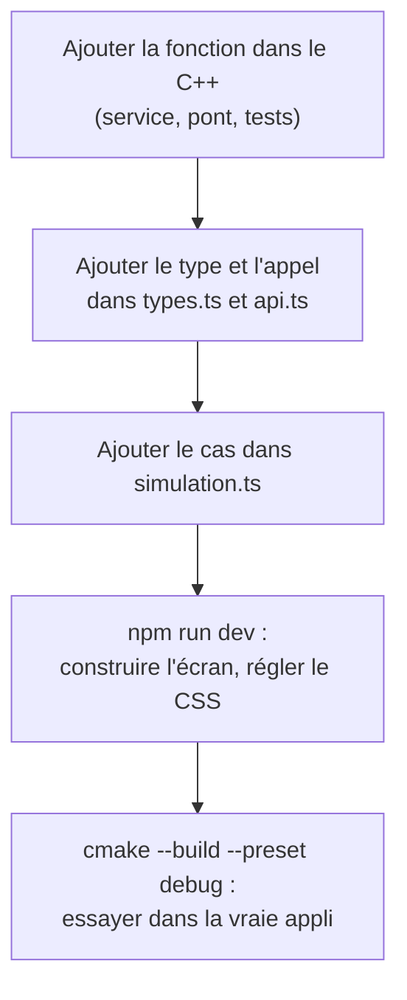

---
tags:
  - projet/cpp
  - type/guide
  - techno/vite
  - techno/typescript
  - sujet/ui
  - sujet/tests
  - statut/a-jour
aliases:
  - Simulation du pont
  - npm run dev
cree: 2026-10-04
maj: 2026-10-04
---

# Travailler l'interface sans le C++

> [!abstract] En une phrase
> Recompiler le C++ à chaque retouche de CSS serait très lent. `npm run dev` lance l'interface dans un **navigateur ordinaire**, avec rechargement instantané ; comme il n'y a pas de C++, un **faux pont** (`simulation.ts`) répond avec des données inventées. Ce fichier n'est **jamais** inclus dans l'application livrée.

---

## ▶️ Lancer

```powershell
cd frontend
npm run dev
```

Ouvrir l'adresse affichée (`http://localhost:5173`). Chaque enregistrement d'un fichier `.tsx` ou `.css` met la page à jour instantanément.

---

## 📄 `src/bridge/simulation.ts`

```ts
// Un FAUX cœur C++, pour travailler l'interface dans un navigateur avec `npm run dev`.
// Jamais inclus dans l'application livrée (import conditionné à import.meta.env.DEV).

import { BridgeError, type Transport } from './client';
import type { Book, NewBook } from './types';

const books: Book[] = [
  { id: 1, title: 'Dune', author: 'Frank Herbert', year: 1965, read: true, addedOn: '2026-09-01' },
  {
    id: 2,
    title: 'Fondation',
    author: 'Isaac Asimov',
    year: 1951,
    read: false,
    addedOn: '2026-09-12',
  },
];
let nextId = 3;

function wait(ms: number) {
  return new Promise((resolve) => setTimeout(resolve, ms));
}

export const simulatedTransport: Transport = async (fn, request) => {
  // Un petit délai, comme le vrai C++ : on voit les états « chargement » de l'interface.
  await wait(120);
  switch (fn) {
    case 'listBooks': {
      const { search } = request as { search: string };
      const text = search.toLowerCase();
      return books
        .filter((b) => `${b.title} ${b.author}`.toLowerCase().includes(text))
        .sort((a, b) => a.title.localeCompare(b.title));
    }
    case 'addBook': {
      const book = request as NewBook;
      if (book.title.trim() === '') {
        throw new BridgeError('book.title_missing', 'Le titre est obligatoire.');
      }
      const id = nextId++;
      books.push({ ...book, id, read: false, addedOn: new Date().toISOString().slice(0, 10) });
      return { id };
    }
    case 'markAsRead': {
      const { id, read } = request as { id: number; read: boolean };
      const book = books.find((b) => b.id === id);
      if (!book) {
        throw new BridgeError('book.not_found', "Ce livre n'existe plus.");
      }
      book.read = read;
      return {};
    }
    case 'removeBook': {
      const { id } = request as { id: number };
      const index = books.findIndex((b) => b.id === id);
      if (index >= 0) {
        books.splice(index, 1);
      }
      return {};
    }
    default:
      throw new BridgeError('bridge.unknown_function', `Fonction inconnue : ${fn}`);
  }
};
```

| Point | Pourquoi |
|---|---|
| Même type `Transport` que le vrai | `client.ts` choisit l'un ou l'autre, les écrans ne voient pas la différence |
| `await wait(120)` | Un petit délai, comme le vrai : on voit les états « chargement » |
| `throw new BridgeError(...)` | On peut tester l'affichage des erreurs |
| Les mêmes codes et messages que le C++ | Le comportement reste réaliste |

### Comment il est choisi

```ts
const host = window.chrome?.webview;
if (host) {
  transport = Promise.resolve(createWebViewTransport(host));         // dans l'appli
} else if (import.meta.env.DEV) {
  transport = import('./simulation').then((m) => m.simulatedTransport);   // npm run dev
} else {
  transport = Promise.reject(/* ... */);                               // build ouvert hors de l'appli
}
```

`import.meta.env.DEV` vaut `false` au `vite build` : Vite **supprime** la branche et le fichier `simulation.ts` n'est pas dans le `dist/`.

---

## 🔁 Le cycle de travail conseillé



> [!warning] La simulation peut mentir
> Elle ne valide que ce qu'on lui a appris. Toujours finir par un essai dans la **vraie** application, où c'est le C++ qui répond.

---

## 🔗 Liens

- [[07 Le pont côté TypeScript]] — `client.ts`
- [[00 Données en C++]] — la suite
