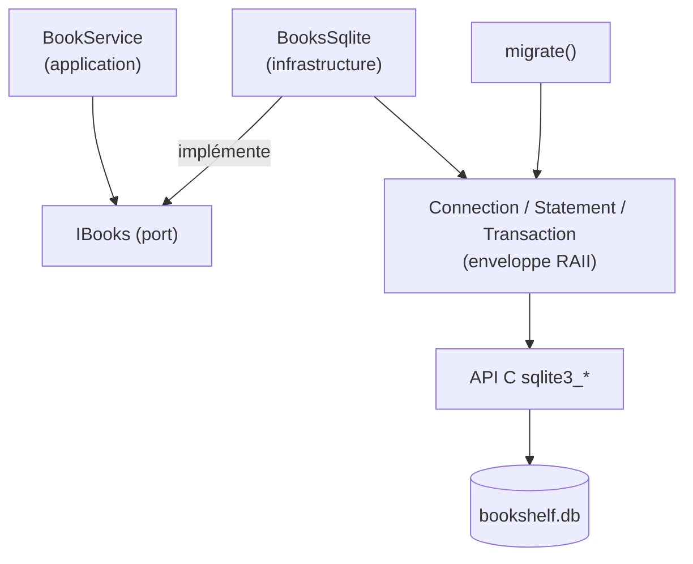

---
tags:
  - projet/cpp
  - type/index
  - techno/cpp
  - techno/sqlite
  - sujet/base-de-donnees
  - statut/a-jour
aliases:
  - C++ — données
cree: 2026-10-04
maj: 2026-10-04
---

# Données en C++

> [!abstract] En une phrase
> Les données de l'application vivent dans une base **SQLite** : un simple fichier, sans serveur, idéal pour une appli de bureau. On l'utilise via son **API C**, enveloppée dans de petites classes **RAII**. Le schéma évolue par **migrations** numérotées, les écritures groupées passent par des **transactions**, et le **JSON** (glaze) sert aux échanges avec l'interface.

---

## 🧭 Vue d'ensemble

---

## 📚 Notes de la section

| Note | Contenu |
|---|---|
| [[01 SQLite — enveloppe RAII]] | `Connection`, `Statement`, `SqliteError` : l'API C rendue sûre |
| [[02 Migrations de schéma]] | `PRAGMA user_version`, ne jamais modifier une migration livrée |
| [[03 Un dépôt SQLite]] | Implémenter un port : SQL, paramètres, lecture des lignes |
| [[04 Transactions]] | Tout ou rien, la classe RAII et le port `ITransactions` |
| [[05 JSON avec glaze]] | Lire et écrire du JSON à partir des structs |
| [[06 Base chiffrée (SQLCipher)]] | Chiffrer le fichier avec un mot de passe |

---

## 🤔 Pourquoi SQLite

| Besoin | SQLite |
|---|---|
| Pas de serveur à installer | ✅ Un fichier |
| Fiable (coupure de courant) | ✅ Transactions ACID |
| Requêtes, tri, recherche, index | ✅ SQL complet |
| Plusieurs utilisateurs en réseau | ❌ Pas fait pour ça (prendre PostgreSQL) |
| Sauvegarder | Copier le fichier (ou `VACUUM INTO 'copie.db'`, sûr même base ouverte) |

---

## 🔗 Liens

- [[cpp]] — accueil du vault
- [[05 L'infrastructure]] — où vit ce code
- [[00 Tests C++]] — la suite
