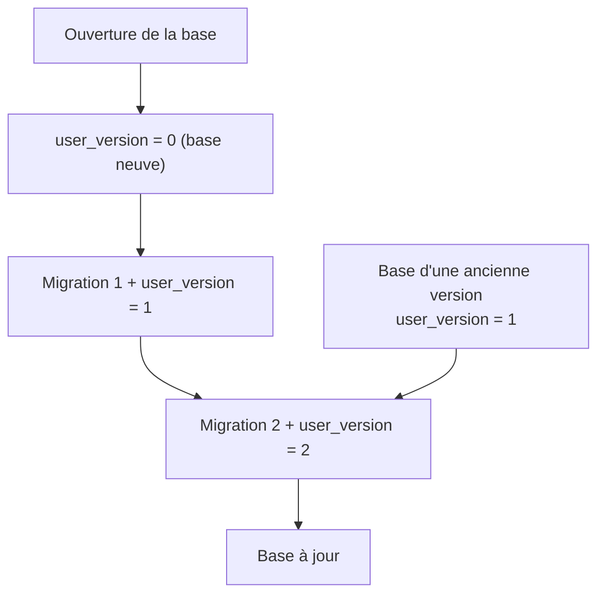

---
tags:
  - projet/cpp
  - type/guide
  - techno/sqlite
  - sujet/base-de-donnees
  - statut/a-jour
aliases:
  - Migrations SQLite
  - user_version
cree: 2026-10-04
maj: 2026-10-04
---

# Migrations de schéma

> [!abstract] En une phrase
> Le schéma de la base (les tables) évolue avec l'application. Chaque changement est une **migration** numérotée, écrite **en dur** dans le code ; la base retient son numéro dans **`PRAGMA user_version`**. Au démarrage, `migrate()` applique dans l'ordre les migrations manquantes. **On ne modifie jamais une migration déjà livrée** : on en ajoute une.

---

## 📄 `migrations.cpp`

```cpp
#include "infrastructure/sqlite/migrations.hpp"

#include <array>
#include <format>
#include <string_view>

namespace bookshelf::infrastructure::sqlite
{

namespace
{

// RÈGLE D'OR : on ne modifie JAMAIS une migration déjà livrée. On en ajoute une à la fin.
constexpr auto Migrations = std::to_array<std::string_view>({
    // 1 : schéma initial
    R"sql(
CREATE TABLE book (
  id       INTEGER PRIMARY KEY,
  title    TEXT NOT NULL CHECK (length(trim(title)) > 0),
  author   TEXT NOT NULL DEFAULT '',
  year     INTEGER,
  read     INTEGER NOT NULL DEFAULT 0 CHECK (read IN (0, 1)),
  added_on TEXT NOT NULL
) STRICT;
)sql",
    // 2 : la recherche par titre doit rester rapide avec beaucoup de livres
    R"sql(
CREATE INDEX book_title ON book (title);
)sql",
});

int currentVersion(Connection& connection)
{
    auto statement = connection.prepare("PRAGMA user_version;");
    statement.next();
    return static_cast<int>(statement.integer(0));
}

} // namespace

void migrate(Connection& connection)
{
    const int from = currentVersion(connection);
    for (int version = from + 1; version <= static_cast<int>(Migrations.size()); ++version)
    {
        // Chaque migration et le numéro de version passent ensemble, ou pas du tout.
        Transaction transaction{connection};
        connection.execute(Migrations[static_cast<std::size_t>(version - 1)]);
        connection.execute(std::format("PRAGMA user_version = {};", version));
        transaction.commit();
    }
}

} // namespace bookshelf::infrastructure::sqlite
```

| Point | Pourquoi |
|---|---|
| `std::to_array<std::string_view>({...})` | Les migrations, dans l'ordre. La n° 1 est à l'indice 0 |
| `R"sql( ... )sql"` | **Chaîne brute** : pas besoin d'échapper les `'` ni les retours à la ligne |
| `PRAGMA user_version` | Un entier libre stocké dans l'en-tête du fichier SQLite : parfait pour la version du schéma |
| Une **transaction** par migration, avec le numéro | Si une migration échoue au milieu, rien n'est appliqué et le numéro ne bouge pas |
| `STRICT` | SQLite refuse une valeur du mauvais type (par défaut il accepte tout) |
| `CHECK (...)` | La base refuse aussi les données invalides : dernière ligne de défense |

---

## 🔁 Le déroulé



---

## ➕ Ajouter une migration

Ajouter une colonne `isbn` :

```cpp
constexpr auto Migrations = std::to_array<std::string_view>({
    R"sql( ... migration 1 ... )sql",
    R"sql( ... migration 2 ... )sql",
    // 3 : le numéro ISBN, facultatif                                         👈
    R"sql(                                                                     👈
ALTER TABLE book ADD COLUMN isbn TEXT NOT NULL DEFAULT '';                     👈
)sql",                                                                         👈
});
```

Puis : le champ dans `Book`, la colonne dans `BooksSqlite` (`Columns`, `readBook`, `INSERT`, `UPDATE`), et un test.

> [!warning] Ne jamais modifier une migration livrée
> Une base qui a déjà `user_version = 2` ne rejouera **jamais** les migrations 1 et 2. Si tu modifies la 2, les nouvelles installations et les anciennes auront **des schémas différents**. Pour corriger : une migration 3.

> [!tip] Tester la reprise
> Garder dans `tests/data/` une base créée par chaque version livrée, et un test qui l'ouvre, la migre et relit ses données. C'est la garantie qu'une mise à jour ne perd rien chez l'utilisateur.

### Les limites de `ALTER TABLE` dans SQLite

SQLite sait ajouter une colonne ou renommer, mais pas changer un type ni retirer une contrainte. Le motif classique :

```sql
CREATE TABLE book_new ( ... nouveau schéma ... ) STRICT;
INSERT INTO book_new (id, title, ...) SELECT id, title, ... FROM book;
DROP TABLE book;
ALTER TABLE book_new RENAME TO book;
```

---

## 🔗 Liens

- [[04 Transactions]] — pourquoi chaque migration est dans une transaction
- [[03 Un dépôt SQLite]] — la suite
