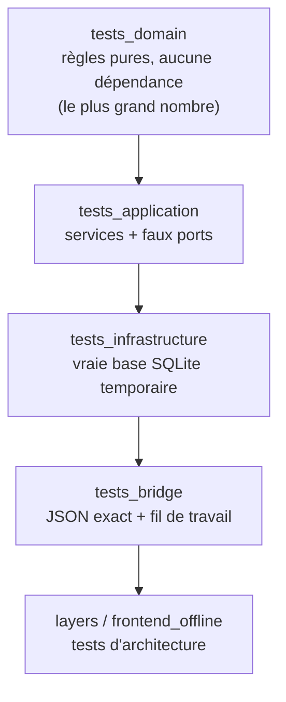

---
tags:
  - projet/cpp
  - type/index
  - techno/cpp
  - techno/doctest
  - sujet/tests
  - statut/a-jour
aliases:
  - C++ — tests
cree: 2026-10-04
maj: 2026-10-04
---

# Tests C++

> [!abstract] En une phrase
> Chaque couche a **son exécutable de tests**, qui ne lie **que** cette couche : les tests du domaine tournent sans base ni fenêtre, ceux de l'application avec de **faux** ports en mémoire, ceux de l'infrastructure sur une **vraie base** dans un fichier temporaire, ceux du pont en comparant le **JSON exact**. Le tout avec **doctest**, lancé par `ctest`.

---

## 🧪 La pyramide



| Exe | Lie | Teste | Vitesse |
|---|---|---|---|
| `tests_domain` | `bookshelf::domain` | `validate`, dates, textes | instantané |
| `tests_application` | `bookshelf::application` | Services avec `FakeBooks`, `FixedClock` | instantané |
| `tests_infrastructure` | `bookshelf::infrastructure` | `BooksSqlite`, migrations, transactions | rapide |
| `tests_bridge` | `bookshelf::bridge` | Forme des JSON, erreurs, fil de travail | rapide |
| `layers` | — (script CMake) | Sens des `#include` | instantané |

> [!tip] Un exe par couche prouve l'isolement
> Si `tests_domain` compile en ne liant **que** le domaine, c'est la preuve que le domaine ne dépend de rien d'autre.

---

## 📄 `tests/CMakeLists.txt`

```cmake
find_package(doctest CONFIG REQUIRED)

# Un exécutable de tests par couche : celui du domaine ne lie QUE le domaine, ce qui
# prouve qu'il se teste sans base ni fenêtre.
function(bookshelf_add_tests name)
    cmake_parse_arguments(PARSE_ARGV 1 arg "" "" "SOURCES;LIBRARIES")
    add_executable(${name} main.cpp ${arg_SOURCES})
    target_include_directories(${name} PRIVATE "${CMAKE_CURRENT_SOURCE_DIR}")
    target_link_libraries(${name} PRIVATE bookshelf::options doctest::doctest ${arg_LIBRARIES})
    add_test(NAME ${name} COMMAND ${name})
endfunction()

bookshelf_add_tests(tests_domain
    SOURCES
        domain/book_tests.cpp
        domain/dates_tests.cpp
    LIBRARIES
        bookshelf::domain
)

bookshelf_add_tests(tests_application
    SOURCES
        application/book_service_tests.cpp
    LIBRARIES
        bookshelf::application
)

bookshelf_add_tests(tests_infrastructure
    SOURCES
        infrastructure/books_sqlite_tests.cpp
    LIBRARIES
        bookshelf::infrastructure
)

bookshelf_add_tests(tests_bridge
    SOURCES
        bridge/bridge_tests.cpp
        bridge/worker_tests.cpp
    LIBRARIES
        bookshelf::bridge
)

# Vérifie qu'aucune couche n'inclut un en-tête d'une couche qui dépend d'elle.
add_test(
    NAME layers
    COMMAND "${CMAKE_COMMAND}" "-DSRC=${CMAKE_SOURCE_DIR}/src" -P "${CMAKE_SOURCE_DIR}/cmake/CheckLayers.cmake"
)

# Vérifie que le frontend embarqué ne référence aucune adresse externe.
if(BOOKSHELF_APP)
    add_test(
        NAME frontend_offline
        COMMAND "${CMAKE_COMMAND}" "-DDIST=${CMAKE_SOURCE_DIR}/frontend/dist" -P "${CMAKE_SOURCE_DIR}/cmake/CheckDist.cmake"
    )
endif()
```

| Code | Pourquoi |
|---|---|
| `function(bookshelf_add_tests name ...)` | Une fonction CMake : chaque exe de tests se déclare en 6 lignes |
| `cmake_parse_arguments(... "SOURCES;LIBRARIES")` | Lit les mots-clés `SOURCES` et `LIBRARIES` |
| `main.cpp` dans chaque exe | Le `main()` fourni par doctest |
| `add_test(NAME ... COMMAND ...)` | Déclare le test à `ctest` |

---

## 📚 Notes de la section

| Note | Contenu |
|---|---|
| [[01 doctest — premiers tests]] | `TEST_CASE`, `CHECK`, `REQUIRE`, lancer un seul test |
| [[02 Tester un service avec des faux]] | `FakeBooks`, `FixedClock`, ce qu'on vérifie |
| [[03 Tester la base de données]] | Base temporaire, migrations, transactions |
| [[04 Tester le pont]] | Comparer le JSON exact, les cas d'erreur |

---

## ▶️ Lancer

```powershell
ctest --preset debug                       # tout
ctest --preset debug -R tests_domain       # un exe (expression régulière sur le nom)
.\build\debug\tests\tests_domain.exe --test-case="*sans titre*"   # un seul TEST_CASE
```

---

## 🔗 Liens

- [[cpp]] — accueil du vault
- [[00 Tutoriel — une app de bureau complète]] — la suite
