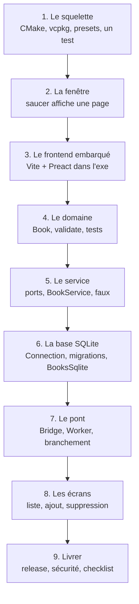

---
tags:
  - projet/cpp
  - type/index
  - type/guide
  - techno/cpp
  - techno/saucer
  - techno/preact
  - statut/a-jour
aliases:
  - Tutoriel C++
cree: 2026-10-04
maj: 2026-10-04
---

# Tutoriel — une app de bureau complète

> [!abstract] En une phrase
> En 9 étapes, on construit **Bookshelf** de zéro : un exe Windows avec une interface web, un cœur C++ en couches, une base SQLite et des tests. À chaque étape, **quelque chose marche** et on sait le vérifier. Le résultat final est le dossier `_projet-exemple/bookshelf/` de ce vault.

---

## 🗺️ Le plan

| Étape | Ce que tu vois à la fin |
|---|---|
| [[01 Étape 1 — le squelette]] | `ctest` vert sur un premier test |
| [[02 Étape 2 — la fenêtre]] | Une fenêtre Windows qui affiche une page |
| [[03 Étape 3 — le frontend embarqué]] | La fenêtre affiche **ton** interface Preact, sans réseau |
| [[04 Étape 4 — le domaine]] | Les règles d'un livre, testées |
| [[05 Étape 5 — le service]] | « Ajouter un livre » testé avec des faux |
| [[06 Étape 6 — la base SQLite]] | Les livres enregistrés dans un fichier, testés |
| [[07 Étape 7 — le pont]] | Le C++ répond aux messages JSON, testé sans fenêtre |
| [[08 Étape 8 — les écrans]] | L'application complète fonctionne |
| [[09 Étape 9 — livrer]] | Un `.exe` release à donner |

> [!tip] Copier plutôt que retaper
> Chaque fichier cité existe dans `_projet-exemple/bookshelf/`. Les étapes disent **dans quel ordre** les créer et **pourquoi** ; les notes de concept liées expliquent le **comment**.

---

## 🔗 Liens

- [[cpp]] — accueil du vault
- [[01 Étape 1 — le squelette]] — commencer
