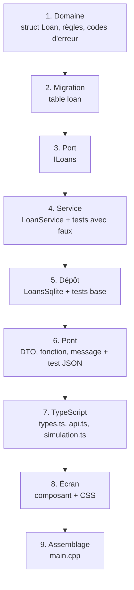

---
tags:
  - projet/cpp
  - type/guide
  - techno/cpp
  - techno/typescript
  - sujet/architecture
  - statut/a-jour
aliases:
  - Nouvelle fonctionnalité C++
  - Checklist fonctionnalité
cree: 2026-10-04
maj: 2026-10-04
---

# Ajouter une fonctionnalité

> [!abstract] En une phrase
> Une fonctionnalité traverse **toutes les couches**, du bas vers le haut : domaine → migration → port → service → dépôt → pont → TypeScript → écran. À chaque couche, **un test** avant de passer à la suivante. Exemple suivi ici : **prêter un livre**.

---

## 🧭 L'ordre



---

## ✅ La checklist

### 1. Domaine — `src/domain/loan/`
- [ ] `struct Loan { Id<Loan> id; Id<Book> bookId; std::string borrower; Date lentOn; std::optional<Date> returnedOn; };`
- [ ] Règles pures : `validate(Loan)`, `isOverdue(const Loan&, Date today)`
- [ ] Codes dans `errors.hpp` : `loan.borrower_missing`, `book.already_lent`
- [ ] `loan/loan.cpp` dans `src/domain/CMakeLists.txt`
- [ ] Tests dans `tests/domain/loan_tests.cpp`

### 2. Migration — `migrations.cpp`
- [ ] **Ajouter** une migration (jamais modifier une ancienne) :
  ```sql
  CREATE TABLE loan (
    id          INTEGER PRIMARY KEY,
    book_id     INTEGER NOT NULL REFERENCES book(id) ON DELETE CASCADE,
    borrower    TEXT NOT NULL CHECK (length(trim(borrower)) > 0),
    lent_on     TEXT NOT NULL,
    returned_on TEXT
  ) STRICT;
  ```

### 3. Port — `src/application/ports/loans.hpp`
- [ ] `class ILoans` avec `create`, `get`, `update`, `listForBook`
- [ ] Si plusieurs écritures : le port `ITransactions` ([[04 Transactions]])

### 4. Service — `src/application/loans/loan_service.hpp/.cpp`
- [ ] `LoanService(IBooks&, ILoans&, ITransactions&, const IClock&)`
- [ ] `lend(NewLoan)`, `giveBack(Id<Loan>)` → `Result<...>`
- [ ] `FakeLoans` dans `tests/support/fakes.hpp`
- [ ] Tests : prêt normal, livre déjà prêté, livre inexistant, emprunteur vide

### 5. Dépôt — `src/infrastructure/sqlite/loans_sqlite.hpp/.cpp`
- [ ] `Columns` + `readLoan()` ; toutes les valeurs en paramètres `?`
- [ ] Tests sur base temporaire

### 6. Pont — `src/bridge/`
- [ ] DTO : `LendRequest`, `Loan`
- [ ] Méthodes `lendBook`, `giveBackBook` + lignes dans `Functions`
- [ ] Messages en français pour chaque nouveau code
- [ ] Tests JSON exact, dont les erreurs

### 7. TypeScript — `frontend/src/bridge/`
- [ ] `types.ts` : `interface Loan` (mêmes noms que le DTO)
- [ ] `api.ts` : `lendBook`, `giveBackBook`
- [ ] `simulation.ts` : les mêmes cas

### 8. Écran — `frontend/src/`
- [ ] Composant (ex. `screens/LendBook.tsx`), gestion du chargement et des erreurs
- [ ] CSS avec les variables du thème
- [ ] Mis au point avec `npm run dev`

### 9. Assemblage — `src/app/main.cpp`
- [ ] `LoansSqlite loans{*connection};` puis `LoanService loanService{books, loans, transactions, clock};`
- [ ] Le pont reçoit le nouveau service (constructeur)
- [ ] **Ordre** des déclarations respecté (ce qui est utilisé avant ce qui utilise)

### Final
- [ ] `.\scripts\check.ps1` vert
- [ ] Essai réel dans l'appli
- [ ] Commit

---

## 🔗 Liens

- [[01 Les couches et la règle des dépendances]] — pourquoi cet ordre
- [[04 Les services (cas d'usage)]] — l'exemple `LoanService::lend`
- [[00 Tutoriel — une app de bureau complète]] — le même chemin, pour la première fonctionnalité
