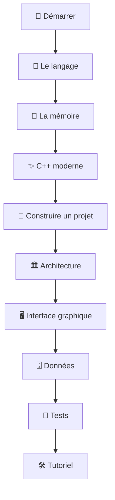

---
tags:
  - projet/cpp
  - type/index
  - techno/cpp
  - statut/a-jour
aliases:
  - C++ — MOC
  - Accueil C++
cree: 2026-10-04
maj: 2026-10-04
---

# 🗂️ C++ — MOC

> [!abstract] Map of Content
> Page d'accueil de la doc **C++**. Elle va du tout premier programme jusqu'à une **application de bureau complète** : une fenêtre avec une interface web, un cœur en C++ découpé en couches, une base SQLite, des tests. Les exemples construisent une application fictive appelée **`Bookshelf`** : un petit gestionnaire de livres (ajouter, chercher, marquer comme lu, supprimer).

> [!tip] Comment lire cette doc
> - Tu débutes : suis le **parcours conseillé** en bas, dans l'ordre.
> - Tu veux construire une app tout de suite : va au [[00 Tutoriel — une app de bureau complète|tutoriel]], et ouvre les notes de concept quand un mot te bloque.
> - Tu cherches un mot : le [[03 Glossaire C++|glossaire]].

---

## 🚀 1. Démarrer

- [[00 Démarrer en C++]] — la section
- [[01 C++ c'est quoi]] — un langage compilé, ce que ça change
- [[02 Installer les outils C++]] — Visual Studio Build Tools, CMake, Ninja, vcpkg, l'IDE
- [[03 Premier programme]] — `main()`, compiler, lancer
- [[04 De la source à l'exe]] — préprocesseur, compilation, édition de liens

---

## 🧱 2. Le langage

- [[00 Le langage C++]] — la section
- [[01 Variables et types]] — `int`, `double`, `bool`, `auto`, `const`
- [[02 Conditions et boucles]] — `if`, `switch`, `for`, `while`
- [[03 Fonctions]] — paramètres par valeur, par référence, surcharge
- [[04 Chaînes de caractères]] — `std::string`, `std::string_view`, `std::format`, UTF-8
- [[05 Conteneurs de la STL]] — `vector`, `map`, `array`, `set`…
- [[06 Références et pointeurs]] — `&`, `*`, `nullptr`
- [[07 Structs et classes]] — membres, constructeurs, `public` / `private`
- [[08 Fichiers hpp et cpp]] — en-têtes, `#pragma once`, `namespace`
- [[09 enum, optional et variant]] — dire « un parmi plusieurs » ou « peut-être rien »
- [[10 Lambdas]] — des fonctions écrites sur place
- [[11 Templates]] — du code qui marche pour plusieurs types
- [[12 Héritage et interfaces]] — `virtual`, `override`, classes abstraites

---

## 🧠 3. La mémoire

- [[00 La mémoire en C++]] — la section
- [[01 Pile et tas]] — où vivent les objets
- [[02 RAII]] — **l'idée la plus importante du C++**
- [[03 Pointeurs intelligents]] — `unique_ptr`, `shared_ptr`
- [[04 Copie et déplacement]] — `std::move`, règle de zéro, règle de cinq
- [[05 Durée de vie et pièges]] — références pendantes, comportement indéfini

---

## ✨ 4. C++ moderne

- [[00 C++ moderne]] — la section
- [[01 Gérer les erreurs (expected et exceptions)]] — `std::expected`, `Result<T>`
- [[02 Types forts]] — `Id<Book>` au lieu d'un `int` nu
- [[03 Dates avec chrono]] — `std::chrono`, sans bibliothèque externe
- [[04 Algorithmes et ranges]] — trier, chercher, filtrer
- [[05 Threads et file de tâches]] — `std::jthread`, `mutex`, `condition_variable`
- [[06 const, constexpr, noexcept et nodiscard]] — dire au compilateur ce qu'on promet

---

## 🔨 5. Construire un projet

- [[00 Construire un projet C++]] — la section
- [[01 CMake — les bases]] — cibles, sources, liens
- [[02 CMake — une bibliothèque par couche]] — l'arborescence d'un vrai projet
- [[03 CMakePresets]] — `debug`, `release`, une commande pour tout
- [[04 vcpkg — les dépendances]] — le `vcpkg.json` et les versions figées
- [[05 Options de compilation et avertissements]] — `/W4`, `/WX`, les options partagées
- [[06 clang-format et clang-tidy]] — le style et l'analyse automatiques
- [[07 Déboguer et sanitizers]] — le débogueur, AddressSanitizer
- [[08 Script de vérification avant commit]] — tout vérifier en une commande

---

## 🏛️ 6. Architecture

- [[00 Architecture C++]] — la section : les couches, la règle d'or
- [[01 Les couches et la règle des dépendances]] — qui a le droit de connaître qui
- [[02 Le domaine]] — les données et les règles pures
- [[03 Les ports (interfaces)]] — ce dont l'application a besoin, sans dire comment
- [[04 Les services (cas d'usage)]] — ce que l'application sait faire
- [[05 L'infrastructure]] — la base, les fichiers, le système
- [[06 La racine de composition]] — le `main()` qui assemble tout
- [[07 Vérifier les couches automatiquement]] — un test qui refuse les mauvais `#include`

---

## 🖥️ 7. Interface graphique

- [[00 Interface graphique en C++]] — la section : l'idée « C++ dedans, web devant »
- [[01 Choisir sa techno d'interface]] — Qt, ImGui, wxWidgets ou webview
- [[02 saucer — ouvrir une fenêtre]] — l'application, la fenêtre, la boucle
- [[03 Le frontend (Vite, TypeScript, Preact)]] — le projet web
- [[04 Embarquer le frontend dans l'exe]] — CMakeRC et le schéma `app://`
- [[05 Le pont C++ JavaScript — le protocole]] — `{ id, function, request }`
- [[06 Le pont côté C++]] — traduire le JSON en appels de services
- [[07 Le pont côté TypeScript]] — `call()`, `api.ts`, les promesses
- [[08 Le fil de travail]] — ne jamais figer la fenêtre
- [[09 Sécuriser la webview]] — CSP, navigation bloquée, aucun réseau
- [[10 Écrans et composants Preact]] — état, effets, formulaires
- [[11 CSS et thème]] — variables CSS, une seule source de vérité
- [[12 Travailler l'interface sans le C++]] — la simulation et `npm run dev`

---

## 🗄️ 8. Données

- [[00 Données en C++]] — la section
- [[01 SQLite — enveloppe RAII]] — `Connection`, `Statement`
- [[02 Migrations de schéma]] — faire évoluer la base sans rien perdre
- [[03 Un dépôt SQLite]] — implémenter un port avec du SQL
- [[04 Transactions]] — tout ou rien
- [[05 JSON avec glaze]] — lire et écrire du JSON sans écrire de code
- [[06 Base chiffrée (SQLCipher)]] — protéger les données sur le disque

---

## 🧪 9. Tests

- [[00 Tests C++]] — la section
- [[01 doctest — premiers tests]] — `TEST_CASE`, `CHECK`, `REQUIRE`
- [[02 Tester un service avec des faux]] — faux dépôts, fausse horloge
- [[03 Tester la base de données]] — une vraie base dans un fichier temporaire
- [[04 Tester le pont]] — la forme exacte des JSON

---

## 🛠️ 10. Tutoriel : une app complète

- [[00 Tutoriel — une app de bureau complète]] — le plan
- [[01 Étape 1 — le squelette]]
- [[02 Étape 2 — la fenêtre]]
- [[03 Étape 3 — le frontend embarqué]]
- [[04 Étape 4 — le domaine]]
- [[05 Étape 5 — le service]]
- [[06 Étape 6 — la base SQLite]]
- [[07 Étape 7 — le pont]]
- [[08 Étape 8 — les écrans]]
- [[09 Étape 9 — livrer]]

---

## 📖 11. Référence

- [[00 Référence C++]] — la section
- [[01 Conventions de code C++]] — nommage, style, commentaires
- [[02 Erreurs fréquentes C++]] — compilation, édition de liens, exécution
- [[03 Glossaire C++]] — tous les mots, en une phrase
- [[04 Antisèche C++]] — la syntaxe sur une page
- [[05 Ajouter une fonctionnalité]] — la checklist, de la base à l'écran

---

## 🧭 Parcours conseillé

---

## 🏷️ Tags du vault

Chaque note a au moins `#projet/cpp`, un `#type/…` et un `#statut/…`.

| Famille | Tags utilisés ici |
|---|---|
| `techno/` | `#techno/cpp` `#techno/cmake` `#techno/vcpkg` `#techno/msvc` `#techno/saucer` `#techno/webview2` `#techno/typescript` `#techno/preact` `#techno/vite` `#techno/css` `#techno/sqlite` `#techno/sqlcipher` `#techno/glaze` `#techno/doctest` `#techno/clang` `#techno/clion` |
| `sujet/` | `#sujet/compilation` `#sujet/build` `#sujet/memoire` `#sujet/erreurs` `#sujet/concurrence` `#sujet/architecture` `#sujet/injection-de-dependances` `#sujet/ui` `#sujet/securite` `#sujet/base-de-donnees` `#sujet/tests` `#sujet/debug` |
| `type/` | `#type/index` `#type/concept` `#type/guide` `#type/reference` `#type/archi` `#type/setup` `#type/decision` |
| `statut/` | `#statut/a-jour` |
