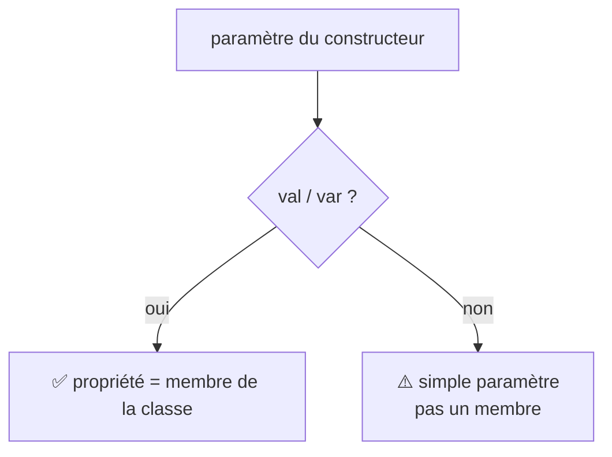

---
tags:
  - projet/kotlin
  - type/concept
  - techno/kotlin
  - statut/a-jour
cours: P1
cree: 2026-09-28
maj: 2026-09-29
---

# Les classes

> [!abstract] Idée
> On déclare souvent une classe **avec son constructeur directement dans la parenthèse** (le *constructeur primaire*).

---

## ✍️ Déclaration de base

> [!quote] Tes mots
> `class nomClass( private val id: Int )`

```kotlin
class NomClass(private val id: Int)
```

Ici `id` est **déclaré dans le constructeur** ET devient un **membre** de la classe, parce qu'on a mis `val`.

---

## 🔑 Membre ou simple paramètre ? (`val` / `var`)

C'est le mot-clé `val` / `var` qui décide :



> [!quote] Tes mots
> `class nomClass2( // membre : val id:Int // pas membre : id ){ private val id:Int = id }`

```kotlin
// Avec val => membre
class NomClass(private val id: Int)

// Sans val => simple paramètre (PAS un membre)
class NomClass2(id: Int) {
    private val id: Int = id   // on en fait un membre dans le corps
}
```

| Écriture | `id` est… |
|---|---|
| `class C(val id: Int)` | un **membre** (propriété) |
| `class C(var id: Int)` | un **membre** modifiable |
| `class C(id: Int)` | un **simple paramètre** (dispo seulement dans le constructeur/corps) |

---

## 🔗 Liens

- [[00 Code]]
- [[01 Kotlin vs Java]]
