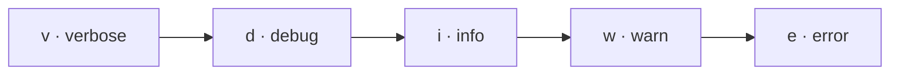
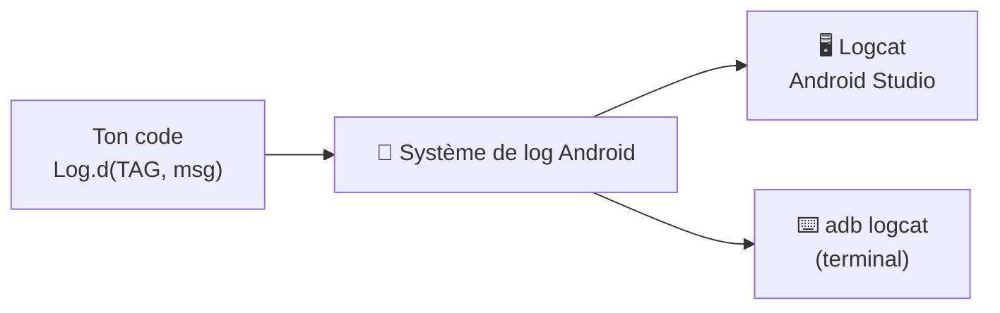

---
tags:
  - projet/kotlin
  - type/concept
  - techno/kotlin
  - techno/android
  - sujet/debug
  - statut/a-jour
cours: P1
cree: 2026-09-28
maj: 2026-09-29
---

# Les logs

> [!abstract] En une phrase
> Un **log**, c'est un **message que ton code écrit** pour dire ce qui se passe. On l'écrit avec la classe **`Log`**, et on le **lit dans Logcat**.

---

## ✍️ Comment on écrit un log

```kotlin
Log.d("MainActivity", "L'écran est créé")
Log.e("Api", "Échec de l'appel réseau", exception)
```

- **1er argument = le `TAG`** : une étiquette pour **retrouver** son log (souvent le nom de la classe).
- **2e argument = le message**.
- **3e argument (optionnel) = une exception** (pour `Log.e`/`Log.w`).

---

## 🎚️ Les niveaux (du moins au plus grave)

| Méthode | Niveau | Quand l'utiliser |
|---|---|---|
| `Log.v` | **Verbose** | tout, très détaillé (bavard) |
| `Log.d` | **Debug** | pour se repérer pendant le dev |
| `Log.i` | **Info** | événement normal important |
| `Log.w` | **Warn** | quelque chose de bizarre mais pas bloquant |
| `Log.e` | **Error** | une vraie erreur / exception |



> [!tip] Filtrer dans Logcat
> Dans la fenêtre **Logcat**, tu peux filtrer par **tag** ou par **niveau** → tu ne vois que ce qui t'intéresse. En ligne de commande : `adb logcat`.

---

## 🧠 Comment ça marche



- `Log.d(...)` envoie le message au **système de log d'Android**.
- **Logcat** (ou `adb logcat`) est juste le **lecteur** qui l'affiche.
- 👉 `println("...")` marche aussi et finit **quand même dans Logcat**, mais on préfère `Log` (tags + niveaux).

---

## ✅ Bonnes pratiques

> [!success] À faire
> - Un **TAG constant** par classe : `private const val TAG = "MainActivity"`.
> - Choisir le **bon niveau** (`d` pour du debug, `e` pour une erreur).
> - Passer l'**exception** en 3e argument (`Log.e(TAG, "msg", e)`) au lieu de logger juste `e.message`.
> - Debugger avec des **breakpoints** quand c'est plus simple que des logs.

> [!failure] À éviter
> - **Logger des données sensibles** (mot de passe, token, email…).
> - Laisser plein de `Log.d` **en production** (bavard + fuite d'infos).
> - Utiliser `println` partout au lieu de `Log`.

---

## 🔗 Liens

- [[00 Code]]
- [[02 Les Activities]] — logger dans les étapes du cycle de vie
