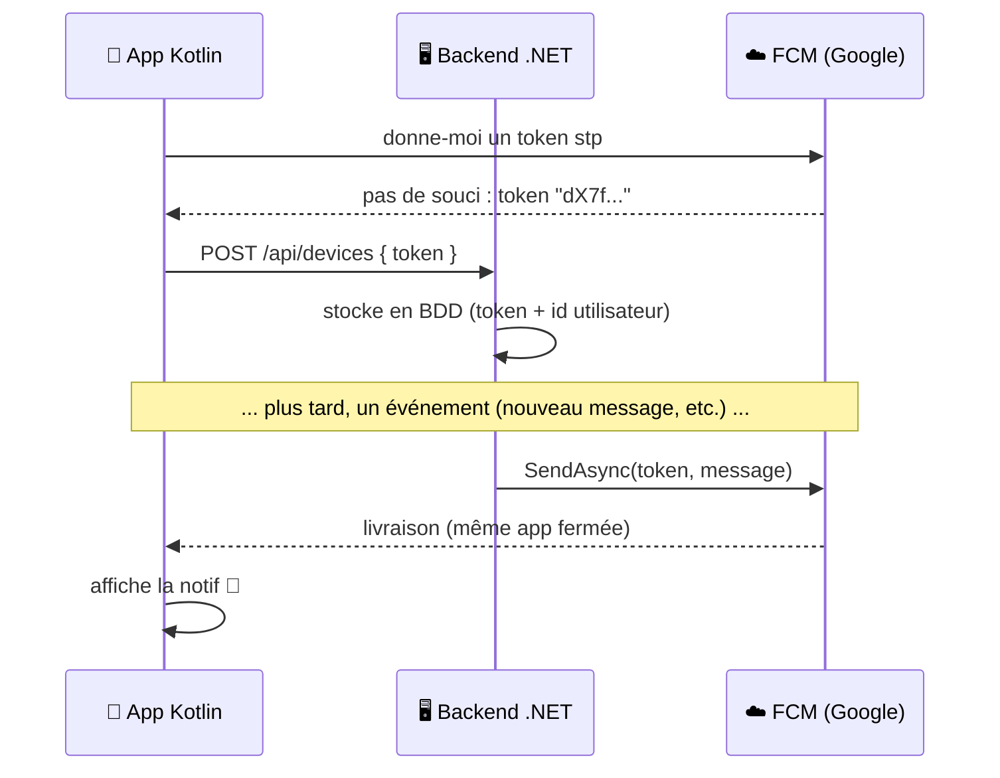
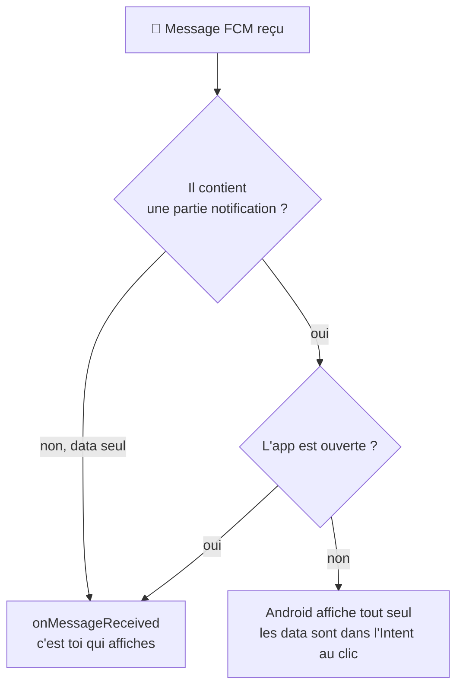

---
tags:
  - projet/kotlin
  - type/concept
  - techno/kotlin
  - techno/android
  - techno/dotnet
  - sujet/notifications
  - sujet/permissions
  - statut/a-jour
aliases:
  - Notifications push
  - FCM
cours: P1
cree: 2026-10-07
maj: 2026-10-07
---

# Les notifications push

> [!abstract] 
>À lire avant : [[05 Les Permissions]] et [[02 Les Activities#Le contexte]]. Le code est dans [[4.1 Notifications push côté Kotlin]] et [[4.2 Notifications push côté .NET]].

---

## 🧠 Pourquoi on a besoin d'un intermédiaire

De base, le backend **ne peut pas contacter le téléphone**, même s'il est connecté en wifi ou en 4G : le téléphone **n'a pas d'adresse fixe**, il change de réseau tout le temps (wifi, 4G…). Bah oui, faut réfléchir, noob.

Du coup, il faut un truc pour faire le lien **téléphone ↔ backend**, et pour ça on utilise **FCM**.

> [!note] En plus
> Le téléphone **dort** aussi pour économiser la batterie. Il garde **une seule connexion ouverte en permanence** avec Google, et **toutes les applis** passent par elle.

### Les 3 acteurs

| Acteur | Rôle |
|---|---|
| 📱 **App Android (Kotlin)** | récupère son « adresse » (le **token**), l'envoie au backend, affiche la notif |
| ☁️ **FCM (Google)** | le facteur : il livre le message au bon téléphone |
| 🖥️ **Backend .NET** | stocke les tokens et décide **quand** et **à qui** envoyer |

> [!info] Définition : le token
> Le **token** (*registration token*) est une longue chaîne de caractères qui identifie **cette installation de l'app sur ce téléphone**. C'est l'« adresse » que FCM sait retrouver.

---

## 🔁 Le déroulé complet




1. Au lancement, l'app demande à Firebase un **token**.
2. L'app **envoie ce token à ton backend .NET**. **C'est ça, la liaison Kotlin ↔ .NET.** Le backend l'enregistre en base, associé à l'utilisateur connecté.
3. Quand quelque chose se passe, le backend appelle FCM avec **le token + le message** : *« Stp mon reuf, envoie-le à ma place, je sais pas où il est, l'autre. »*
4. FCM livre au téléphone, **même si l'app est fermée**.
5. Le téléphone affiche la notif.

> [!warning]
> Le token peut changer pour plein de raisons : suppression puis réinstallation de l'app, données effacées, nouveau téléphone, etc.
>
> Firebase prévient l'app avec **`onNewToken`** : il faut **renvoyer le nouveau token au backend**.

---

## Les deux types de messages

Bah oui, il y a **deux types**, sinon c'est trop simple.

| Type | Contenu | App en arrière-plan / fermée | App ouverte |
|---|---|---|---|
| **notification** | `title` + `body` | **Android l'affiche tout seul** | arrive dans `onMessageReceived` : **c'est toi qui affiches** |
| **data** | des clés/valeurs libres (`"type": "message", "id": "42"`) | arrive dans `onMessageReceived` | arrive dans `onMessageReceived` |

En pratique, on envoie souvent **les deux** : `notification` pour l'affichage et `data` pour savoir **où naviguer** quand l'utilisateur clique.

En gros, il y a **la notif** (ce que l'utilisateur voit) et **l'autre** (`data`), juste là pour dire à l'app : « regarde, le serveur t'a envoyé ça ». Hahahahahah.



> [!warning] Pas de données sensibles dans un message
> Un message FCM est **limité à 4 Ko** et il passe par Google. On envoie un **id** (`"id": "42"`), puis l'app va chercher le contenu complet sur le backend.

---

## Le contrat entre Kotlin et le backend

Concrètement, les deux côtés doivent se mettre d'accord sur **2 choses** :

| Contrat | Côté Kotlin | Côté .NET |
|---|---|---|
| **L'endpoint du token** | `POST api/devices` avec `{ token, platform }` | `DevicesController.Register` |
| **Les clés `data`** | lit `data["type"]`, `data["id"]` pour savoir où naviguer | remplit `Data["type"]`, `Data["id"]` |

Si le backend envoie `"kind"` et que l'app lit `"type"`, **rien ne plante**, mais le clic sur la notif ne mène nulle part. Écris ce contrat quelque part, dans ta doc par exemple.

> [!tip] Les noms JSON
> Kotlin envoie `{"token": "...", "platform": "android"}` (minuscules) et le record C# a `Token` / `Platform` (majuscules). Pas de souci : **ASP.NET ignore la casse** à la lecture du JSON.

---

## 🧩 Variante : les topics (sans stocker de tokens)

Pour des notifs « pour tout le monde » (news, promo), l'app peut **s'abonner à un sujet** :

```kotlin
FirebaseMessaging.getInstance().subscribeToTopic("news")
```

```csharp
new Message { Topic = "news", Notification = new Notification { Title = "...", Body = "..." } };
```

Le backend n'a **plus besoin de stocker les tokens**. En revanche, impossible de viser **un seul utilisateur**.

| Besoin | Token | Topic |
|---|---|---|
| Notifier **une personne** (nouveau message, commande prête) | ✅ | ❌ |
| Notifier **tout le monde** ou un groupe (news, promo) | possible mais lourd | ✅ |
| Le backend stocke des tokens | oui | non |

---

## ❓ Et SignalR / WebSocket ?

SignalR (le temps réel de .NET) **ne remplace pas** le push. Il marche **uniquement quand l'app est ouverte**, car la connexion meurt dès qu'Android met l'app en arrière-plan. En pratique, beaucoup d'apps utilisent les deux :

- **SignalR** pour le temps réel quand l'app est ouverte (chat qui se met à jour) ;
- **FCM** pour réveiller l'utilisateur quand elle est fermée.

---

## Les erreurs fréquentes

| Symptôme | Cause | Solution |
|---|---|---|
| Aucune notif sur Android 13+ | `POST_NOTIFICATIONS` non demandée à l'utilisateur | la demander à l'exécution → [[4.1 Notifications push côté Kotlin#Étape 3 Demander la permission]] |
| Notif reçue en arrière-plan mais pas app ouverte | message `notification` : quand l'app est ouverte, c'est à toi de l'afficher | appeler `showNotification` dans `onMessageReceived` |
| Rien ne s'affiche du tout (Android 8+) | pas de **canal** créé | `createNotificationChannel` avant `notify` |
| Le backend envoie mais ça n'arrive plus | token périmé : `onNewToken` n'envoie pas le nouveau token au backend | appeler `sendTokenToBackend` dans `onNewToken` |
| `Unregistered` côté .NET | app désinstallée | supprimer le token en base |
| L'émulateur ne reçoit rien | image d'émulateur **sans Google Play** | prendre une image « Google Play » dans le Device Manager |
| Crash au démarrage `FirebaseApp is not initialized` | `google-services.json` absent ou plugin pas appliqué | voir [[4.1 Notifications push côté Kotlin#Étape 1 Brancher Firebase]] |

---

## 🔗 Liens

- [[4.1 Notifications push côté Kotlin]] — le code Android pas à pas
- [[4.2 Notifications push côté .NET]] — le code backend pas à pas
- [[05 Les Permissions]] — `POST_NOTIFICATIONS`, une permission **avec popup**
- [[01 Le manifest]] — où se déclarent le service et la permission
- [[02 Les Activities#Le contexte]] — c'est lui qui donne accès au `NotificationManager`
