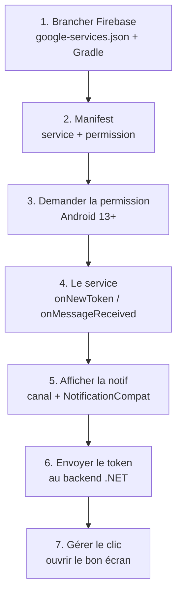

---
tags:
  - projet/kotlin
  - type/guide
  - techno/kotlin
  - techno/android
  - techno/koin
  - techno/gradle
  - sujet/notifications
  - sujet/permissions
  - statut/a-jour
aliases:
  - Push côté Android
cours: P1
cree: 2026-10-07
maj: 2026-10-07
---

# Notifications push côté Kotlin

> [!abstract] En une phrase
> Tout ce qu'il faut **dans l'app Android** pour recevoir une notif push : brancher Firebase, déclarer le service, demander la permission, afficher la notif et **envoyer le token au backend .NET**.
>
> À lire avant : [[04 Les notifications push]] (le principe). La suite côté serveur : [[4.2 Notifications push côté .NET]].

---

## 🗺️ Ce qu'on met en place

| Élément | Où | Pourquoi |
|---|---|---|
| `google-services.json` | `app/` | téléchargé depuis la console Firebase : il relie l'app au projet Firebase |
| plugin `com.google.gms.google-services` | Gradle | lit le `google-services.json` |
| `firebase-bom` + `firebase-messaging` | dépendances | la lib FCM |
| le **service** FCM | manifest | Android doit savoir **qui** reçoit les messages |
| `POST_NOTIFICATIONS` | manifest + demande à l'exécution | obligatoire depuis **Android 13** |

> 🔐 Le lien avec ta note sur les permissions : depuis Android 13, afficher une notif devient une permission **avec popup**. Oui, c'est plus chiant pour harceler les gens. Il faut la **déclarer dans le manifest** _et_ la **demander à l'utilisateur**. Si tu ne fais que la déclarer, Android (le gardien) ne demande rien à l'utilisateur et **aucune notif ne s'affiche**.



---

## Étape 1 Brancher Firebase

1. Va sur la **console Firebase** → **Ajouter un projet** (ou prends celui de l'équipe).
2. **Ajouter une application** → icône **Android** → donne le **nom de package** (le `namespace` / `applicationId` de ton `build.gradle.kts`, ex. `com.diiage.metrix`).
3. Télécharge le **`google-services.json`** et pose-le dans le dossier **`app/`** (à côté de `app/build.gradle.kts`, pas dans `src/`).

Puis Gradle (voir [[02 Ajouter une dépendance]] pour le principe du catalogue et du BOM) :

```toml
# gradle/libs.versions.toml
[versions]
firebaseBom = "34.0.0"
googleServices = "4.4.3"

[libraries]
firebase-bom = { group = "com.google.firebase", name = "firebase-bom", version.ref = "firebaseBom" }
firebase-messaging = { group = "com.google.firebase", name = "firebase-messaging" }

[plugins]
google-services = { id = "com.google.gms.google-services", version.ref = "googleServices" }
```

```kotlin
// build.gradle.kts (racine du projet)
plugins {
    // ... les plugins déjà là
    alias(libs.plugins.google.services) apply false   // 👈
}
```

```kotlin
// app/build.gradle.kts
plugins {
    // ... les plugins déjà là
    alias(libs.plugins.google.services)   // 👈
}

dependencies {
    implementation(platform(libs.firebase.bom))   // 👈 le BOM choisit les versions
    implementation(libs.firebase.messaging)       // 👈 pas de version : c'est le BOM qui la donne
}
```

Puis **Sync Now**.

> [!tip] Les versions
> Les numéros ci-dessus sont ceux connus au moment d'écrire la note. Android Studio **surligne en jaune** une version dépassée : survole-la pour voir la dernière.

| Code | Pourquoi |
|---|---|
| `apply false` à la racine | on **déclare** le plugin pour tout le projet sans l'appliquer à la racine |
| `alias(libs.plugins.google.services)` dans `app/` | c'est lui qui **lit** le `google-services.json` à la compilation |
| `platform(libs.firebase.bom)` | une seule version pour **toute la famille** Firebase |

---

## Étape 2 Le manifest

Le manifest, c'est la **carte d'identité** ([[01 Le manifest]]) : on y déclare la permission et le service.

```xml
<!-- app/src/main/AndroidManifest.xml -->
<manifest ...>

    <uses-permission android:name="android.permission.POST_NOTIFICATIONS" />   <!-- 👈 -->
    <!-- exemple de code : pense à le mettre -->

    <application ...>
        <!-- l'activity déjà là -->

        <service
            android:name=".push.MyFirebaseMessagingService"
            android:exported="false">
            <intent-filter>
                <action android:name="com.google.firebase.MESSAGING_EVENT" />
            </intent-filter>
        </service>   <!-- 👈 -->
    </application>
</manifest>
```

| Code | Pourquoi |
|---|---|
| `uses-permission POST_NOTIFICATIONS` | sans elle, Android 13+ **refuse** d'afficher les notifs |
| `<service android:name=".push.MyFirebaseMessagingService">` | dit à Android **quelle classe** reçoit les messages FCM (le `.` = le package de l'app) |
| `android:exported="false"` | les **autres applis** ne peuvent pas appeler ce service |
| `MESSAGING_EVENT` | « réveille ce service quand un message FCM arrive » |

> [!note] La permission `INTERNET`
> Pas besoin de l'écrire : la lib `firebase-messaging` l'ajoute toute seule au manifest final (c'est une permission **simple**, sans popup, voir [[05 Les Permissions]]).

---

## Étape 3 Demander la permission

Depuis **Android 13** (API 33), déclarer ne suffit plus : il faut **demander à l'utilisateur**, avec la popup. En Compose, on fait ça avec un *launcher* :

```kotlin
// ui/core/AskNotificationPermission.kt
import android.Manifest   // 👈 celui d'Android, PAS le Manifest de ton app
import android.os.Build
import android.util.Log
import androidx.activity.compose.rememberLauncherForActivityResult
import androidx.activity.result.contract.ActivityResultContracts
import androidx.compose.runtime.Composable
import androidx.compose.runtime.LaunchedEffect

@Composable
fun AskNotificationPermission() {
    // Avant Android 13, la permission est donnée d'office : rien à demander
    if (Build.VERSION.SDK_INT < Build.VERSION_CODES.TIRAMISU) return

    val launcher = rememberLauncherForActivityResult(
        ActivityResultContracts.RequestPermission()
    ) { granted ->
        Log.d("Push", "Permission notif accordée : $granted")
    }

    LaunchedEffect(Unit) {
        launcher.launch(Manifest.permission.POST_NOTIFICATIONS)
    }
}
```

On l'appelle **une fois** dans la fonction App de [[03 MainActivity]] :

```kotlin
@Composable
fun MetrixApp() {
    val navController = rememberNavController()
    AskNotificationPermission()   // 👈
    MetrixTheme {
        // ... le Scaffold
    }
}
```

| Code | Pourquoi |
|---|---|
| `Build.VERSION.SDK_INT < TIRAMISU` | `TIRAMISU` = Android 13 : avant, pas de popup à demander |
| `rememberLauncherForActivityResult(RequestPermission())` | prépare la popup système et récupère la réponse (`granted` = oui / non) |
| `LaunchedEffect(Unit)` | lance la demande **une seule fois**, pas à chaque recomposition |
| `import android.Manifest` | piège : sinon Android Studio importe le `Manifest` de **ton** app et `POST_NOTIFICATIONS` est introuvable |

> [!tip] Déjà accordée ?
> Si l'utilisateur a déjà dit oui, `launch` répond `granted = true` **sans afficher de popup**. Android vérifie les réglages d'abord, comme dans [[05 Les Permissions]].

---

## Étape 4 Le service qui reçoit les messages

```kotlin
// push/MyFirebaseMessagingService.kt
class MyFirebaseMessagingService : FirebaseMessagingService() {

    // Appelé quand Firebase donne un NOUVEAU token
    override fun onNewToken(token: String) {
        Log.d("Push", "Nouveau token : $token")
        // 👉 on l'envoie au backend .NET. Et oui, c'est simple.
        sendTokenToBackend(token)
    }

    // Appelé quand un message arrive (data, ou notification si l'app est ouverte)
    override fun onMessageReceived(message: RemoteMessage) {
        val title = message.notification?.title ?: message.data["title"]
        val body = message.notification?.body ?: message.data["body"]
        showNotification(title, body, message.data)
    }
}
```

> 💡 Ce service est un **composant Android à part entière** (les « services » de tes 4 composants de base, voir [[00 les composant de base]]). Android peut le réveiller **même si aucune activity n'est vivante**. C'est pour ça que la notif arrive même app fermée.

| Code | Pourquoi |
|---|---|
| `: FirebaseMessagingService()` | on hérite du service de Firebase : il fait tout le branchement avec FCM |
| `onNewToken` | le token a changé → il **faut** prévenir le backend |
| `message.notification?.title ?: message.data["title"]` | on prend le titre de la partie `notification`, sinon celui des `data` |
| `Log.d("Push", ...)` | pour retrouver le token dans **Logcat** (filtre `Push`), voir [[03 Les logs]] |

---

## Étape 5 Afficher la notif

Canal **obligatoire depuis Android 8**. On ajoute cette fonction **dans** le service :

```kotlin
private fun showNotification(title: String?, body: String?, data: Map<String, String>) {
    // Android 13+ : sans la permission, pas la peine d'aller plus loin
    if (Build.VERSION.SDK_INT >= Build.VERSION_CODES.TIRAMISU &&
        checkSelfPermission(Manifest.permission.POST_NOTIFICATIONS) != PackageManager.PERMISSION_GRANTED
    ) return   // 👈

    val channelId = "messages"
    val notifId = System.currentTimeMillis().toInt()   // 👈 un id par notif
    val manager = getSystemService(NotificationManager::class.java)

    // 1. Le canal (une seule fois, mais le recréer ne pose pas de problème)
    manager.createNotificationChannel(
        NotificationChannel(channelId, "Messages", NotificationManager.IMPORTANCE_HIGH)
    )

    // 2. Ce qui s'ouvre au clic : MainActivity + les infos pour naviguer
    val intent = Intent(this, MainActivity::class.java).apply {
        putExtra("type", data["type"])
        putExtra("id", data["id"])
    }
    val pendingIntent = PendingIntent.getActivity(
        this, notifId, intent, PendingIntent.FLAG_IMMUTABLE or PendingIntent.FLAG_UPDATE_CURRENT   // 👈 notifId au lieu de 0
    )

    // 3. La notif
    val notif = NotificationCompat.Builder(this, channelId)
        .setSmallIcon(R.drawable.ic_notification)
        .setContentTitle(title)
        .setContentText(body)
        .setContentIntent(pendingIntent)
        .setAutoCancel(true)
        .build()

    manager.notify(notifId, notif)
}
```

> 🔗 Le **contexte** encore une fois : `getSystemService` et `NotificationManager`, c'est le contexte qui donne accès aux capacités du téléphone, comme pour vibrer (voir [[02 Les Activities#Le contexte]]). Un service est aussi un contexte, d'où le `this`.

| Code | Pourquoi |
|---|---|
| `checkSelfPermission(...)` | si l'utilisateur a dit non, on n'essaie même pas |
| `NotificationChannel(channelId, "Messages", IMPORTANCE_HIGH)` | le **canal** : l'utilisateur peut couper « Messages » dans les réglages sans couper le reste. `HIGH` = la notif s'affiche en haut de l'écran |
| `Intent(this, MainActivity::class.java)` | **quoi ouvrir** au clic |
| `putExtra("type", ...)` | on glisse les `data` dans l'Intent pour savoir **où naviguer** (étape 7) |
| `PendingIntent` | un Intent « en attente » qu'Android déclenchera **plus tard**, au clic |
| `notifId` en *requestCode* | avec `0` partout, chaque nouvelle notif **écrase les extras** des anciennes : le clic sur une vieille notif ouvrirait le mauvais message |
| `FLAG_IMMUTABLE` | obligatoire depuis Android 12 |
| `setSmallIcon` | **obligatoire**, sinon crash |
| `setAutoCancel(true)` | la notif disparaît quand on clique dessus |

> [!tip] L'icône `ic_notification`
> Clic droit sur `res` → **New → Vector Asset** → choisis une icône → nomme-la `ic_notification`. Elle doit être **blanche sur fond transparent**, sinon Android affiche un carré gris.

---

## Étape 6 Envoyer le token au backend

C'est **la liaison Kotlin ↔ .NET**. Il faut envoyer le token à **deux moments** :
- **au démarrage** (ou juste après le login) : on demande le token actuel ;
- **dans `onNewToken`** : le token a changé.

### L'API (Retrofit)

```kotlin
// data/remote/DeviceApi.kt
interface DeviceApi {
    @POST("api/devices")
    suspend fun register(@Body body: RegisterDeviceRequest)
}

data class RegisterDeviceRequest(val token: String, val platform: String = "android")
```

### Un petit envoyeur partagé (fourni par Koin)

On le met dans une classe pour **ne pas écrire deux fois** l'envoi (service + MainActivity) :

```kotlin
// push/PushTokenSender.kt
class PushTokenSender(private val api: DeviceApi) {
    suspend fun send(token: String) {
        try {
            api.register(RegisterDeviceRequest(token))
            Log.d("Push", "Token envoyé au backend")
        } catch (e: Exception) {
            Log.e("Push", "Envoi du token raté", e)
        }
    }
}
```

```kotlin
// di/PushModule.kt
val pushModule = module {
    single {
        Retrofit.Builder()
            .baseUrl("http://10.0.2.2:5000/")   // 👈 10.0.2.2 = le localhost de ton PC vu depuis l'émulateur
            .addConverterFactory(GsonConverterFactory.create())
            .build()
    }
    single { get<Retrofit>().create(DeviceApi::class.java) }
    single { PushTokenSender(get()) }
}
```

(Le principe de `module`, `single` et `get()` est dans [[08 Koin (injection de dépendances)]].)

> [!warning] Deux pièges réseau en local
> - `localhost` dans l'émulateur = **l'émulateur lui-même**, pas ton PC. Utilise **`10.0.2.2`**.
> - Android **bloque le HTTP non chiffré** par défaut. En dev, soit tu lances le backend en **HTTPS**, soit tu ajoutes `android:usesCleartextTraffic="true"` sur `<application>` (**jamais en prod**).

> [!todo] À compléter
> Le contrôleur .NET est en `[Authorize]` : il faut envoyer le **jeton de connexion** de l'utilisateur dans l'en-tête `Authorization`. Ça dépend de comment le login est fait dans ton projet.

### Dans le service

```kotlin
class MyFirebaseMessagingService : FirebaseMessagingService() {

    private val tokenSender: PushTokenSender by inject()                       // 👈 Koin
    private val scope = CoroutineScope(SupervisorJob() + Dispatchers.IO)       // 👈

    private fun sendTokenToBackend(token: String) {
        scope.launch { tokenSender.send(token) }                               // 👈
    }

    override fun onDestroy() {
        scope.cancel()                                                         // 👈 on range en partant
        super.onDestroy()
    }

    // ... onNewToken, onMessageReceived, showNotification
}
```

### Au démarrage (MainActivity)

Au démarrage de l'app (ou après le login), tu récupères le token et tu l'envoies :

```kotlin
class MainActivity : ComponentActivity() {

    private val tokenSender: PushTokenSender by inject()   // 👈

    override fun onCreate(savedInstanceState: Bundle?) {
        super.onCreate(savedInstanceState)
        enableEdgeToEdge()

        FirebaseMessaging.getInstance().token.addOnSuccessListener { token ->
            lifecycleScope.launch { tokenSender.send(token) }   // 👈
        }

        setContent { MetrixApp() }
    }
}
```

| Code | Pourquoi |
|---|---|
| `by inject()` | Koin fournit le `PushTokenSender` (marche dans une activity **et** dans un service) |
| `CoroutineScope(SupervisorJob() + Dispatchers.IO)` | l'appel réseau ne doit **pas** bloquer le thread principal. `SupervisorJob` = un envoi raté ne casse pas les suivants |
| `scope.cancel()` dans `onDestroy` | on arrête les envois en cours quand Android tue le service |
| `FirebaseMessaging.getInstance().token` | demande le token **actuel** (Firebase le crée si besoin) |
| `lifecycleScope.launch` | coroutine liée à l'activity : annulée toute seule à sa mort ([[02 Les Activities#Le cycle de vie d'une Activity]]) |

---

## Étape 7 Gérer le clic sur la notif

Au clic, Android ouvre `MainActivity` avec les extras `type` et `id`. Il reste à **naviguer** vers le bon écran.

```kotlin
// MainActivity.onCreate
val pushType = intent.getStringExtra("type")   // 👈 null si l'app a été ouverte normalement
setContent { MetrixApp(pushType = pushType) }
```

```kotlin
@Composable
fun MetrixApp(pushType: String? = null) {   // 👈
    val navController = rememberNavController()
    AskNotificationPermission()

    LaunchedEffect(pushType) {   // 👈
        if (pushType == "message") navController.navigate(Routes.DETAIL)
    }

    MetrixTheme {
        // ... le Scaffold, la navbar, le NavHost
    }
}
```

> [!note] Ça marche aussi app fermée
> Quand l'app est fermée et que le message a une partie `notification`, c'est **Android** qui affiche la notif (voir [[04 Les notifications push#Les deux types de messages]]). Au clic, il met **lui aussi** les `data` dans les extras de l'Intent. Donc `intent.getStringExtra("type")` fonctionne dans les deux cas.

> [!question] À confirmer
> Ici on navigue vers `Routes.DETAIL` du [[03 MainActivity|NavHost de Metrix]]. Dans un vrai projet, on passerait aussi l'`id` à l'écran (route avec argument), ce qui n'est pas encore vu dans le cours.

---

## 🧪 Tester sans backend

Pas besoin d'attendre que le backend soit prêt :

1. Lance l'app, ouvre **Logcat**, filtre sur `Push` → copie le token.
2. Console Firebase → **Messaging** → **Nouvelle campagne** → **Notifications** → **Envoyer un message test**.
3. Colle le token → **Tester**.

Essaie **app ouverte** puis **app fermée** : tu verras la différence entre les deux cas du tableau des types de messages.

---

## ✅ Le service final complet

```kotlin
package com.diiage.metrix.push

import android.Manifest
import android.app.NotificationChannel
import android.app.NotificationManager
import android.app.PendingIntent
import android.content.Intent
import android.content.pm.PackageManager
import android.os.Build
import android.util.Log
import androidx.core.app.NotificationCompat
import com.diiage.metrix.MainActivity
import com.diiage.metrix.R
import com.google.firebase.messaging.FirebaseMessagingService
import com.google.firebase.messaging.RemoteMessage
import kotlinx.coroutines.CoroutineScope
import kotlinx.coroutines.Dispatchers
import kotlinx.coroutines.SupervisorJob
import kotlinx.coroutines.cancel
import kotlinx.coroutines.launch
import org.koin.android.ext.android.inject

class MyFirebaseMessagingService : FirebaseMessagingService() {

    private val tokenSender: PushTokenSender by inject()
    private val scope = CoroutineScope(SupervisorJob() + Dispatchers.IO)

    // Appelé quand Firebase donne un NOUVEAU token
    override fun onNewToken(token: String) {
        Log.d("Push", "Nouveau token : $token")
        sendTokenToBackend(token)
    }

    // Appelé quand un message arrive (data, ou notification si l'app est ouverte)
    override fun onMessageReceived(message: RemoteMessage) {
        val title = message.notification?.title ?: message.data["title"]
        val body = message.notification?.body ?: message.data["body"]
        showNotification(title, body, message.data)
    }

    override fun onDestroy() {
        scope.cancel()
        super.onDestroy()
    }

    private fun sendTokenToBackend(token: String) {
        scope.launch { tokenSender.send(token) }
    }

    private fun showNotification(title: String?, body: String?, data: Map<String, String>) {
        if (Build.VERSION.SDK_INT >= Build.VERSION_CODES.TIRAMISU &&
            checkSelfPermission(Manifest.permission.POST_NOTIFICATIONS) != PackageManager.PERMISSION_GRANTED
        ) return

        val channelId = "messages"
        val notifId = System.currentTimeMillis().toInt()
        val manager = getSystemService(NotificationManager::class.java)

        manager.createNotificationChannel(
            NotificationChannel(channelId, "Messages", NotificationManager.IMPORTANCE_HIGH)
        )

        val intent = Intent(this, MainActivity::class.java).apply {
            putExtra("type", data["type"])
            putExtra("id", data["id"])
        }
        val pendingIntent = PendingIntent.getActivity(
            this, notifId, intent, PendingIntent.FLAG_IMMUTABLE or PendingIntent.FLAG_UPDATE_CURRENT
        )

        val notif = NotificationCompat.Builder(this, channelId)
            .setSmallIcon(R.drawable.ic_notification)
            .setContentTitle(title)
            .setContentText(body)
            .setContentIntent(pendingIntent)
            .setAutoCancel(true)
            .build()

        manager.notify(notifId, notif)
    }
}
```

> [!note] Le package
> `com.diiage.metrix` est celui de Metrix : remplace-le par le tien. Le service doit être dans un sous-dossier `push/`, sinon le `.push.MyFirebaseMessagingService` du manifest ne le trouve pas.

---

## 🧯 Erreurs fréquentes (côté code)

| Symptôme | Cause | Solution |
|---|---|---|
| `Unresolved reference: POST_NOTIFICATIONS` | mauvais `Manifest` importé | `import android.Manifest` |
| `Unresolved reference: FirebaseMessagingService` | dépendance absente ou pas de Sync | étape 1 puis **Sync Now** |
| `File google-services.json is missing` | fichier au mauvais endroit | le mettre dans `app/` |
| `No matching client found for package name` | le package déclaré dans Firebase ≠ celui de l'app | recréer l'app Android dans la console avec le bon package |
| Crash `Invalid notification (no valid small icon)` | pas de `setSmallIcon` ou icône introuvable | créer `ic_notification` (Vector Asset) |
| Le backend ne reçoit jamais le token | `localhost` au lieu de `10.0.2.2`, ou HTTP bloqué | voir l'encadré « Deux pièges réseau » |
| Le clic ouvre l'app mais pas le bon écran | les clés `data` ne correspondent pas | vérifier le contrat dans [[04 Les notifications push#Le contrat entre Kotlin et le backend]] |

Les erreurs côté principe (permission, canal, token périmé, émulateur) sont dans [[04 Les notifications push#Les erreurs fréquentes]].

---

## 🔗 Liens

- [[04 Les notifications push]] — le principe et le contrat
- [[4.2 Notifications push côté .NET]] — l'autre bout de la liaison
- [[03 MainActivity]] — où appeler `AskNotificationPermission` et gérer le clic
- [[08 Koin (injection de dépendances)]] — `single`, `get()`, `inject()`
- [[02 Ajouter une dépendance]] — catalogue, BOM, plugin
