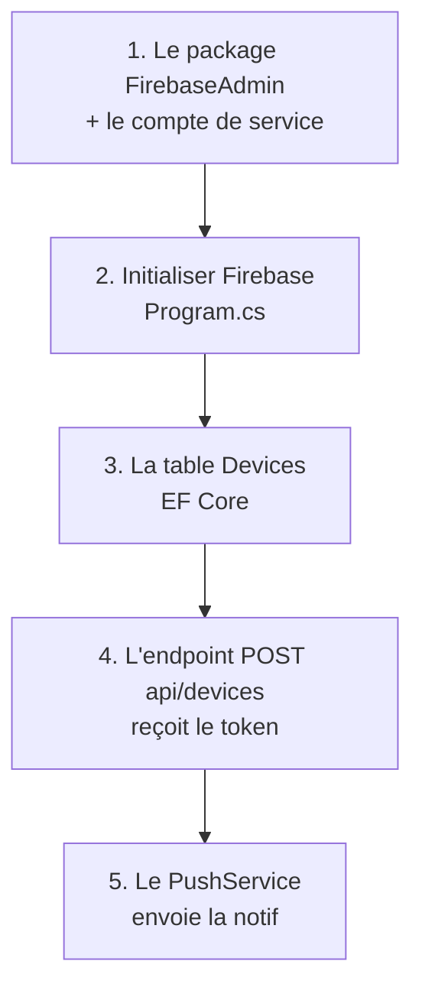

---
tags:
  - projet/kotlin
  - type/guide
  - techno/dotnet
  - techno/csharp
  - techno/efcore
  - sujet/notifications
  - statut/a-jour
aliases:
  - Push côté backend
cours: P1
cree: 2026-10-07
maj: 2026-10-07
---

# Notifications push côté .NET

> [!abstract] En une phrase
> Tout ce qu'il faut **dans le backend .NET** : recevoir et stocker les tokens envoyés par l'app Kotlin, puis demander à **FCM** de livrer la notif.
>
> À lire avant : [[04 Les notifications push]] (le principe). L'autre bout de la liaison : [[4.1 Notifications push côté Kotlin]].

---

## 🗺️ Ce qu'on met en place



---

## Étape 1 Ce qu'il faut

- Le package NuGet **`FirebaseAdmin`** :

```bash
dotnet add package FirebaseAdmin
```

- Le fichier **compte de service** (`service-account.json`), téléchargé depuis la console Firebase : **Paramètres du projet → Comptes de service → Générer une nouvelle clé privée**.

> 🚨 Ce fichier est un **secret serveur**. Il ne va **jamais** dans l'app Android ni dans Git. Celui qui l'a peut envoyer des notifs à **tous** tes utilisateurs.

```gitignore
# .gitignore du backend
service-account.json
```

> [!info] Deux fichiers, deux rôles
> | Fichier | Où | Secret ? |
> |---|---|---|
> | `google-services.json` | l'app Android (`app/`) | non : il dit juste « je suis l'app X du projet Firebase Y » |
> | `service-account.json` | le backend .NET | **oui** : il donne le droit d'**envoyer** |

---

## Étape 2 Initialiser Firebase

**À ne pas oublier**, sinon on pleure longtemps en debug.

```csharp
// Program.cs
using FirebaseAdmin;
using Google.Apis.Auth.OAuth2;

var builder = WebApplication.CreateBuilder(args);

FirebaseApp.Create(new AppOptions
{
    Credential = GoogleCredential.FromFile("service-account.json")
});

builder.Services.AddScoped<PushService>();   // 👈 étape 5

// ... le reste (AddControllers, AddDbContext, auth...)
```

| Code | Pourquoi |
|---|---|
| `FirebaseApp.Create(...)` | **une seule fois** au démarrage : sans ça, `FirebaseMessaging.DefaultInstance` vaut `null` et tout plante au premier envoi |
| `GoogleCredential.FromFile(...)` | lit le compte de service : c'est **la preuve** pour Google que c'est bien ton backend |
| `AddScoped<PushService>()` | on rend le service d'envoi injectable dans les contrôleurs |

> [!tip] Ne pas écrire le chemin en dur
> Mieux : mettre le chemin dans la config (`appsettings.json` ou les *user-secrets*) :
> ```csharp
> var path = builder.Configuration["Firebase:CredentialsPath"];
> FirebaseApp.Create(new AppOptions { Credential = GoogleCredential.FromFile(path) });
> ```

> [!question] À confirmer
> Dans les versions récentes de `Google.Apis.Auth`, `GoogleCredential.FromFile` peut apparaître **barré (obsolète)**. Si c'est le cas, remplace-le par :
> `CredentialFactory.FromFile<ServiceAccountCredential>(path).ToGoogleCredential()`.

---

## Étape 3 La table Devices

Le backend doit **se souvenir** de quel token appartient à quel utilisateur.

```csharp
// Models/Device.cs
public class Device
{
    public int Id { get; set; }
    public string Token { get; set; } = "";
    public string UserId { get; set; } = "";
}
```

```csharp
// Data/AppDbContext.cs
public DbSet<Device> Devices => Set<Device>();

protected override void OnModelCreating(ModelBuilder modelBuilder)
{
    modelBuilder.Entity<Device>()
        .HasIndex(d => d.Token)
        .IsUnique();   // 👈 un token = une seule ligne
}
```

```bash
dotnet ef migrations add AddDevices
dotnet ef database update
```

| Code | Pourquoi |
|---|---|
| `Token` + `UserId` | le lien « cette adresse FCM = cet utilisateur » |
| un utilisateur, **plusieurs** lignes | il peut avoir un téléphone **et** une tablette : on envoie à tous ses appareils |
| `HasIndex(...).IsUnique()` | la base **refuse** un doublon de token, même si le code oublie de vérifier |

---

## Étape 4 L'endpoint qui reçoit le token

C'est **le bout .NET de la liaison** : l'app Kotlin appelle `POST api/devices` ([[4.1 Notifications push côté Kotlin#Étape 6 Envoyer le token au backend]]).

```csharp
// Controllers/DevicesController.cs
using System.Security.Claims;
using Microsoft.AspNetCore.Authorization;
using Microsoft.AspNetCore.Mvc;
using Microsoft.EntityFrameworkCore;

[ApiController]
[Route("api/devices")]
[Authorize]
public class DevicesController : ControllerBase
{
    private readonly AppDbContext _db;
    public DevicesController(AppDbContext db) => _db = db;

    [HttpPost]
    public async Task<IActionResult> Register(RegisterDeviceRequest req)
    {
        var userId = User.FindFirstValue(ClaimTypes.NameIdentifier)!;

        // Pas de doublon : même token = on met à jour
        var device = await _db.Devices.FirstOrDefaultAsync(d => d.Token == req.Token);
        if (device is null)
            _db.Devices.Add(new Device { Token = req.Token, UserId = userId });
        else
            device.UserId = userId;

        await _db.SaveChangesAsync();
        return NoContent();
    }
}

public record RegisterDeviceRequest(string Token, string Platform);
```

| Code | Pourquoi |
|---|---|
| `[Authorize]` | seul un utilisateur **connecté** peut enregistrer un token, sinon n'importe qui pourrait s'abonner aux notifs d'un autre |
| `User.FindFirstValue(ClaimTypes.NameIdentifier)` | l'id de l'utilisateur est lu dans **son jeton de connexion**, pas dans le body : impossible de tricher |
| `FirstOrDefaultAsync(d => d.Token == req.Token)` | le même téléphone renvoie souvent le même token (à chaque démarrage) |
| `device.UserId = userId` | si quelqu'un d'autre se connecte sur ce téléphone, le token **change de propriétaire** |
| `return NoContent()` | 204 : « c'est enregistré, rien à te renvoyer » |
| `record RegisterDeviceRequest(string Token, string Platform)` | le **même contenu** que la `data class RegisterDeviceRequest` côté Kotlin |

---

## Étape 5 Envoyer une notif

On met l'envoi dans un **service**, pour l'appeler depuis n'importe quel contrôleur.

```csharp
// Services/PushService.cs
using FirebaseAdmin.Messaging;
using Microsoft.EntityFrameworkCore;

public class PushService
{
    private readonly AppDbContext _db;
    public PushService(AppDbContext db) => _db = db;

    public async Task NotifyUserAsync(string userId, string title, string body, string messageId)
    {
        var tokens = await _db.Devices.Where(d => d.UserId == userId)
                                      .Select(d => d.Token).ToListAsync();

        foreach (var token in tokens)
        {
            var message = new Message
            {
                Token = token,
                Notification = new Notification { Title = title, Body = body },
                Data = new Dictionary<string, string>
                {
                    ["type"] = "message",   // 👈 le contrat avec l'app Kotlin
                    ["id"] = messageId
                }
            };

            try
            {
                await FirebaseMessaging.DefaultInstance.SendAsync(message);
            }
            catch (FirebaseMessagingException ex)
                when (ex.MessagingErrorCode == MessagingErrorCode.Unregistered)
            {
                // Token mort (app désinstallée…) → on le supprime
                _db.Devices.RemoveRange(_db.Devices.Where(d => d.Token == token));
                await _db.SaveChangesAsync();
            }
        }
    }
}
```

| Code | Pourquoi |
|---|---|
| `Where(d => d.UserId == userId)` | on récupère **tous** les appareils de l'utilisateur |
| `Notification = ...` | la partie **visible** (titre + texte) |
| `Data = ...` | le petit mot **pour l'app** : où naviguer au clic. Les clés doivent être **les mêmes** que celles lues côté Kotlin |
| `SendAsync(message)` | on donne le message au **facteur** (FCM) |
| `catch ... when Unregistered` | FCM répond « cette adresse n'existe plus » → on fait le ménage en base |

### Qui l'appelle ?

L'endroit où **l'événement** se passe. Exemple : quand quelqu'un envoie un message.

```csharp
[HttpPost]
public async Task<IActionResult> Send(SendMessageRequest req, [FromServices] PushService push)
{
    // ... on enregistre le message en base (msg)

    await push.NotifyUserAsync(req.RecipientId, "Nouveau message", req.Text, msg.Id.ToString());   // 👈
    return Ok();
}
```

> [!tip] Beaucoup d'appareils ?
> Pour envoyer en une fois à plusieurs tokens (jusqu'à 500), il existe `MulticastMessage` + `SendEachForMulticastAsync`. Pour un projet de cours, la boucle suffit largement.

> [!warning] L'envoi peut être lent
> `SendAsync` passe par Internet. Si la notif part **pendant** une requête, l'utilisateur attend. Pour un projet de cours c'est OK ; en vrai, on met l'envoi dans une **file d'attente** traitée en arrière-plan.

---

## 🧯 Erreurs fréquentes (côté .NET)

| Symptôme | Cause | Solution |
|---|---|---|
| `NullReferenceException` sur `FirebaseMessaging.DefaultInstance` | `FirebaseApp.Create` jamais appelé | étape 2, dans `Program.cs` |
| `FileNotFoundException: service-account.json` | le fichier n'est pas dans le dossier d'exécution | le mettre à la racine du projet + propriété **Copier dans le répertoire de sortie**, ou donner un chemin absolu |
| `401` sur `POST api/devices` | l'app n'envoie pas le jeton de connexion | voir le `[!todo]` de [[4.1 Notifications push côté Kotlin]] |
| `FirebaseMessagingException: SenderId mismatch` | l'app et le backend ne sont pas sur le **même projet Firebase** | prendre `google-services.json` et `service-account.json` du **même** projet |
| `Unregistered` | app désinstallée ou token périmé | normal : le `catch` le supprime |
| `DbUpdateException` (doublon) | deux appels simultanés avec le même token | l'index unique protège la base ; on peut ignorer l'erreur |

---

## 🔗 Liens

- [[04 Les notifications push]] — le principe et le contrat
- [[4.1 Notifications push côté Kotlin]] — l'autre bout de la liaison
