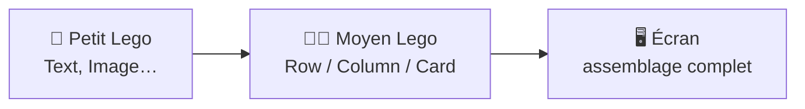
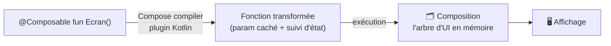
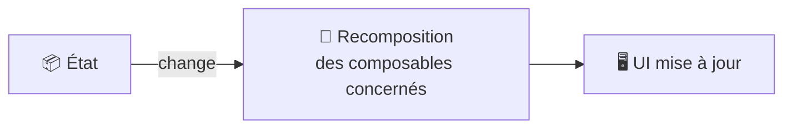

---
tags:
  - projet/kotlin
  - type/index
  - techno/kotlin
  - techno/android
  - techno/compose
  - sujet/ui
  - statut/a-jour
cours: P1
cree: 2026-09-28
maj: 2026-09-29
---

# Compose

> [!abstract] En une phrase
> **Compose**, c'est construire l'UI avec des **fonctions** (pas des balises), en **empilant des composants comme des Lego**.

C'est la suite de [[07 UI déclarative|l'UI déclarative]] : on **décrit** l'écran en Kotlin au lieu d'écrire du XML.

---

## 🧩 Ce n'est pas des balises, mais des fonctions

> [!quote] Tes mots
> C'est **pas des balises** mais des **fonctions**.

```kotlin
fun nomFun() { }
```

Un écran Compose = un assemblage de **fonctions composables**.

---

## 🎯 La philosophie Kotlin

> [!quote] Tes mots
> Kotlin c'est un langage qui a pour objectif de **simplifier le code** : *less code, less bugs*. **Moins de code = moins de bugs.**

---

## 🧱 La métaphore Lego

> [!quote] Tes mots
> En gros Compose c'est des **Lego** : un écran, c'est simplement un **petit Lego** qu'on empile → ça fait un **moyen Lego**, on en rajoute un, etc.



---

## Comment Compose fonctionne (compilation)

> [!info] L'idée
> Une fonction `@Composable` n'est **pas une fonction normale**. Un **plugin de compilation** (le *Compose compiler*) la **transforme** pour qu'elle sache **émettre de l'UI** et **réagir aux changements d'état**.

### La chaîne de compilation



1. On écrit des fonctions annotées **`@Composable`**.
2. À la **compilation**, le **Compose compiler** les réécrit : il leur ajoute de quoi **s'enregistrer** dans la *composition* et **observer l'état**.
3. À l'**exécution**, la **première composition** construit l'arbre d'UI en mémoire et l'affiche.

### La recomposition (le point clé)

> [!tip] On ne redessine pas tout
> Quand un **état observé change**, Compose **ré-exécute uniquement** les composables qui en dépendent. C'est la **recomposition**.



> [!question] À confirmer avec le cours
> Le détail « paramètre caché `$composer` » ajouté par le compilateur est le mécanisme réel, mais je l'ai simplifié ici. Dis-moi si le prof est entré dans ce détail.

---

## 📚 Notes de la section

| Note | Contenu |
|---|---|
| [[01 Les composants]] | card, row, column, image, text… |
| [[02 Le modifier]] | configurer / décorer un composant |
| [[03 MainActivity]] | construire `MainActivity.kt` étape par étape : Scaffold, NavHost, navbar |

---

## 🔗 Liens

- [[07 UI déclarative]]
- [[04 Architecture (Screen - ViewModel - Model)]]
