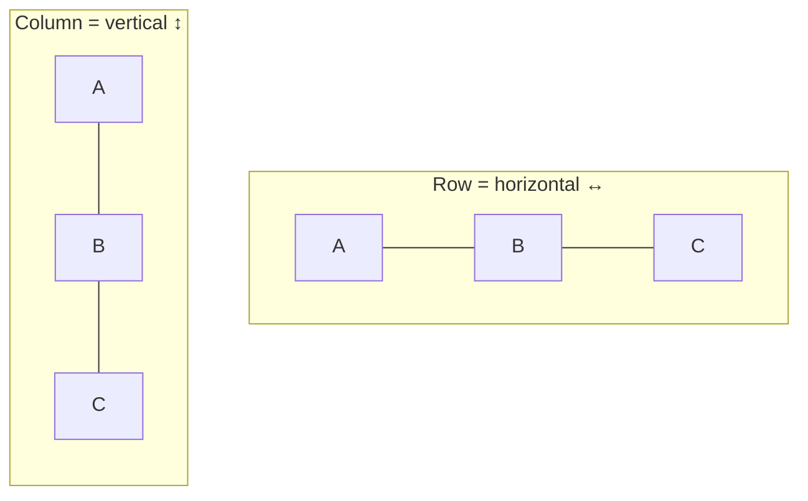
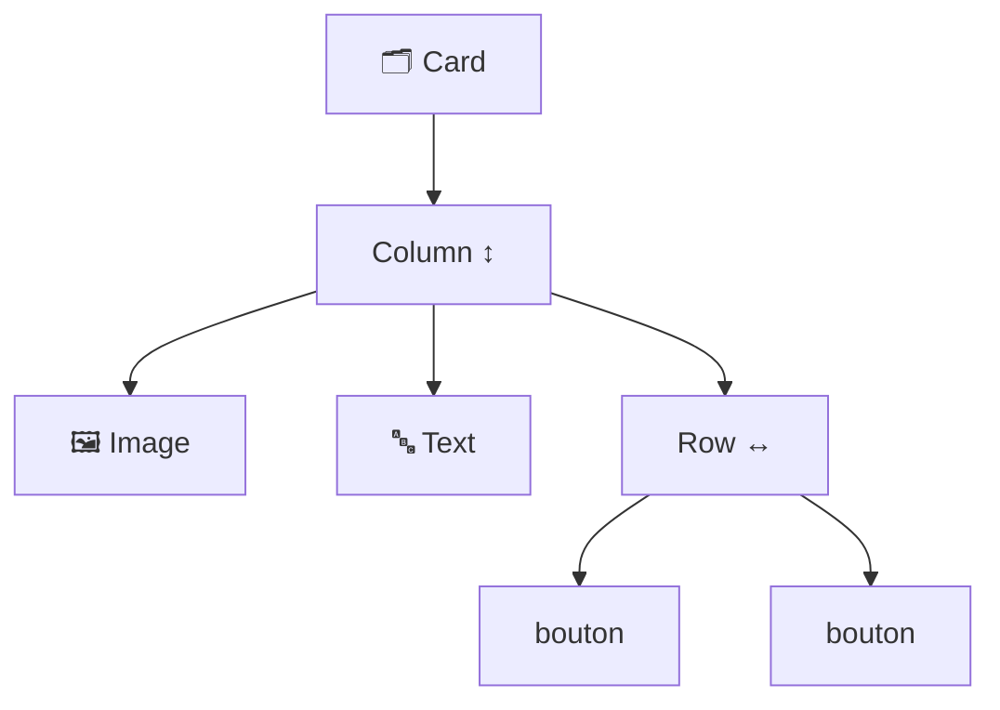

---
tags:
  - projet/kotlin
  - type/concept
  - techno/kotlin
  - techno/android
  - techno/compose
  - sujet/ui
  - statut/a-jour
cours: P1
cree: 2026-09-28
maj: 2026-09-29
---

# Les composants Compose

> [!info] Idée
> Les composants sont les **Lego de base** de l'UI. On les **empile** pour faire un écran.

---

## 🧱 Les composants de base

| Composant    | Rôle (tes mots)                            |
| ------------ | ------------------------------------------ |
| **`Text`**   | du texte                                   |
| **`Image`**  | une image *(évident 😄 « bravo génie »)*   |
| **`Row`**    | empilement **horizontal** de quelque chose |
| **`Column`** | empilement **vertical**                    |
| **`Card`**   | … bah, c'est une **card**                  |
| …            | etc.                                       |
|              |                                            |

---

## ↔️↕️ Row vs Column

- **`Row`** → aligne ses enfants **côte à côte** (horizontal).
- **`Column`** → aligne ses enfants **les uns sous les autres** (vertical).

> [!warning] Toujours mettre un Row ou un Column
> Si tu **n'utilises pas** de `Column` ou de `Row`, c'est le **scope parent** qui **décide de l'orientation**. → mets-en un pour maîtriser la disposition.

---

## 🧩 On empile (métaphore Lego)

Un composant peut en **contenir d'autres** → c'est comme ça qu'on assemble un écran.

---

## 🔗 Liens

- [[00 Compose]]
- [[02 Le modifier]]
