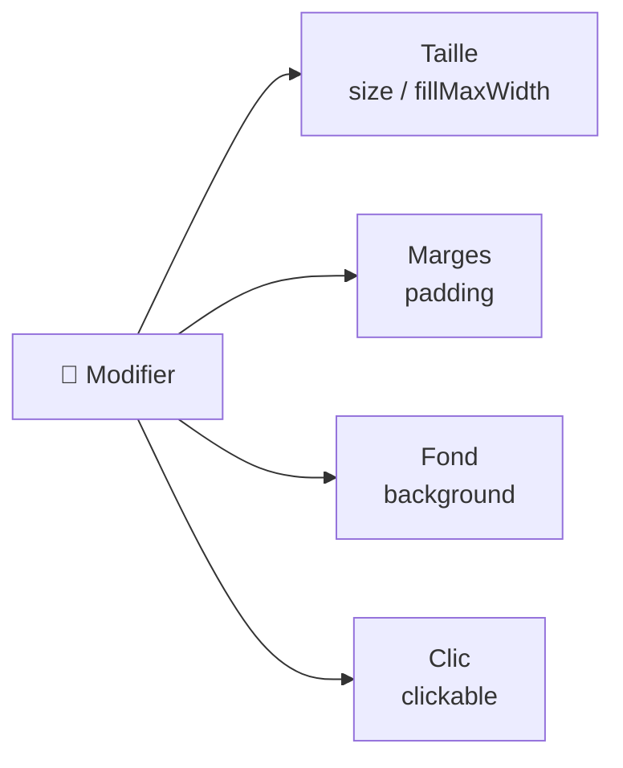

---
tags:
  - projet/kotlin
  - type/concept
  - techno/kotlin
  - techno/android
  - techno/compose
  - sujet/ui
  - statut/a-jour
cours: P1
cree: 2026-09-28
maj: 2026-09-29
---

# Le `modifier`

> [!info] Expliqué simplement
> Le **`modifier`** sert à **configurer et décorer** un composant : sa **taille**, ses **marges (padding)**, son **fond**, son **comportement au clic**, etc. C'est le « réglage » qu'on attache à un Lego.

---

## ✍️ Comment on l'utilise

> [!quote] Tes mots
> `composantNom( modifier = … )` ou `modifier.`

```kotlin
Text(
    text = "Salut",
    modifier = Modifier
        .padding(16.dp)   // marge
        .fillMaxWidth()    // prend toute la largeur
)
```

- On le passe en **paramètre** du composant : `modifier = Modifier…`
- On **enchaîne** les réglages avec des points : `Modifier.padding(...).background(...)`

---

## 🧩 À quoi ça sert



> [!tip] L'ordre compte
> Les réglages s'appliquent **dans l'ordre** où on les enchaîne (ex. `padding` puis `background` ≠ `background` puis `padding`).

---

## 🔗 Liens

- [[00 Compose]]
- [[01 Les composants]]
