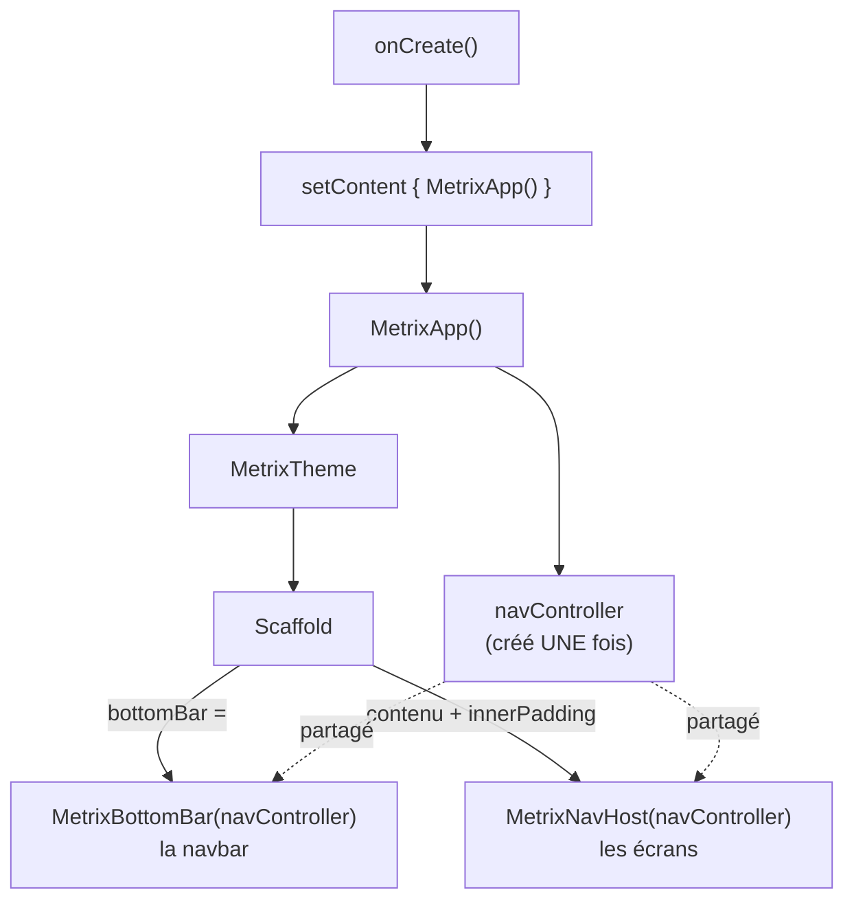
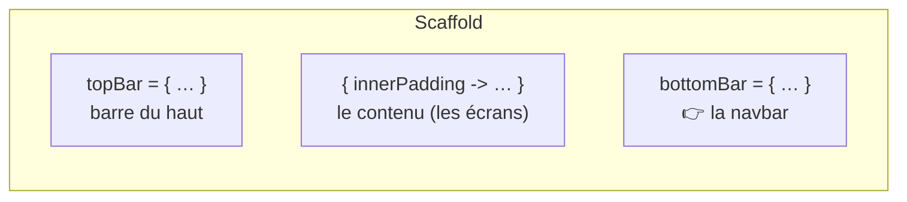
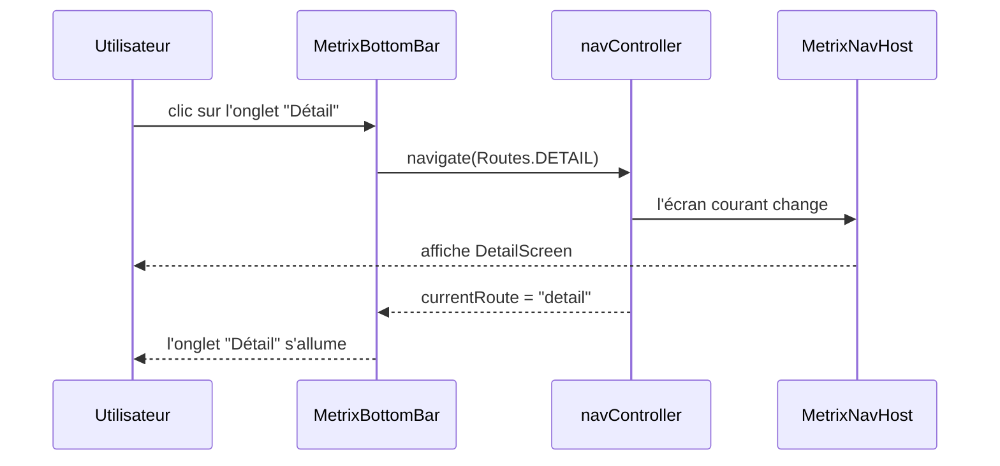

---
tags:
  - projet/kotlin
  - type/guide
  - techno/kotlin
  - techno/android
  - techno/compose
  - sujet/navigation
  - sujet/ui
  - statut/a-jour
cours: P1
cree: 2026-09-28
maj: 2026-09-29
---

# MainActivity pas à pas

> [!abstract] Le but
> Tu as **déjà un projet qui run**. Ici on construit le fichier **`MainActivity.kt`** étape par étape, **côté code uniquement** : chaque étape ajoute un morceau, et on explique pourquoi il est là.
> Le reste (manifest, ressources, composants…) est dans les autres notes → [[00 Compose]], [[02 Les Activities]].

---

## 🎯 Ce qu'on construit



---

## Étape 1 — Le squelette de l'activity

```kotlin
class MainActivity : ComponentActivity() {
    override fun onCreate(savedInstanceState: Bundle?) {
        super.onCreate(savedInstanceState)
        enableEdgeToEdge()
    }
}
```

| Code | Pourquoi |
|---|---|
| `class MainActivity : ComponentActivity()` | Notre activity **est une** `ComponentActivity` : la classe de base qui sait afficher du Compose |
| `override fun onCreate(...)` | La 1re étape du [[02 Les Activities#Le cycle de vie d'une Activity\|cycle de vie]] (mort → purgatoire) : c'est ici qu'on construit l'écran |
| `super.onCreate(savedInstanceState)` | Android fait d'abord son travail. **Toujours en 1re ligne** |
| `savedInstanceState: Bundle?` | L'état sauvegardé (ex. après une reconfig). Le `?` = peut être `null` |
| `enableEdgeToEdge()` | L'app dessine **jusqu'aux bords**, sous les barres du téléphone (on gère ça à l'étape 4) |

---

## Étape 2 — Brancher Compose : `setContent` + la fonction App

```kotlin
class MainActivity : ComponentActivity() {
    override fun onCreate(savedInstanceState: Bundle?) {
        super.onCreate(savedInstanceState)
        enableEdgeToEdge()
        setContent {           // 👈
            MetrixApp()        // 👈
        }
    }
}

@Composable                    // 👈
fun MetrixApp() {              // 👈
}
```

| Code | Pourquoi |
|---|---|
| `setContent { }` | **Le pont vers Compose** : « voici l'UI de cette activity » |
| `MetrixApp()` | Toute l'UI part dans **une fonction à part** → `onCreate` reste court et ne bougera plus |
| `@Composable fun MetrixApp()` | Une fonction qui **décrit de l'UI** → [[00 Compose]]. Nom conseillé : `<TonApp>App` |

> [!warning] `MetrixApp` en dehors de la classe
> On l'écrit **sous** la classe `MainActivity`, pas dedans. Les composables sont des fonctions « libres ».

---

## Étape 3 — Le thème

```kotlin
@Composable
fun MetrixApp() {
    MetrixTheme {              // 👈
    }                          // 👈
}
```

- `MetrixTheme { }` applique **couleurs + typo** à tout ce qu'il contient. Il est généré par Android Studio (dans `ui/theme` ou `ui/core/theme`).
- Il est **tout en haut** : tout ce qu'on met dedans (navbar, écrans) aura le même style.

---

## Étape 4 — Le Scaffold (la structure de l'écran)

```kotlin
@Composable
fun MetrixApp() {
    MetrixTheme {
        Scaffold(modifier = Modifier.fillMaxSize()) { innerPadding ->   // 👈
        }                                                                // 👈
    }
}
```

Le `Scaffold` est le **squelette** d'un écran Material. Il a des **emplacements** prévus :



| Code | Pourquoi |
|---|---|
| `Modifier.fillMaxSize()` | Le Scaffold prend **tout l'écran** → [[02 Le modifier]] |
| `{ innerPadding -> }` | Le Scaffold te donne `innerPadding` = la place prise par **les barres du téléphone + la topBar + la bottomBar** |

> [!note] `innerPadding` souligné en rouge ?
> Tant qu'on ne l'utilise pas, Android Studio râle. C'est normal : on l'utilise à l'étape 5.

---

## Étape 5 — La navigation : le `navController` et le `NavHost`

```kotlin
@Composable
fun MetrixApp() {
    val navController = rememberNavController()      // 👈

    MetrixTheme {
        Scaffold(modifier = Modifier.fillMaxSize()) { innerPadding ->
            MetrixNavHost(                           // 👈
                navController = navController,       // 👈
                modifier = Modifier.padding(innerPadding)   // 👈
            )                                        // 👈
        }
    }
}
```

### Où et pourquoi là

| Code | Pourquoi |
|---|---|
| `val navController = rememberNavController()` | Le **chauffeur** : c'est lui qui change d'écran. Créé **une seule fois**, **en haut** de `MetrixApp`, pour être **partagé** entre le NavHost et la navbar |
| `remember…` | Il est **gardé en mémoire** entre les recompositions (sinon on en recréerait un à chaque redessin) |
| `MetrixNavHost(...)` **dans le contenu du Scaffold** | Le NavHost affiche **l'écran courant** : il va là où le Scaffold met le contenu |
| `Modifier.padding(innerPadding)` | Les écrans sont **décalés** pour ne passer ni sous les barres du téléphone, ni sous la navbar |

### Comment il est appelé

`MetrixApp` n'a besoin que de **ça** : `MetrixNavHost(navController, modifier)`. Il ne connaît pas les écrans, c'est le NavHost qui les liste.

> [!example]- Rappel : le fichier `ui/core/MetrixNavHost.kt` appelé ici
> ```kotlin
> package com.diiage.metrix.ui.core
>
> import androidx.compose.runtime.Composable
> import androidx.compose.ui.Modifier
> import androidx.navigation.NavHostController
> import androidx.navigation.compose.NavHost
> import androidx.navigation.compose.composable
> import com.diiage.metrix.ui.screens.DetailScreen
> import com.diiage.metrix.ui.screens.HomeScreen
>
> object Routes {
>     const val HOME = "home"
>     const val DETAIL = "detail"
> }
>
> @Composable
> fun MetrixNavHost(
>     navController: NavHostController,
>     modifier: Modifier = Modifier
> ) {
>     NavHost(
>         navController = navController,
>         startDestination = Routes.HOME,
>         modifier = modifier
>     ) {
>         composable(Routes.HOME) {
>             HomeScreen(onGoToDetail = { navController.navigate(Routes.DETAIL) })
>         }
>         composable(Routes.DETAIL) {
>             DetailScreen(onBack = { navController.popBackStack() })
>         }
>     }
> }
> ```
> Nécessite la dépendance `navigation-compose` dans `build.gradle.kts`.

---

## Étape 6 — La navbar : où la mettre et comment l'appeler

### Où la mettre

Dans l'emplacement **`bottomBar`** du Scaffold, en lui passant **le même** `navController` :

```kotlin
@Composable
fun MetrixApp() {
    val navController = rememberNavController()

    MetrixTheme {
        Scaffold(
            modifier = Modifier.fillMaxSize(),
            bottomBar = { MetrixBottomBar(navController = navController) }   // 👈
        ) { innerPadding ->
            MetrixNavHost(
                navController = navController,
                modifier = Modifier.padding(innerPadding)
            )
        }
    }
}
```

| Choix | Pourquoi |
|---|---|
| Dans `bottomBar = { }` | Le Scaffold la place **en bas** et **ajoute sa hauteur** dans `innerPadding` → les écrans ne passent pas dessous |
| **Dans `MetrixApp`**, pas dans chaque écran | Elle est **commune** à toute l'app : on l'écrit **une fois**, elle reste affichée quand on change d'écran |
| **Même** `navController` que le NavHost | La navbar **commande** le NavHost. Deux `navController` différents = la navbar ne ferait rien bouger |

### Comment elle s'appelle

- **Le composable** : `MetrixBottomBar` (convention : `<TonApp>BottomBar`).
- **Son fichier** : `ui/core/MetrixBottomBar.kt`, à côté de `MetrixNavHost.kt` (comme le thème, c'est du « cœur » d'app).
- **Ce qu'elle reçoit** : juste le `navController`.

```kotlin
package com.diiage.metrix.ui.core

import androidx.annotation.StringRes
import androidx.compose.material.icons.Icons
import androidx.compose.material.icons.filled.Home
import androidx.compose.material.icons.filled.Info
import androidx.compose.material3.Icon
import androidx.compose.material3.NavigationBar
import androidx.compose.material3.NavigationBarItem
import androidx.compose.material3.Text
import androidx.compose.runtime.Composable
import androidx.compose.runtime.getValue
import androidx.compose.ui.graphics.vector.ImageVector
import androidx.compose.ui.res.stringResource
import androidx.navigation.NavGraph.Companion.findStartDestination
import androidx.navigation.NavHostController
import androidx.navigation.compose.currentBackStackEntryAsState
import com.diiage.metrix.R

// Un onglet de la navbar = une route + un texte + une icône
data class BottomItem(
    val route: String,
    @StringRes val label: Int,
    val icon: ImageVector
)

// La liste des onglets (l'ordre = l'ordre affiché)
val bottomItems = listOf(
    BottomItem(Routes.HOME, R.string.home_title, Icons.Filled.Home),
    BottomItem(Routes.DETAIL, R.string.detail_title, Icons.Filled.Info)
)

@Composable
fun MetrixBottomBar(navController: NavHostController) {
    // Sur quel écran on est ? (se met à jour tout seul quand on navigue)
    val backStackEntry by navController.currentBackStackEntryAsState()
    val currentRoute = backStackEntry?.destination?.route

    NavigationBar {
        bottomItems.forEach { item ->
            NavigationBarItem(
                selected = currentRoute == item.route,
                onClick = {
                    navController.navigate(item.route) {
                        popUpTo(navController.graph.findStartDestination().id) {
                            saveState = true
                        }
                        launchSingleTop = true
                        restoreState = true
                    }
                },
                icon = { Icon(item.icon, contentDescription = null) },
                label = { Text(stringResource(item.label)) }
            )
        }
    }
}
```

| Code | Pourquoi |
|---|---|
| `data class BottomItem` + `bottomItems` | Les onglets sont **décrits une fois** dans une liste. Ajouter un onglet = ajouter une ligne |
| `Routes.HOME`, `Routes.DETAIL` | Les **mêmes routes** que le NavHost → la navbar et le NavHost parlent des mêmes écrans |
| `currentBackStackEntryAsState()` | Donne l'**écran actuel** et se met à jour quand on navigue → sert à **allumer** le bon onglet |
| `selected = currentRoute == item.route` | L'onglet est surligné si c'est l'écran affiché |
| `navigate(item.route) { … }` | Au clic, on **demande au chauffeur** d'aller sur l'écran de l'onglet |
| `popUpTo(...startDestination) { saveState = true }` | On ne **empile pas** les écrans à chaque clic d'onglet : on revient à la base (sinon le bouton retour repasse par tous les onglets cliqués) |
| `launchSingleTop = true` | Recliquer sur l'onglet actuel ne **recrée pas** l'écran une 2e fois |
| `restoreState = true` | En revenant sur un onglet, on retrouve **son état** (scroll, etc.) |
| `contentDescription = null` | Pas de description vocale pour l'icône, car le `label` texte est déjà là |

> [!warning] `Icons` en rouge ?
> Les icônes sont dans une bibliothèque à part. Ajouter dans `build.gradle.kts (Module :app)`, bloc `dependencies` :
> `implementation("androidx.compose.material:material-icons-core")` puis **Sync Now**. Pas de numéro de version à mettre : le BOM Compose du projet s'en charge.

### Qui appelle qui



---

## ✅ Le fichier final complet

```kotlin
package com.diiage.metrix

import android.os.Bundle
import androidx.activity.ComponentActivity
import androidx.activity.compose.setContent
import androidx.activity.enableEdgeToEdge
import androidx.compose.foundation.layout.fillMaxSize
import androidx.compose.foundation.layout.padding
import androidx.compose.material3.Scaffold
import androidx.compose.runtime.Composable
import androidx.compose.ui.Modifier
import androidx.navigation.compose.rememberNavController
import com.diiage.metrix.ui.core.MetrixBottomBar
import com.diiage.metrix.ui.core.MetrixNavHost
import com.diiage.metrix.ui.core.theme.MetrixTheme

class MainActivity : ComponentActivity() {
    override fun onCreate(savedInstanceState: Bundle?) {
        super.onCreate(savedInstanceState)
        enableEdgeToEdge()
        setContent {
            MetrixApp()
        }
    }
}

@Composable
fun MetrixApp() {
    val navController = rememberNavController()

    MetrixTheme {
        Scaffold(
            modifier = Modifier.fillMaxSize(),
            bottomBar = { MetrixBottomBar(navController = navController) }
        ) { innerPadding ->
            MetrixNavHost(
                navController = navController,
                modifier = Modifier.padding(innerPadding)
            )
        }
    }
}
```

> [!tip] Pour ton app
> Remplace `metrix` / `Metrix` par ton nom (ex. `edusec` / `EduSec`) : `EduSecTheme`, `EdusecApp`, `EdusecNavHost`, `EdusecBottomBar`.

---

## 🧯 Erreurs fréquentes (côté code)

| Symptôme | Cause | Solution |
|---|---|---|
| `Unresolved reference: X` | Import manquant | **Alt + Entrée** → **Import** |
| `Unresolved reference: R` (dans `ui/core`) | `R` est dans `com.diiage.metrix` | `import com.diiage.metrix.R` (pas `android.R`) |
| `@Composable invocations can only happen from the context of a @Composable function` | Composable appelé depuis une fonction normale | Mettre `@Composable` au-dessus, ou appeler depuis `setContent { }` |
| Le contenu passe sous l'heure ou sous la navbar | `innerPadding` pas utilisé | `Modifier.padding(innerPadding)` sur le NavHost |
| Clic sur un onglet : rien ne bouge | Deux `navController` différents | Un seul `rememberNavController()` dans `MetrixApp`, passé aux deux |
| Aucun onglet ne s'allume | Route de l'onglet ≠ route du NavHost | Utiliser `Routes.X` des deux côtés |
| Le bouton retour repasse par tous les onglets | `popUpTo` oublié | Remettre le bloc `navigate(item.route) { popUpTo… }` |
| Crash : `navigation destination ... is unknown` | Route pas déclarée dans le NavHost | Un `composable(Routes.X)` par onglet |

---

## 🔗 Liens

- [[00 Compose]]
- [[01 Les composants]]
- [[02 Le modifier]]
- [[02 Les Activities]]
- [[03 Les logs]] — pour débugger si ça ne marche pas
