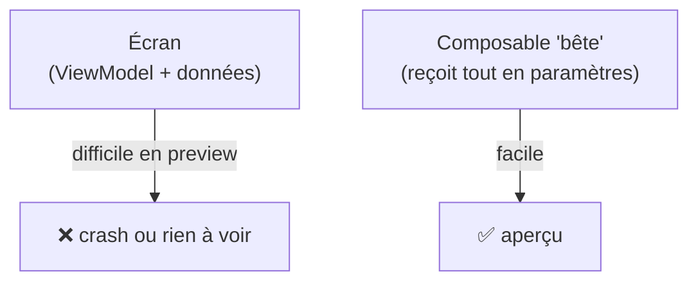
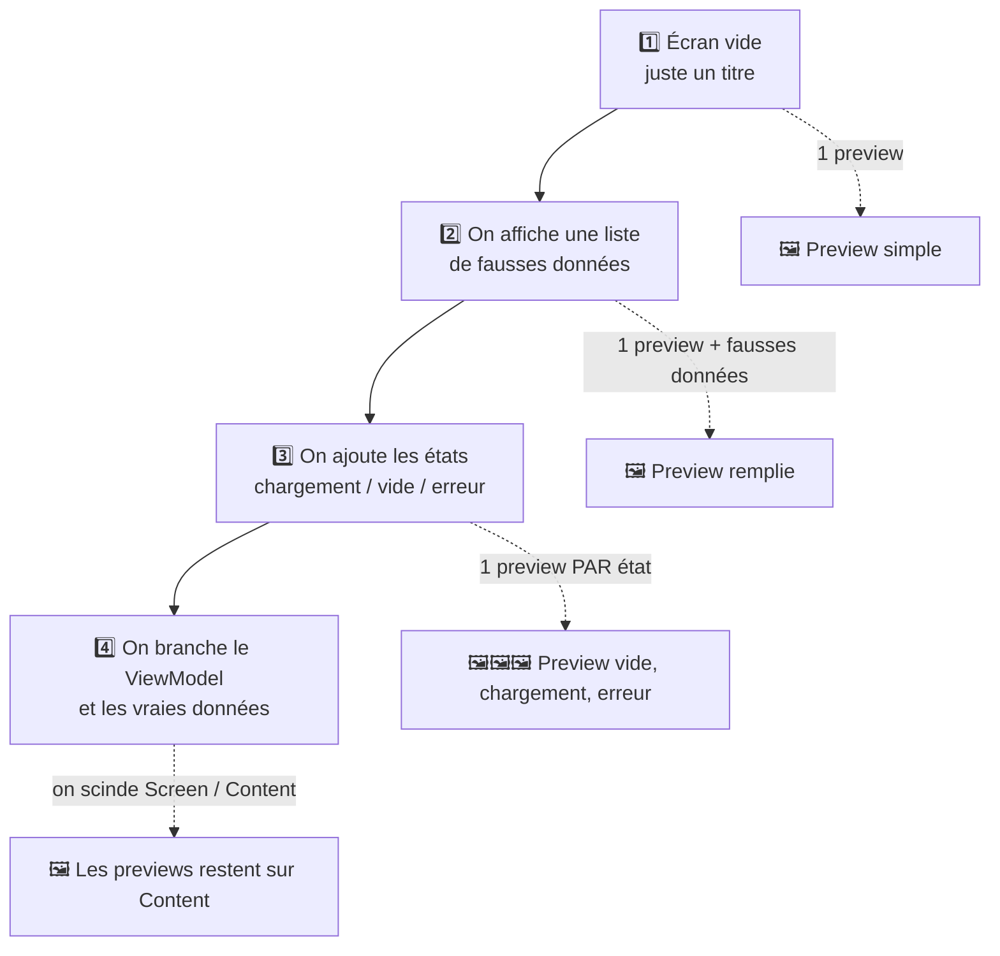

---
tags:
  - projet/kotlin
  - type/guide
  - techno/kotlin
  - techno/android
  - techno/compose
  - sujet/ui
  - sujet/debug
  - statut/a-jour
cours: P1
cree: 2026-09-29
maj: 2026-09-29
---

# Les previews

> [!abstract] En une phrase
> Une **preview**, c'est un **aperçu d'un composable directement dans Android Studio**, sans lancer l'émulateur.
> À lire avant : [[00 Compose]] et [[01 Les composants]].

---

## 🧩 À quoi ça sert

> [!example] L'atelier de peinture
> Au lieu de monter tout le tableau dans la salle d'expo (l'émulateur) pour voir si une couleur va bien, on regarde le morceau sur l'établi. C'est plus rapide, et on voit le clair **et** le sombre côte à côte.

Le mot technique : l'annotation **`@Preview`**. Android Studio l'affiche dans le panneau **Split** ou **Design** du fichier.

---

## 📦 Les dépendances

Elles sont déjà là dans un projet Compose créé par Android Studio (voir [[02 Ajouter une dépendance]]).

```kotlin
implementation(libs.androidx.compose.ui.tooling.preview) // l'annotation @Preview
debugImplementation(libs.androidx.compose.ui.tooling)    // le moteur d'aperçu (debug seulement)
```

| Code | Pourquoi |
|---|---|
| `ui-tooling-preview` | fournit l'annotation `@Preview` utilisée dans le code |
| `ui-tooling` | fait tourner l'aperçu ; inutile en release, donc `debugImplementation` |

---

## 🛠️ La recette d'une preview propre

Une preview propre, c'est **4 règles** :

1. Une fonction **`private`** dédiée, nommée `NomDuComposablePreview`. Elle n'est jamais appelée par l'app.
2. Elle **n'a aucun paramètre** : on fabrique les données dedans.
3. Elle est enveloppée dans **le thème de l'app**, sinon couleurs et polices sont celles par défaut.
4. Elle est **au-dessous** du composable, dans le même fichier.

```kotlin
@Preview(name = "Clair", showBackground = true)
@Preview(name = "Sombre", showBackground = true, uiMode = Configuration.UI_MODE_NIGHT_YES)
@Composable
private fun MaBarrePreview() {
    MonTheme {
        MaBarre(navController = rememberNavController())
    }
}
```

| Code | Pourquoi |
|---|---|
| `@Preview` posé **deux fois** | deux aperçus côte à côte (clair / sombre), on n'a pas besoin de deux fonctions |
| `name = "…"` | l'étiquette affichée au-dessus de chaque aperçu |
| `showBackground = true` | sinon le fond est **transparent** et un texte sombre disparaît |
| `uiMode = Configuration.UI_MODE_NIGHT_YES` | simule le **mode sombre** |
| `private` | la fonction n'est visible que dans le fichier, elle ne pollue pas le reste du code |
| `MonTheme { … }` | applique les vraies couleurs et polices |

> [!tip] Plusieurs tailles d'un coup
> Les paramètres `widthDp`, `heightDp`, `fontScale = 1.5f` ou `locale = "en"` testent une petite fenêtre, une grosse police ou une autre langue.

---

## 🧠 Le problème : le composable a besoin de « choses » que la preview n'a pas

Une preview est **isolée** : pas de ViewModel, pas d'injection Koin, pas d'internet.



**La solution : séparer en deux.** C'est le principe du **state hoisting** (on « remonte » l'état vers le parent).

| Niveau | Rôle | Preview ? |
|---|---|---|
| **Screen** (avec le ViewModel) | récupère les données | ❌ non |
| **Contenu** (reçoit une liste, des lambdas) | affiche | ✅ oui |

```kotlin
@Composable
fun ListeScreen(viewModel: ListeViewModel = koinViewModel()) {
    val items by viewModel.items.collectAsState()
    ListeContent(items = items, onItemClick = viewModel::select)
}

@Composable
fun ListeContent(items: List<String>, onItemClick: (String) -> Unit) { /* … */ }

@Preview(showBackground = true)
@Composable
private fun ListeContentPreview() {
    MonTheme {
        ListeContent(items = listOf("Un", "Deux", "Trois"), onItemClick = {})
    }
}
```

| Code | Pourquoi |
|---|---|
| `ListeContent(items, onItemClick)` | ne connaît ni ViewModel ni Koin : on lui donne tout |
| `listOf("Un", …)` | de **fausses données** écrites à la main pour l'aperçu |
| `onItemClick = {}` | une lambda vide : dans une preview, cliquer ne fait rien |

---

## 🧭 Le cas d'une barre de navigation

Un composable qui prend un `NavHostController` se prévisualise avec **`rememberNavController()`** : un contrôleur neuf, créé pour l'occasion.

```kotlin
MonTheme {
    MaBarreDuBas(navController = rememberNavController())
}
```

> [!warning] Aucun onglet n'est allumé
> Le contrôleur n'est relié à **aucun `NavHost`** : il ne sait pas sur quel écran on est, donc `currentRoute` vaut `null` et **aucun onglet n'apparaît sélectionné**. Pour voir un onglet actif, il faut soit passer la route en paramètre (state hoisting), soit lancer l'app.

---

## 🖥️ Sur un gros écran : une preview par état

> [!question] Faut-il des previews sur les gros écrans ?
> **Oui, c'est une bonne pratique.** Mais on ne prévisualise pas l'écran branché au ViewModel : on prévisualise son **contenu**, et on en fait **une preview par état**.

Un écran n'a pas une seule apparence. Une liste d'éléments peut être :

| État | Ce qu'on voit | Pourquoi le prévisualiser |
|---|---|---|
| **Chargement** | un cercle qui tourne | vérifier qu'il est centré et visible |
| **Liste remplie** | les lignes | vérifier la mise en page, les textes longs |
| **Liste vide** | « Aucun élément » | on l'oublie souvent, et il est dur à provoquer dans l'émulateur |
| **Erreur** | message + bouton « Réessayer » | impossible à voir sans couper le réseau |

Sans preview, chaque état demande de **lancer l'app et de fabriquer la situation**. Avec, ils sont tous affichés en même temps.

### Étape par étape : quand ajouter quoi

Une preview s'ajoute **au fur et à mesure que l'écran grandit**, pas d'un coup.



| Étape | Ce qu'on fait | Previews |
|---|---|---|
| **1. Écran vide** | un titre au milieu, comme un écran de départ | une seule preview, sans données |
| **2. Liste de fausses données** | on affiche une `List<String>` écrite à la main | une preview « remplie » |
| **3. Plusieurs états** | on introduit un état (chargement / vide / erreur) | **une preview par état** |
| **4. Branchement au ViewModel** | on **scinde** en `Screen` + `Content` | on ne touche pas aux previews : elles sont déjà sur `Content` |

> [!tip] Pourquoi c'est confortable
> À l'étape 4, tu ne réécris pas les previews. Elles visaient déjà `Content`, qui ne dépend pas du ViewModel. Le branchement se fait **au-dessus**, sans les casser.

### Exemple complet

**Étape 3 :** on décrit les états possibles avec une `sealed interface` (un type qui n'a qu'un nombre fini de cas).

```kotlin
sealed interface ListeState {
    data object Chargement : ListeState
    data class Succes(val items: List<String>) : ListeState
    data class Erreur(val message: String) : ListeState
}
```

**Le contenu**, qui reçoit l'état et affiche le bon morceau :

```kotlin
@Composable
fun ListeContent(
    state: ListeState,
    onRetry: () -> Unit,
    modifier: Modifier = Modifier
) {
    when (state) {
        is ListeState.Chargement -> CircularProgressIndicator()
        is ListeState.Erreur -> Column {
            Text(state.message)
            Button(onClick = onRetry) { Text("Réessayer") }
        }
        is ListeState.Succes -> {
            if (state.items.isEmpty()) Text("Aucun élément")
            else LazyColumn(modifier) { items(state.items) { Text(it) } }
        }
    }
}
```

**Les previews**, une par état :

```kotlin
@Preview(name = "Chargement", showBackground = true)
@Composable
private fun ListeChargementPreview() {
    MonTheme { ListeContent(state = ListeState.Chargement, onRetry = {}) }
}

@Preview(name = "Remplie", showBackground = true)
@Composable
private fun ListeRemplieePreview() {
    MonTheme {
        ListeContent(state = ListeState.Succes(listOf("Un", "Deux", "Trois")), onRetry = {})
    }
}

@Preview(name = "Vide", showBackground = true)
@Composable
private fun ListeVidePreview() {
    MonTheme { ListeContent(state = ListeState.Succes(emptyList()), onRetry = {}) }
}

@Preview(name = "Erreur", showBackground = true)
@Composable
private fun ListeErreurPreview() {
    MonTheme { ListeContent(state = ListeState.Erreur("Pas de connexion"), onRetry = {}) }
}
```

**L'écran branché** (jamais prévisualisé) : il ne fait que lire le ViewModel et passer l'état.

```kotlin
@Composable
fun ListeScreen(viewModel: ListeViewModel = koinViewModel()) {
    val state by viewModel.state.collectAsState()
    ListeContent(state = state, onRetry = viewModel::recharger)
}
```

| Code | Pourquoi |
|---|---|
| `sealed interface ListeState` | liste **tous** les états possibles, et le `when` t'oblige à les traiter tous |
| `ListeContent(state, onRetry)` | ne connaît ni ViewModel ni Koin : il **affiche** ce qu'on lui donne |
| 4 fonctions `@Preview` | une par état, toutes visibles en même temps dans le panneau |
| `ListeScreen` | la seule fonction qui touche au ViewModel, donc la seule sans preview |
| `onRetry = {}` | lambda vide : en preview, cliquer ne fait rien |

> [!success] À faire
> - Une preview par **état** qui change l'affichage.
> - Des previews sur le **contenu**, jamais sur l'écran branché.
> - Des fausses données **écrites à la main**, simples et parlantes.

> [!failure] À éviter
> - Une preview qui crée un vrai ViewModel, ou appelle Koin ou le réseau.
> - Un seul état prévisualisé alors que l'écran en a quatre.
> - Des previews sur chaque petit composant sans intérêt : garde-les pour ce qui change l'affichage.

---

## ⚠️ Erreurs fréquentes

| Symptôme | Cause | Solution |
|---|---|---|
| Rien ne s'affiche / « Render problem » | le composable lit un ViewModel ou Koin | séparer en Screen / Contenu, previewer le contenu |
| Fond blanc avec texte invisible | pas de `showBackground` ou pas de thème | `showBackground = true` + entourer avec le thème |
| `@Preview` en rouge | dépendance `ui-tooling-preview` absente | l'ajouter dans `build.gradle.kts` puis **Sync** |
| Le panneau Preview n'apparaît pas | mauvais mode d'affichage | bouton **Split** ou **Design** en haut à droite du fichier |
| L'aperçu ne bouge plus après une modif | build périmé | bouton **Build & Refresh** en haut du panneau |
| Preview publique dans la liste d'autocomplétion | fonction non `private` | ajouter `private` |

---

## 🔗 Liens

- [[00 Compose]] — le principe des composables
- [[01 Les composants]] — ce qu'on prévisualise
- [[03 MainActivity]] — l'écran qui assemble barre et navigation
- [[04 Architecture (Screen - ViewModel - Model)]] — pourquoi séparer Screen et contenu
