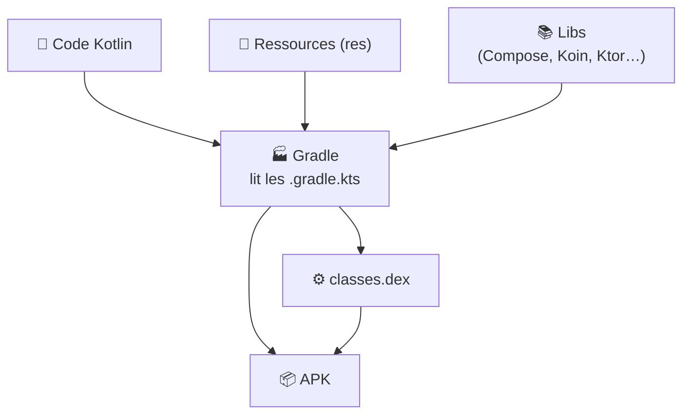

---
tags:
  - projet/kotlin
  - type/index
  - techno/kotlin
  - techno/android
  - techno/gradle
  - sujet/build
  - statut/a-jour
cours: P1
cree: 2026-09-29
maj: 2026-09-29
---

# Gradle

> [!abstract] En une phrase
> **Gradle** est l'outil qui **fabrique l'application** : il récupère les bibliothèques, compile le code et assemble le tout en **APK**. On lui dit quoi faire avec des fichiers `.gradle.kts`, écrits en Kotlin.

---

## 🏭 La métaphore : le chef de chantier

> [!example] Gradle = le chef de chantier
> Tu écris le code et tu ranges tes ressources. Gradle, lui, **commande les matériaux** (les **dépendances**, c'est-à-dire les libs comme Compose ou Koin), **fait travailler les ouvriers** (le **compilateur** Kotlin) et **livre la maison** (l'**APK**).
> Les fichiers `build.gradle.kts` sont **le plan du chantier**.

👉 C'est Gradle qui produit le [[06 Classes.dex|classes.dex]] et qui range les [[03 Les Ressources|ressources]] dans l'[[00 les composant de base|APK]].

---

## 🔄 Le « Sync » : le réflexe n°1

> [!warning] Après chaque modification d'un fichier Gradle → **Sync Now**
> Quand tu modifies un fichier `.gradle.kts` ou `libs.versions.toml`, Android Studio affiche un bandeau jaune **« Sync Now »**. Tant que tu ne cliques pas dessus, **rien n'est pris en compte**, et les nouveaux imports restent en rouge.
> On peut aussi passer par **File → Sync Project with Gradle Files** (l'icône 🐘 avec une flèche).

---

## 🧩 Les mots à connaître

| Mot | Ce que ça veut dire |
|---|---|
| **Gradle** | L'outil de construction (le **build system**) |
| **AGP** (*Android Gradle Plugin*) | Le plugin qui apprend à Gradle à fabriquer une **app Android** |
| **Dépendance** | Une bibliothèque externe dont l'app a besoin (Compose, Koin…) |
| **Module** | Un sous-projet. Une app simple n'en a qu'un : **`:app`** |
| **Build** | L'action de fabriquer l'app (compiler + assembler) |
| **Wrapper** (`gradlew`) | Un petit script qui télécharge **la bonne version** de Gradle pour le projet |
| **Sync** | Android Studio relit les fichiers Gradle et télécharge ce qui manque |

---

## 📚 Notes de la section

| Note | Contenu |
|---|---|
| [[01 Les fichiers Gradle]] | La carte des fichiers : lequel sert à quoi |
| [[02 Ajouter une dépendance]] | Ajouter une lib pas à pas (catalogue de versions, BOM) |
| [[03 Le bloc android]] | `namespace`, `minSdk`, `targetSdk`, `buildFeatures`… expliqués ligne par ligne |
| [[04 Commandes et erreurs Gradle]] | Les commandes `gradlew` et les erreurs fréquentes |

---

## 🔗 Liens

- [[kotlin]] — accueil du cours
- [[06 Classes.dex]] — ce que Gradle produit
- [[08 Koin (injection de dépendances)]] — une lib ajoutée via Gradle
