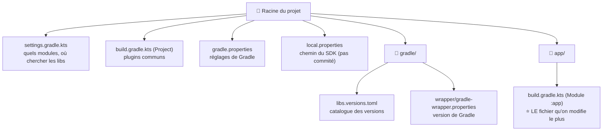

---
tags:
  - projet/kotlin
  - type/concept
  - techno/kotlin
  - techno/android
  - techno/gradle
  - sujet/build
  - statut/a-jour
cours: P1
cree: 2026-09-29
maj: 2026-09-29
---

# Les fichiers Gradle

> [!abstract] En une phrase
> Un projet Android a **plusieurs fichiers Gradle**, et chacun a **un seul rôle**. Les exemples de cette note viennent du projet **Metrix**.

---

## 🗺️ La carte



> [!tip] Dans Android Studio
> En vue **Android** (en haut à gauche de l'arborescence), tous ces fichiers sont regroupés dans **Gradle Scripts**. Le nom entre parenthèses dit lequel est lequel : **(Project: Metrix)** ou **(Module :app)**.

---

## 📋 Chaque fichier en détail

| Fichier | Rôle | On y touche ? |
|---|---|---|
| **`app/build.gradle.kts`** (Module :app) | La config de l'app : SDK, id, **dépendances** | ⭐ **Souvent** |
| **`gradle/libs.versions.toml`** | Le **catalogue** : toutes les libs et leurs versions, en un seul endroit | ⭐ **Souvent** (à chaque nouvelle lib) |
| `build.gradle.kts` (Project) | Déclare les plugins pour tout le projet, sans les activer (`apply false`) | Rarement |
| `settings.gradle.kts` | Nom du projet, liste des modules (`include(":app")`), dépôts où télécharger les libs | Rarement |
| `gradle.properties` | Réglages de Gradle (mémoire, AndroidX…) | Rarement |
| `gradle/wrapper/gradle-wrapper.properties` | La **version de Gradle** utilisée | Presque jamais (Android Studio propose la mise à jour) |
| `local.properties` | Le chemin du SDK Android **sur ta machine** | **Jamais à la main**, et **jamais commité** |

---

## ⭐ `app/build.gradle.kts` : le plus important

Il a **3 blocs** :

```kotlin
plugins {                 // 1) Les outils activés pour ce module
    alias(libs.plugins.android.application)
    alias(libs.plugins.kotlin.android)
    alias(libs.plugins.kotlin.compose)
}

android {                 // 2) La config Android de l'app
    namespace = "com.diiage.metrix"
    // … minSdk, targetSdk, buildFeatures …
}

dependencies {            // 3) Les libs utilisées
    implementation(libs.androidx.compose.material3)
    implementation(libs.androidx.navigation.compose)
}
```

| Bloc | Pourquoi |
|---|---|
| `plugins { }` | Active les **outils** : fabriquer une app Android, compiler du Kotlin, compiler du Compose |
| `android { }` | Décrit **l'app** : son identifiant, les versions d'Android visées… → détail dans [[03 Le bloc android]] |
| `dependencies { }` | Liste les **libs** → détail dans [[02 Ajouter une dépendance]] |

> [!note] `libs.xxx` ?
> `libs.` renvoie au **catalogue** `gradle/libs.versions.toml`. On n'écrit pas les versions dans `build.gradle.kts`, on les centralise dans le catalogue.

---

## 📒 `gradle/libs.versions.toml` : le catalogue

Il a **3 sections** :

```toml
[versions]          # les numéros de version, une seule fois
kotlin = "2.0.21"
navigationCompose = "2.8.4"

[libraries]         # les libs, qui pointent vers une version
androidx-navigation-compose = { group = "androidx.navigation", name = "navigation-compose", version.ref = "navigationCompose" }

[plugins]           # les plugins Gradle
kotlin-android = { id = "org.jetbrains.kotlin.android", version.ref = "kotlin" }
```

> [!tip] Tirets → points
> Dans le catalogue, on écrit `androidx-navigation-compose`. Dans `build.gradle.kts`, ça devient `libs.androidx.navigation.compose` : **les tirets deviennent des points**.

---

## ⚠️ Pièges

> [!warning] `local.properties` et `gradle.properties`
> - `local.properties` contient **ton** chemin du SDK. Il est propre à ta machine, donc il doit être dans le `.gitignore`.
> - `gradle.properties`, lui, est **commité**. N'y mets pas un chemin propre à ta machine (par exemple `org.gradle.java.home=C:\...`) : il casserait le build chez les autres.

---

## 🔗 Liens

- [[00 Gradle]]
- [[02 Ajouter une dépendance]]
- [[03 Le bloc android]]
