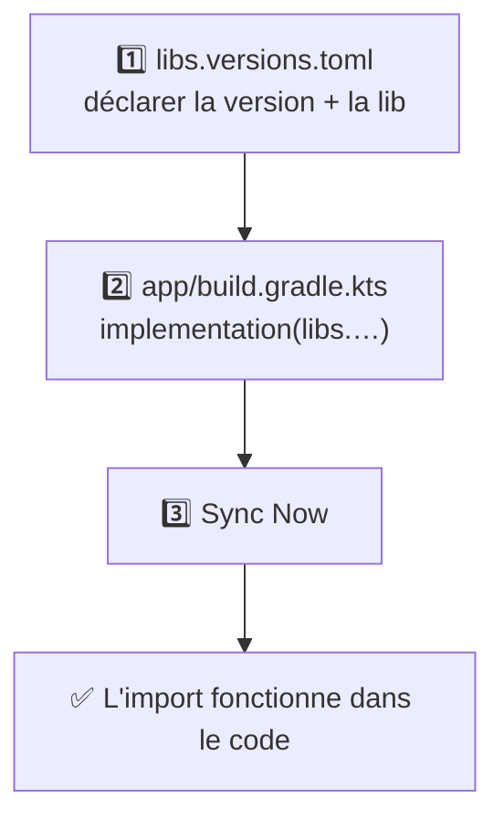

---
tags:
  - projet/kotlin
  - type/guide
  - techno/kotlin
  - techno/android
  - techno/gradle
  - sujet/build
  - sujet/dependances
  - statut/a-jour
aliases:
  - Ajouter une lib
cours: P1
cree: 2026-09-29
maj: 2026-09-29
---

# Ajouter une dépendance

> [!abstract] Le but
> Ajouter une **lib** au projet (par exemple Koin ou `navigation-compose`) en passant par le **catalogue de versions**, comme dans Metrix.

---

## 🧭 Les 3 étapes



---

## Étape 1 — Déclarer la lib dans le catalogue

Dans `gradle/libs.versions.toml` :

```toml
[versions]
navigationCompose = "2.8.4"                                      # 👈

[libraries]
androidx-navigation-compose = { group = "androidx.navigation", name = "navigation-compose", version.ref = "navigationCompose" }   # 👈
```

| Code | Pourquoi |
|---|---|
| `navigationCompose = "2.8.4"` | La version, écrite **une seule fois** |
| `group` + `name` | **L'adresse** de la lib sur le dépôt (Google ou Maven Central). Elle se trouve dans la doc officielle de la lib |
| `version.ref = "navigationCompose"` | « Prends la version déclarée plus haut sous ce nom » |

> [!tip] Écriture courte
> `{ module = "io.insert-koin:koin-android" }` revient au même que `group` + `name`. Metrix utilise les deux formes.

---

## Étape 2 — L'utiliser dans le module

Dans `app/build.gradle.kts`, bloc `dependencies` :

```kotlin
dependencies {
    implementation(libs.androidx.navigation.compose)   // 👈
}
```

Les **tirets** du catalogue deviennent des **points** : `androidx-navigation-compose` → `libs.androidx.navigation.compose`.

---

## Étape 3 — Sync Now

Cliquer sur **Sync Now** dans le bandeau jaune. Android Studio télécharge la lib, et les `import` ne sont plus rouges.

---

## 📦 Le BOM : une version pour toute une famille

> [!info] Définition
> Un **BOM** (*Bill of Materials*, la « liste de matériel ») fixe **d'un coup** les versions de toute une famille de libs qui vont ensemble. On donne la version **au BOM seulement**, et les libs de la famille n'en ont pas.

```kotlin
dependencies {
    implementation(platform(libs.androidx.compose.bom))   // le BOM, avec sa version
    implementation(libs.androidx.compose.material3)        // pas de version : le BOM décide
    implementation(libs.androidx.compose.material.icons.core)
}
```

```toml
[versions]
composeBom = "2024.09.00"

[libraries]
androidx-compose-bom = { group = "androidx.compose", name = "compose-bom", version.ref = "composeBom" }
androidx-compose-material3 = { group = "androidx.compose.material3", name = "material3" }   # pas de version.ref
```

| Code | Pourquoi |
|---|---|
| `platform(...)` | Dit à Gradle : « ceci n'est pas une lib, c'est une **liste de versions** » |
| Pas de `version.ref` sur `material3` | C'est le BOM qui fournit la version → les libs Compose restent **compatibles entre elles** |

Metrix utilise 3 BOM : **Compose**, **Koin** et **Ktor**.

---

## 🧪 `implementation`, `testImplementation`… : lequel choisir ?

| Mot-clé | La lib sert… | Exemple dans Metrix |
|---|---|---|
| `implementation` | dans l'**app** | Compose, Koin, Ktor |
| `testImplementation` | dans les **tests unitaires** (`src/test`) | JUnit |
| `androidTestImplementation` | dans les **tests sur téléphone** (`src/androidTest`) | Espresso |
| `debugImplementation` | seulement dans la **version debug** | les outils de preview Compose |

---

## 🧩 Exemple complet : ajouter Koin

```toml
# gradle/libs.versions.toml
[versions]
koin-bom = "4.0.3"

[libraries]
koin-bom = { module = "io.insert-koin:koin-bom", version.ref = "koin-bom" }
koin-android = { module = "io.insert-koin:koin-android" }
koin-androidx-compose = { module = "io.insert-koin:koin-androidx-compose" }
```

```kotlin
// app/build.gradle.kts
dependencies {
    implementation(platform(libs.koin.bom))
    implementation(libs.koin.android)
    implementation(libs.koin.androidx.compose)
}
```

Puis **Sync Now**. Comment s'en servir → [[08 Koin (injection de dépendances)]].

---

## 🔌 Et pour un plugin ?

Un plugin (ex. `kotlin-serialization`) se déclare dans la section **`[plugins]`** du catalogue, puis s'active dans le bloc `plugins { }` du module :

```toml
[plugins]
kotlin-serialization = { id = "org.jetbrains.kotlin.plugin.serialization", version.ref = "kotlin" }
```

```kotlin
// app/build.gradle.kts
plugins {
    alias(libs.plugins.kotlin.serialization)   // 👈
}
```

> [!note] `apply false` dans le build.gradle.kts du projet
> Dans le `build.gradle.kts` **(Project)**, on déclare souvent les plugins avec `apply false` : « je le connais, mais je ne l'active pas ici ». Ce sont les modules qui l'activent.

---

## 🔗 Liens

- [[00 Gradle]]
- [[01 Les fichiers Gradle]]
- [[04 Commandes et erreurs Gradle]] — si le Sync échoue
- [[03 MainActivity]] — utilise `navigation-compose` et `material-icons-core`
