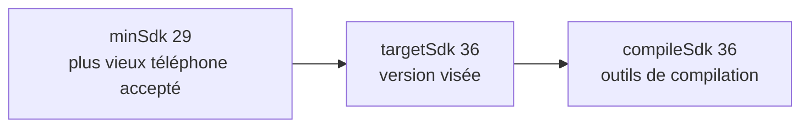

---
tags:
  - projet/kotlin
  - type/concept
  - techno/kotlin
  - techno/android
  - techno/gradle
  - sujet/build
  - statut/a-jour
cours: P1
cree: 2026-09-29
maj: 2026-09-29
---

# Le bloc `android { }`

> [!abstract] En une phrase
> Le bloc `android { }` de `app/build.gradle.kts` est la **fiche technique** de l'app : son identifiant, les versions d'Android qu'elle supporte, et les options de compilation.

---

## 🧾 Le bloc de Metrix, ligne par ligne

```kotlin
android {
    namespace = "com.diiage.metrix"
    compileSdk {
        version = release(36)
    }

    defaultConfig {
        applicationId = "com.diiage.metrix"
        minSdk = 29
        targetSdk = 36
        versionCode = 1
        versionName = "1.0"
    }

    buildTypes {
        release {
            isMinifyEnabled = false
        }
    }
    compileOptions {
        sourceCompatibility = JavaVersion.VERSION_11
        targetCompatibility = JavaVersion.VERSION_11
    }
    kotlinOptions {
        jvmTarget = "11"
    }
    buildFeatures {
        compose = true
        buildConfig = true
    }
}
```

### L'identité

| Code | Pourquoi |
|---|---|
| `namespace = "com.diiage.metrix"` | Le **package** du code généré, comme la classe **`R`** des ressources. C'est pour ça qu'on écrit `import com.diiage.metrix.R` |
| `applicationId = "com.diiage.metrix"` | L'**identifiant unique** de l'app sur le téléphone et sur le Play Store. Deux apps ne peuvent pas avoir le même |
| `versionCode = 1` | Un **nombre** qu'on augmente à chaque publication (le Play Store refuse un numéro plus petit) |
| `versionName = "1.0"` | La version **affichée** à l'utilisateur |

> [!tip] `namespace` vs `applicationId`
> Ils ont souvent la même valeur, mais pas le même rôle : `namespace` concerne **le code**, `applicationId` concerne **l'app installée**. On peut changer `applicationId` sans toucher au code.

### Les versions d'Android (SDK)

| Code | Pourquoi |
|---|---|
| `compileSdk` (ici 36) | La version d'Android dont on utilise les **outils pour compiler**. En général la plus récente |
| `minSdk = 29` | La version **minimale** : l'app ne s'installe pas en dessous (29 = Android 10) |
| `targetSdk = 36` | La version pour laquelle l'app est **testée**. Android active les comportements récents jusqu'à cette version |



> [!note] Règle simple
> `minSdk` ≤ `targetSdk` ≤ `compileSdk`.

### La compilation

| Code | Pourquoi |
|---|---|
| `buildTypes { release { … } }` | Les réglages de la version **publiée**. Il existe aussi `debug`, celle qu'on lance depuis Android Studio |
| `isMinifyEnabled = false` | Pas de **réduction / obfuscation** du code (R8) pour l'instant |
| `compileOptions` + `jvmTarget = "11"` | La version de **Java** que vise le code compilé. Les deux valeurs doivent **correspondre** |
| `buildFeatures { compose = true }` | Active **Compose** dans le module → [[00 Compose]] |
| `buildFeatures { buildConfig = true }` | Génère la classe **`BuildConfig`** (par exemple `BuildConfig.DEBUG` pour savoir si on est en debug) |

> [!warning] `kotlinOptions` souligné ?
> Dans les versions récentes de Kotlin, `kotlinOptions { jvmTarget = "11" }` est remplacé par `kotlin { compilerOptions { … } }`. Si Android Studio le signale, c'est ça : ça marche encore, mais c'est l'ancienne écriture.

---

## 🔗 Liens

- [[01 Les fichiers Gradle]]
- [[01 Le manifest]] — l'autre « carte d'identité » de l'app
- [[04 Commandes et erreurs Gradle]]
