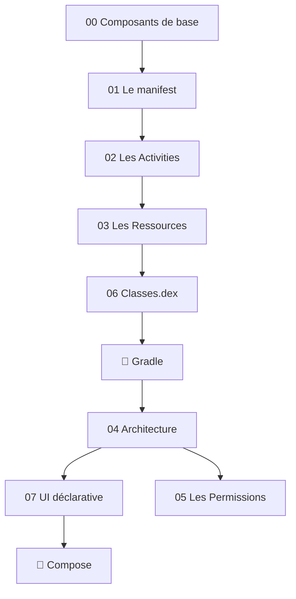

---
tags:
  - projet/kotlin
  - type/index
  - techno/kotlin
  - techno/android
  - statut/a-jour
aliases:
  - Kotlin / Android — MOC
  - Accueil Kotlin
cours: P1
cree: 2026-09-28
maj: 2026-09-29
---

# 🗂️ Kotlin / Android — MOC

> [!abstract] Map of Content
> Page d'accueil du cours **Kotlin / Android (P1)**. Point d'entrée vers toutes les notes.

## 🧱 La base

- [[00 les composant de base]] — vue d'ensemble des composants
- [[01 Le manifest]] — la carte d'identité de l'app
- [[02 Les Activities]] — activities, contexte & cycle de vie
- [[03 Les Ressources]] — le répertoire `res` & la reconfiguration
- [[04 Architecture (Screen - ViewModel - Model)]] — Screen / ViewModel / Model
- [[05 Les Permissions]] — Android vérifie le manifest & les autorisations
- [[06 Classes.dex]] — le code compilé / exécutable
- [[07 UI déclarative]] — l'UI en déclaratif (Compose)
- [[08 Koin (injection de dépendances)]] — fournir les objets de l'extérieur

## 🎨 Compose

- [[00 Compose]] — fonctions, philosophie Kotlin, métaphore Lego
- [[01 Les composants]] — card, row, column, image, text…
- [[02 Le modifier]] — configurer / décorer un composant
- [[03 MainActivity]] — construire `MainActivity.kt` étape par étape (Scaffold, NavHost, navbar)

## 💻 Code (mémo Kotlin)

- [[00 Code]] — index des sous-catégories
- [[01 Kotlin vs Java]] — pas d'accesseurs à coder, etc.
- [[02 Les classes]] — constructeur, membre vs paramètre
- [[03 Les logs]] — écrire/lire des logs, niveaux, bonnes pratiques

## 🐘 Gradle

- [[00 Gradle]] — ce que fait Gradle, le réflexe « Sync Now »
- [[01 Les fichiers Gradle]] — la carte des fichiers `.gradle.kts` et du catalogue
- [[02 Ajouter une dépendance]] — ajouter une lib pas à pas (catalogue, BOM)
- [[03 Le bloc android]] — `namespace`, `minSdk`, `targetSdk`… ligne par ligne
- [[04 Commandes et erreurs Gradle]] — `gradlew` et les erreurs fréquentes

## 🧭 Parcours conseillé

## 🏷️ Tags du cours

Chaque note a au moins `#projet/kotlin`, un `#type/…` et un `#statut/…`.

| Famille | Tags utilisés ici |
|---|---|
| `techno/` | `#techno/kotlin` `#techno/android` `#techno/compose` `#techno/koin` `#techno/gradle` `#techno/java` |
| `sujet/` | `#sujet/apk` `#sujet/manifest` `#sujet/activity` `#sujet/cycle-de-vie` `#sujet/ressources` `#sujet/compilation` `#sujet/architecture` `#sujet/mvvm` `#sujet/ui` `#sujet/permissions` `#sujet/securite` `#sujet/injection-de-dependances` `#sujet/navigation` `#sujet/debug` `#sujet/build` `#sujet/dependances` |
| `type/` | `#type/index` `#type/concept` `#type/guide` `#type/reference` |
| `statut/` | `#statut/a-jour` `#statut/brouillon` |
